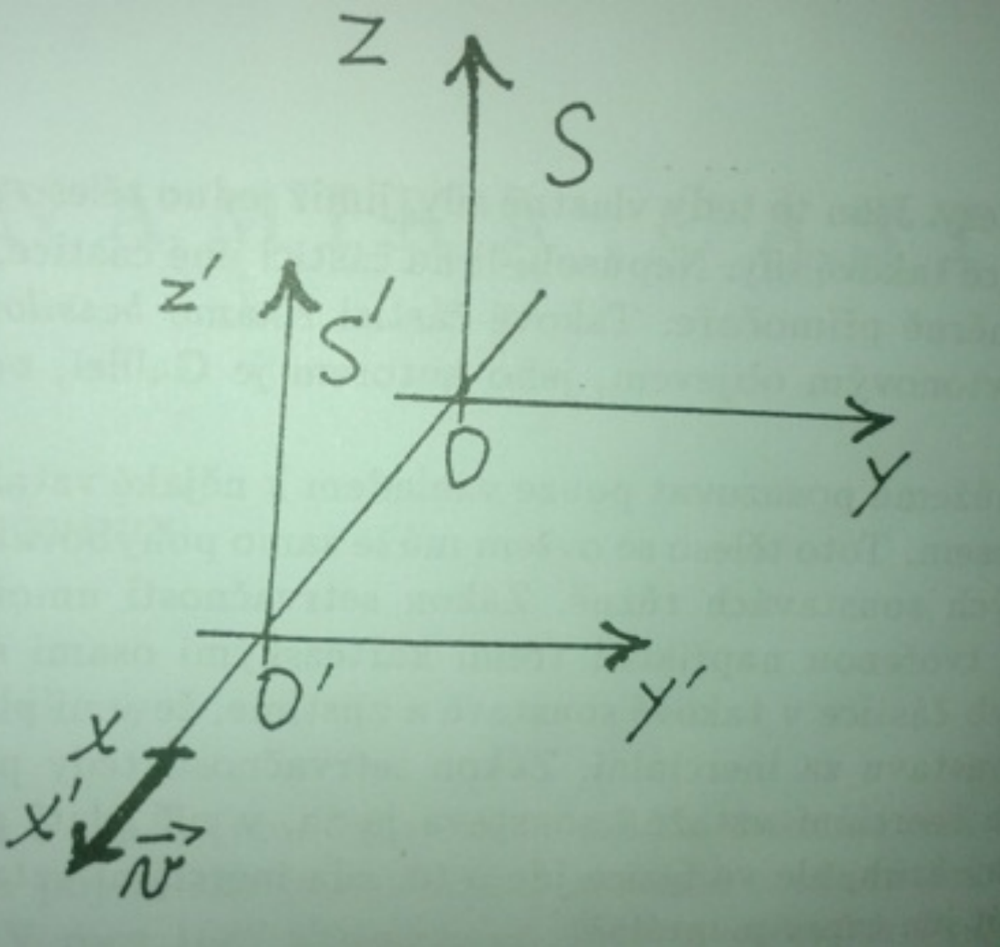
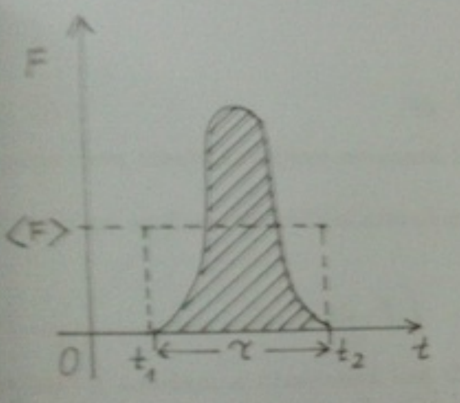
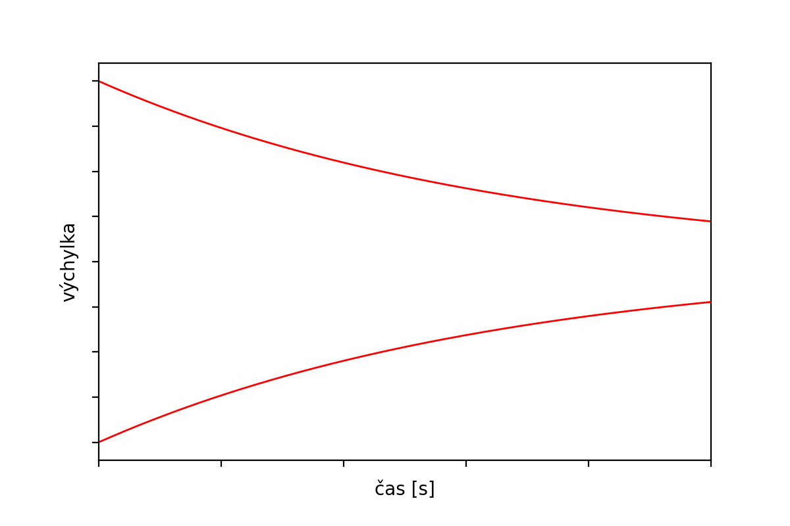
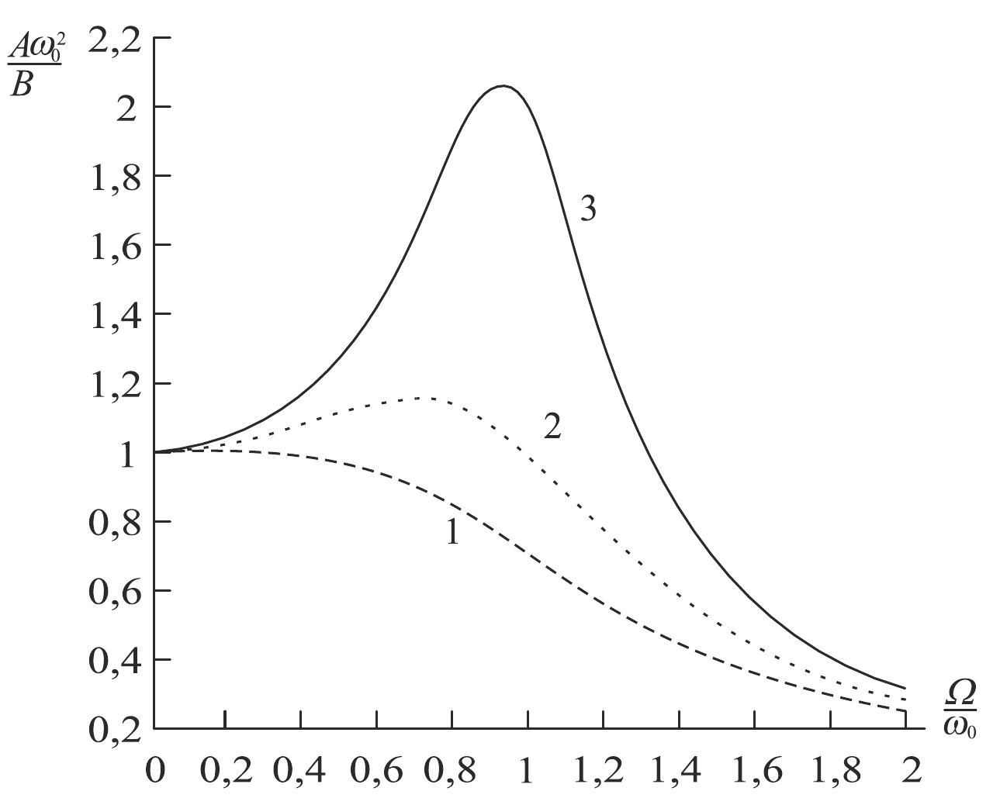
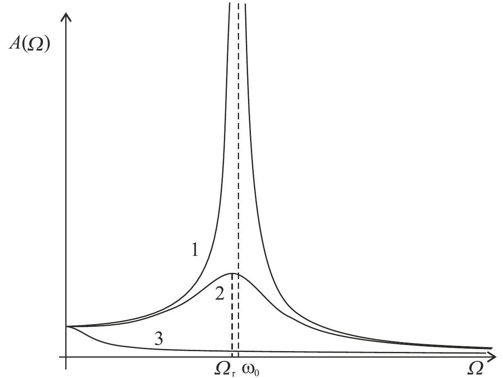

# Dynamika pohybu hmotného bodu

<aside>
🏐

### Hmotný bod

Model, kterým nahrazujeme reálnou částici → odhlížíme od tvaru/rozměru částice → považujeme jí za bodovou → popisuje jí její geometrická poloha a hmotnost → hmotný bod/částice

</aside>

<aside>
🌌

### Absolutní čas a absolutní prostor

**Čas** - univerzální parametr, který je všude stejně plyne, spojitý, rovnoměrný, jednorozměrný, nezávislý na pohybujících tělesech ani na fyzikálních jevech

**Prostor** - soubor míst, kde se mohou nacházet hmotné body, homogenní, izotropní, 3D a euklidovský, není ovlivněn tělesy/jevy co v něm jsou

</aside>

# Dynamika

Nauka o silách (*dynamos=síla*).

V roce *1687 Newton* zformuloval ve svých **Principiích** tři zákony dynamiky, na jejichž základě je možné napsat tzv. pohybové rovnice a jejich řešením studovat pohyb částic a těles.

**Newton ukázal, že síle je příčina změny pohybu, změny pohybového stavu tělesa.**

Newtonova mechanika platí pro rychlosti menší jak rychlost světla a pro velké rozměry (máme jinak STR a kvantovku)

Síla není přímo definována NZ → vystupuje v nich jako základní pojem, který nabývá významu právě těmito zákony

3 pohybové zákony umožňují určit pohyb tělesa v IVS.

<aside>
1️⃣

## Zákon setrvačnosti

*Corpus omne perseverare in statu suo quiescendi vel movendi uniformiter in directum, nisi quatenus illud a viribus impressis cogitur statum suum mutare* 

**Každé těleso setrvává ve svém stavu klidu nebo rovnoměrného přímočarého pohybu, pokud a dokud není vtištěnými silami donuceno tento svůj stav změnit**

$$
\sum_i \vec F_i= 0 \to \vec v = konst.
$$

Pod pojmem těleso se zde myslí hmotný bod.

Těleso zůstává v klidu/pohybuje se setrvačností → nepůsobí-li na něj **vtištěné síly** (síly pravé → síly, které jsou vtištěny jinými silami → jedno těleso působí na druhé)

Nepůsobí-li na částici jiné částice (nebo se pohybuje rovnoměrně) → **bezsilová částice**

Newton není objevitel → autorem je Galilei (*Newton to čmajznul*).

---

Pohyb částice posuzujeme pouze vzhledem k nějaké vztažné soustavě (VS), spojené s tuhým tělesem (může se samo pohybovat → pohyb částice se může v různých soustavách jevit různě).

Zákon setrvačnosti nám dovoluje zavést [inerciální vztažnou soustavu](https://cs.wikipedia.org/wiki/Inerci%C3%A1ln%C3%AD_vzta%C5%BEn%C3%A1_soustava) (IVS) → pozoruje-li se pohyb částice v této soustavě, pak jde vidět, že v ní platí zákon setrvačnosti → pak se soustava dá nazvat inerciální → definice kruhem já vím (zákon setrvačnosti platí v IVS → IVS je ta soustava kde platí zákon setrvačnosti ) → ve fyzice se zajímáme jestli IVS existuje (to zjišťujeme experimentem)

IVS spojená se Zemí (krátkodobé mechanické pohyby) → mění se její stav (aniž by na ní něco přímo působilo) tak musíme spojit soustavu se Sluncem

---

Jiný způsob nepotřebuje zavést IVS → v neinerciální vztažné soustavě musíme zavést nepravé síly → **setrvačné, zdánlivé, nepravé** → u nich nejde ukázat na původce (žádné těleso je nevyvolává)

---

<aside>
🧠

### Galileiho princip relativity a Galileiho transformace

**Je-li jedna VS inerciální, pak ty VS, které se vůči ní pohybují rovnoměrně přímočaře, jsou také inerciální**

**Zákony mechaniky mají stejný tvar ve všech inerciálních vztažných soustavách**

Laboratorní/nehybná VS se značí S (osa x) a pohybující VS se značí S$^\prime$ (osa x$^\prime$ - rovnoběžná s x a splývají) a často se pohybuje konst rychlostí $\vec v$

Předpokládali, že laboratorní soustava je nehybná vůči absolutnímu prostoru a čas plyne stejně v obou soustavách (nulový čas je tehdy, když soustavy splynou)

Transformace souřadnice a času se provádí **Galileiho transformací**

$$
\begin{split}
x^\prime &= x-vt, \quad y^\prime=y,\quad z^\prime=z,\quad t^\prime=t \\
v^\prime_x &= v_x -v, \quad v^\prime_y=v_y, \quad v^\prime_z = v_z\\
a^\prime_x&=a_x, \quad  a^\prime_y=a_y, \quad a^\prime_z=a_z
\end{split}
$$

→zrychlení je tedy všude stejné (síly v obou soustavách jsou stejné)

</aside>

**Z Galileiho principu relativity** → NZ mechaniky mají ve všech inerciálních soustavách stejný tvar → žádným mechanickým experimentem je neodlišíme →všechny IVS jsou si rovny

</aside>

<aside>
2️⃣

## Zákon síly

*Mutationem motus proportionalem esse vi motrici impressae et fieri secundam lineam rectam qua vis illa imprimitur*

**Změna pohybu je úměrná hybné vtištěné síle a nastává podél přímky v níž síla působí**

$$
\frac{d\vec p}{dt} = \frac{d(m\vec v)}{dt} = k\vec F
$$

Působí-li na těleso nějaká vnější síla, pohybuje se těleso se zrychlením, které je nepřímo úměrné hmotnosti a přímo úměrné vtištěné síle.

Umožňuje napsat [**pohybovou rovnici částice**](11Dynamika_pohybu.md)

Definoval množství pohybu → $\vec p = m\vec v$ (hybnost) → pro konstantní hmotnost (setrvačná hmotnost) dostaneme ze zákona (konst. úměrnosti se bere 1)

$$
 m\frac{d\vec v}{dt} = m\vec a = \vec F
$$

Abychom získali jednoznačné řešení → musíme mít počáteční podmínky (poloha, rychlost částice v nějakém okamžiku)

<aside>
❓

- **Jak vypadají počáteční podmínky**
    
    $$
    m\dfrac{d^2\vec r}{dt^2} = \vec F, \quad \vec r (t_0) = \vec r_0, \quad \vec v(t_0) = \vec v_0
    $$
    
    Newtonova pohybová rovnice je vektorová → soustava 3 ODR druhého řádu (řešení závisí na 3 integračních konstantách)
    
</aside>

Vážením určujeme hmotnost gravitační (na rotující Zemi máme hmotnost tíhovou - kombinace gravitační a setrvačné) → odnikud neplyne, že hmotnost daná vážením musí být stejná setrvačné hmotnosti

Experimentální poznatek: na Zemi ve vakuu padají všechna tělesa (bez ohledu na hmotnost) se stejným zrychlením

Na [PS](11Dynamika_pohybu.md) vystupuje síla → za její definici lze považovat zákon síly, ale ! musíme udat nezávislý způsob jak tuto sílu změřit a matematicky vyjádřit ! → Newton stanovil **gravitační zákon**

$$
\vec F = \kappa \frac{M m }{r^2} \vec r_0,
$$

kde $\vec F$ je síla, kterou působí částice gravitační hmotnosti $M$ na částici o gravitační hmotnosti $m$, $\vec r_0$ je jednotkový vektor ve směru spojnice obou částic ⇒ Centrální síla (míří ve směru spojnice částic) a izotropní (závisí pouze na vzdálenosti, ne na vzájemné poloze)

$\kappa$ je gravitační konstanta → musí se měřit [experimentálně](https://edu.techmania.cz/cs/encyklopedie/fyzika/gravitace/mereni-gravitacni-konstanty)

Pro těleso na povrchu Země je Newtonova pohybová rovnice tvaru

$$
m_s \vec a = m_g \vec a _g + m_s \vec a_0\qquad a_g = \frac{\kappa M_Z}{R^2_Z}
$$

→ máme zde setrvačné a gravitační hmotnosti částice a gravitační a setrvačné zrychlení → jsou-li tyto dvě hmotnosti úměrné → dají se měřit ve stejných jednotkách a učinit sobě rovnými → jsou-li si rovny ([**princip ekvivalence**](https://cs.wikipedia.org/wiki/Princip_ekvivalence)) (rovny si jsou s nějakou experimentální přesností) pak

$$
\vec a = \vec g = \vec a_g + \vec a_0
$$

Musíme znát obě zrychlení, abychom spočítali tíhové zrychlení

</aside>

<aside>
3️⃣

## Zákon akce a reakce

*Actioni contrariam semper et aequalem esse reactionem; sive: corporum duorom actiones in se mutuo semper esse aequales et in partes contrarias dirigi*

**Proti každé akci vždy působí stejná reakce; jinak: vzájemné působení dvou těles jsou vždy stejně velká a míří na opačné strany**

**Vykoná-li těleso sílu na jiné těleso, tak i to druhé těleso vykonává sílu na první, síly mají stejnou velikost a opačný směr**

$$
-\vec F_2 = \vec F_1 \to \frac{d(\vec p_1 + \vec p_2)}{dt} = 0\to \vec p_1 + \vec p_2 = konst
$$

Tento zákon umožňuje přejít od mechaniky pohybu 1 částice k mechanice soustavy více částic (zde se pak rozlišují síly **vnější/externí** - na soustavu působí jiná tělesa mimo ni; síly **vnitřní/interní** - mezi sebou působí částice navzájem) → pokud na soustavu nepůsobí žádné vnější síly  → izolovaná soustava

Vnitřní síly se podřizují zákonu akce a reakce → platí to v každém okamžiku → **okamžité reakce** → Síly v Newtonově mechanice působí na dálku okamžitě → vzájemné působené se šíří prostorem nekonečně rychle

</aside>

<aside>
📑

## Shrnutí NZ

Na NZ byla vybudovaná první fyzikální teorie → Newtonova mechanika → vektorová teorie, jejími základy jsou hybnost a síla → zákony platí ve všech IVS, které jsou spojeny Galileiho transformací

O sílách předpokládáme, že jsou

- centrální - míří podél spojnice silově vzájemně působících částic
- izotropní - závisí jen na vzdálenosti, případně vzájemných rychlostech částic a nikoli na směru v prostoru = ve všech směrech mají stejné vlastnosti
- okamžité - šíří se nekonečnou rychlostí

Gravitační síla klesá s $1/r^2$ → Newton to vše dělal pro popis těles ve sluneční soustavě

Teoreticky se někdy značí i 4. NZ → princip superpozice → působí-li na těleso více sil → chová se to těleso tak, jako by na ní působila jedna síla (výslednice těch všech sil)

</aside>

<aside>
👌

## Další základní veličiny

### Impuls síly

Vyjadřuje časový účinek síly/ změna hybnosti částice → působí-li na částici konstantní síla po dobu \tau=t_2-t_1, pa

$$
\begin{split}\vec I &= \vec F \tau = \vec p_2 - \vec p_1 \\&=\int_{t_1}^{t_2}\vec F dt= \int_{t_1}^{t_2}\frac{d\vec p}{dt} dt\end{split}
$$

Síla bývá často krátkodobá → střední síla

$$
\vec I = \langle \vec F \rangle\tau =\frac{1}{\tau} \int_{t_1}^{t_2}\vec F dt \cdot \tau 
$$

### Práce a kinetická energie

Vyjadřuje dráhový účinek síly → působí-li na dráze $s$ podél trajektorie konstantní síla → práce bude

$$
A = F\cdot s = m \frac{v_2-v_1}{\tau} \cdot \langle v \rangle \cdot \tau = \frac{1}{2} mv_2^2 -\frac{1}{2} mv_1^2 
$$

Zavádí se pojem kinetické energie (stavová veličina)

$$
T = \frac{1}{2}mv^2 = \frac{p^2}{2m}
$$

Pak si zjednodušíme život

$$
A = \int_1^2\vec F d\vec r  = \int_{t_1}^{t_2}\vec F \cdot \vec vd  t = \ldots= T_2-T_1 
$$

Jejich jednotka se nazývá Joule.

### Výkon

Práce za jednotku času; jelikož máme $dA = \vec F \cdot d\vec r$, pak 

$$
N = \frac{dA}{dt} = \vec F\cdot \vec v
$$

Jednotka je watt.

</aside>

# Lineární harmonický oscilátor

<aside>
🙂

## Nadefinování  HO a LHO

1D pohyb částice o hmotnosti $m$ podél osy x → působí na něj síla (přímo úměrná výchylce)

$$
F_x = -kx\qquad k>0\qquad F=-\dfrac{dU}{dx}
$$

**Síla konzervativní** (pokud potencionální funkce nezávisí na čase → nazývá se potenciální energií a jí odpovídající síly se nazývají konzervativní; pak jsou síly disipativní - síly závislé na rychlosti částice…) a tedy její potencionální energie je

$$
U(x) = \frac{1}{2} kx^2
$$

aditivní konstanta se zvolila tak, aby v $x=0$ to bylo nulový → částice má při pohybu určitou energii $E$ (jen **integrálem pohybu**) - musí platit $E\geq U(x)$ ⇒ částice se pohybuje v symetrické, parabolické potenciálové jámě a $-A\leq x \leq A$, kde $A$ je amplituda/největší výchylka → vykonává netlumené harmonické kmity s vlastní úhlovou frekvencí 

$$
\omega_0 = \frac{k}{m}
$$

⇒ TAHLE soustava se nazývá **HARMONICKÝ OSCILÁTOR**

Systém, který má parabolickou/kvadratickou závislost potenciální energie (?síla jde opačně výchylce?) ⇒ LINEÁRNÍ HARMONICKÝ OSCILÁTOR

</aside>

<aside>
🛠

## Netlumený LHO

Sílu a potenciální energii jsme si zapsali [ZDE](11Dynamika_pohybu.md).

Pohybová rovnice bude

$$
m\ddot x = F =-kx\to \ddot x + \omega_0^2 x = 0 \qquad \omega_0 = \sqrt{\frac{k}{m}}
$$

Řešení bude tvaru

<aside>
🏗️

- Trocha ANB3
    
    máme lineární DR →řešení ve tvaru $x=ce^{\lambda t}$
    
    $$
    \begin{split}
    \lambda^2ce^{\lambda t} + \frac{k}{m} ce^{\lambda t} &= 0 \\
    \lambda^2 &= -\frac{k}{m} \qquad \lambda_{1,2} = \pm i\sqrt{\frac{k}{m}}
    \end{split}
    $$
    
</aside>

$$
\begin{split}x(t) &= C_1e^{i\omega_0t}+C_2e^{-i\omega_0t} = A_1\cos(\omega_0t)+ A_2\sin(\omega_0t)\\ &= A\sin(\omega_0t + \varphi_0)    \\ v_x(t) &= A\omega_0 \cos(\omega_0t + \varphi_0)\end{split}
$$

Platí tam 

$$
\begin{split}C_1,C_2 &\in \mathbf C\\A_1&= C_1+C_2 - A\sin\varphi_0\\A_2 &= i(C_1-C_2) = A\cos\varphi_0\end{split}
$$

Počáteční podmínky ($x(t_0)= x_0; v(t_0) = v_0$) nám říkají, jak kmitavý pohyb započal

Po využití PP dostaneme

$$
A = \sqrt{x_0^2 + \frac{v_0^2}{\omega_0^2}} \qquad \tan(\omega_0t_0 + \varphi_0) = \frac{\omega_0x_0}{v_0}
$$

Částice vykonává netlumené kmity s vlastní úhlovou frekvencí  $\omega_0$

Z viriálového teorému plyne 

$$
\begin{split}\langle T\rangle &= \frac{1}{2}mv_0^2 \langle \cos^2\omega_0 t\rangle = \frac{1}{4} mv_0^2 \\  \langle U\rangle &= \frac{1}{2}mv_0^2 \langle \sin^2\omega_0 t\rangle = \frac{1}{4} mv_0^2 \\  \langle T\rangle &= \langle U\rangle\end{split}
$$

<aside>
🏗️

- Trocha VOAF
    
    $$
    \begin{split}\langle \sin^2(\omega_0t)\rangle &= \dfrac{\int_0^T \sin^2(\omega_0t) dt}{T} = \left\Vert y= \omega_0t= \frac{2\pi}{T} t\right\Vert\\&= \dfrac{\int_0^{2\pi} \sin^2(y) dy}{\omega_0 \frac{2\pi}{\omega_0}} = \dfrac{\int_0^{2\pi} \frac{1-\cos(2y)}{2} dy}{2\pi}\\&= \frac{1}{2}\end{split}
    $$
    
</aside>

Energie lze zapsat jako

$$
E = \frac{1}{2}m \dot x ^2 + \frac{1}{2}k x^2 = \frac{1}{2}mv_0^2 = \frac{1}{2}m \omega_0^2 A^2
$$

Jakoukoliv symetrickou potenciálovou jámu lze pro malé kmity aproximovat parabolickou jámou a HO popisuje libovolné kmitavé pohyby s malou amplitudou

</aside>

<aside>
🔎

## Tlumený LHO

Netlumený LHO byl idealizací, kde nedocházelo k disipaci mechanické energie → v real světě musíme přidat disipativní sílu (obvykle se bere úměrná rychlosti)

$$
m\ddot x =-kx - h\dot x \to \ddot x + \frac{h}{m}\dot x + \frac{k}{m} x =0 \to\ddot x + 2\delta \dot x + \omega_0^2 x = 0
$$

Konstanty bereme jako $k>0,h>0$ a zavádí se **dekrement útlumu** $\delta$

Řešení se hledá ve tvaru $x = Ce^{\alpha t}$ 

$$
\alpha^2 + 2\delta\alpha + \omega_0^2 = 0 \Rightarrow \alpha =-\delta \pm \sqrt{\delta^2-\omega_0^2} = -\delta \pm D
$$

$D$ je diskriminant charakteristické rovnice a rovná se $D^2= \delta^2- \omega_0^2$

Obecné řešení bude tvaru

$$
x(t) = e^{-\delta t} \left( C_1 e^{Dt} + C_2 e^{-Dt}\right)
$$

Rozlišují se pak 4 případy

### Případ nulového útlumu

Je-li $\delta = 0,$ pak $D^2 = -\omega_0^2$ ⇒ dostává se idealizovaný případ netlumeného HO

### Případ malého útlumu

Je-li $D^2 = \delta^2- \omega_0^2 <0$ - zavede se úhlová frekvence

$$
\omega = \sqrt{\omega_0^2-\delta^2}
$$

Pak obecný tvar řešení přejde na

$$
\begin{split}x(t) &= A e^{-\delta t}\sin(\omega t + \varphi_0)\\v_x(t) &= Ae^{-\delta t}\left( \omega\cos(\omega t  + \varphi_0)- \delta \sin(\omega t  + \varphi_0)  \right)\end{split}
$$

Dochází k periodickým kmitům, jejichž amplituda exponenciálně klesá v čase

Pohyb tlumeného oscilátoru zde není přesně periodický → amplituda se mění

**Perioda je** $T = \frac{2\pi}{\omega}$

Další poznatky jsou, když zavedeme PP $t=0,x=0,v=v_0>0$.

**Vystředovaná energie** (za periodu) je

$$
\langle E \rangle = \frac{1}{2} kv_0^2 e^{-2\delta t}
$$

Střední energie klesá s časem a dochází k disipaci kmitavé energie v energii tepelnou. **Střední disipovaný výkon** bude dán

$$
\vert \langle P \rangle \vert = \left\vert \frac{d}{dt} \langle E\rangle  \right\vert = 2\delta \langle E\rangle 
$$

Disipaci energie v tlumeném oscilátoru vyjadřuje bezrozměrná veličina → **kvalita/činitel jakosti oscilátoru**

$$
Q = \frac{\omega_0 \langle E\rangle }{\vert \langle P \rangle \vert} = \frac{\omega_0}{2\delta}
$$

### Případ kritického útlumu

Je-li $D=0\to \delta = \omega_0$ → kmitavý pohyb přestává být právě periodický

Řešení pohybové rovnice bude

$$
x = (C_1 + C_2t)e^{-\delta t} \qquad v_x = -\delta (C_1+ C_2 t )t^{-\delta t}
$$

### Případ aperiodického útlumu

Je-li $D^2= \delta^2- \omega_0^2 >0$ → oba kořeny charakteristické rovnice jsou reálné 

$$
x = C_1e^{(-\delta +D)t}+C_2e^{(-\delta - D)t}
$$

Průběh je stejný jako u kritického útlumu, akorát, že to nevystoupá tak daleko (rychleji tlumeno)

</aside>

<aside>
⚠️

## Vynucené kmity a rezonance

Nechť na oscilátor působí vnější periodická harmonická síla s periodou $\Omega$ → síla bude rozkmitávat oscilátor, **vnucovat mu svou frekvenci,** dodávat mu energii

Nechť ta síla je tvaru

$$
F_x(t) = F_0 \cos(\Omega t)
$$

Poté bude pohybová rovnice nehomogenní

$$
m\ddot x + h\dot x + kx = F_x(t) \Rightarrow \ddot x +2\delta\dot x + \omega_0^2 x = B\cos(\Omega t) \quad B=\frac{F_0}{m}
$$

Obecné řešení je dáno součtem obecného řešení homogenní rovnice (tlumený LHO) a partikulárního řešení

Řešení bude tvaru vynucených kmitů s vnější frekvencí

$$
x(t) = A \sin(\Omega t + \varphi_0)
$$

Zderivuje se → dosadí zpět do pohybové rovnice → moc výpočtů…

$$
\tan \varphi_0 = \frac{\omega_0^2-\Omega^2}{2\delta\Omega} \qquad A = \dfrac{B}{\sqrt{(\omega_0^2 - \Omega^2)+4\delta^2 \Omega^2}}
$$

⇒ Pokud útlum není příliš velký, amplituda kmitů roste při přibližování  $\Omega$  k vlastní frekvenci rezonátoru $\omega_0$   → říká se tomu **REZONANCE** a závislost amplitudy na vnějším kmitočtu nazýváme **rezonanční křivkou v amplitudě**

Když se pozoruje funkce $A(\Omega)$ tak se z toho zjistí pár věcí:

- Při $\Omega = 0$ je $A_S = \frac{B}{\omega_0^2}$ → nazývá se to statistická výchylka
- Pro velký útlum $\delta > \frac{\omega_0}{\sqrt{2}}$ dosahuje funkce maxima v 0 - rezonance nenastává
- Při útlumu $\delta < \frac{\omega_0}{\sqrt{2}}$ nabývá křivka maxima na rezonanční frekvenci $\Omega_r = \sqrt{\omega_0^2-2\delta^2}$ ⇒ $A_{max} = \frac{B}{2\delta\sqrt{\omega_0^2-\delta^2}}$ **AMPLITUDOVÁ REZONANCE**→s klesajícím útlumem tato hodnota roste do nekonečna a rezonanční frekvence se blíží vlastní frekvenci $\omega_0$

Ty čísla na obou grafech neodpovídají stejným případům

Vynucené kmity oscilátoru jsou netlumené → stav energetické rovnováhy → ztráty mechanické energie disipací jsou nahrazovány energií vnějšího zdroje

Energie oscilátoru v tomto režimu je 

$$
E = \frac{1}{2} m\Omega^2 A^2 \cos^2(\Omega t \varphi_0)+ \frac{1}{2} k A^2 \sin^2( \Omega t + \varphi_0)
$$

Její vystředovaná hodnota přes periodu má tvar

$$
\langle E\rangle = \frac{1}{4}\dfrac{m(\Omega^2+\omega_0^2)B^2}{(\omega_0^2-\Omega^2)^2+4\delta^2\Omega^2}
$$

Maximální energii dostaneme pro $\omega_0 = \Omega$

</aside>

# Matematické kyvadlo

**Matematické kyvadlo** = hmotný bod $m$  zavěšený na nehmotném vlákně délky $l$ v tíhovém poli; délka závěsu je neměnná a nehmotná → pohybu bodu je omezen→ může se pohybovat jen po kulové ploše (na popis stačí jen dvě souřadnice) → takový systém je **SFÉRICKÉ KYVADLO** 

Jednoduší případ je, když se hmotný bod může pohybovat pouze po svislé rovině (kyvadlo jsme vychýlili nebo jsme mu dodali vodorovnou počáteční rychlost v rovnovážné poloze) → hmotný bod bude opisovat oblouk kružnice a k popisu pohybu stačí jen jedna souřadnice → **ROVINNÉ MATEMATICKÉ KYVADLO** 

Často se případ popisuje v  polárních souřadnicích

Počátek se dá v bodě závěsu → pohybové rovnice pak budou 

$$
\begin{split}ma_r &=m(\ddot r - r\dot \varphi^2) =mg\cos \varphi - F_n\\ma_\varphi &=m(2\dot r \dot \varphi + r\ddot \varphi) =-mg\sin\varphi\end{split}
$$

Síla, jíž je napínán závěs kyvadla se vyjádří z první rovnice

$$
F_n = mg\cos\varphi + mr\dot\varphi ^2
$$

Tento vztah udává, že dostředivá síla (dělá ten nerovnoměrný kruhový pohyb) je dána silou napětí závěsu zmenšenou o radiální složku tíhy.

Druhá rovnice je již nelineární a těžce řešitelná → řeší se pro malé výkyvy (rozložení sinus a cosinus do Taylora- bereme první)

Dostaneme rovnici 

$$
\ddot \varphi + \frac{g}{l} \varphi = 0
$$

To je rovnice harmonického oscilátoru a pro jeho okamžitou periodu plyne

$$
T = 2\pi \sqrt{\frac{l}{g}}
$$

Pro malé výkyvy je matematické kyvadlo izochronní (jeho perioda nezávisí na amplitudě)