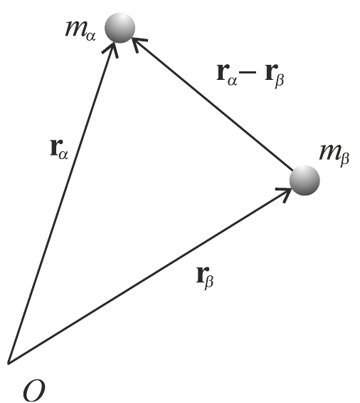
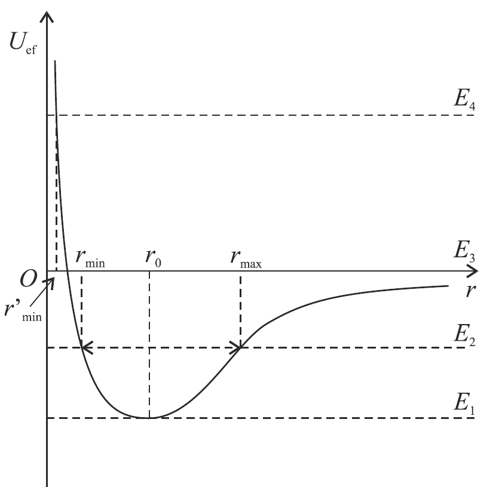
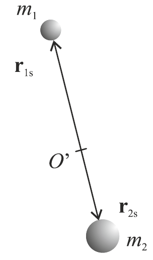
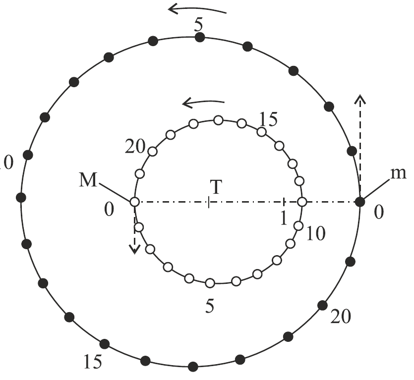
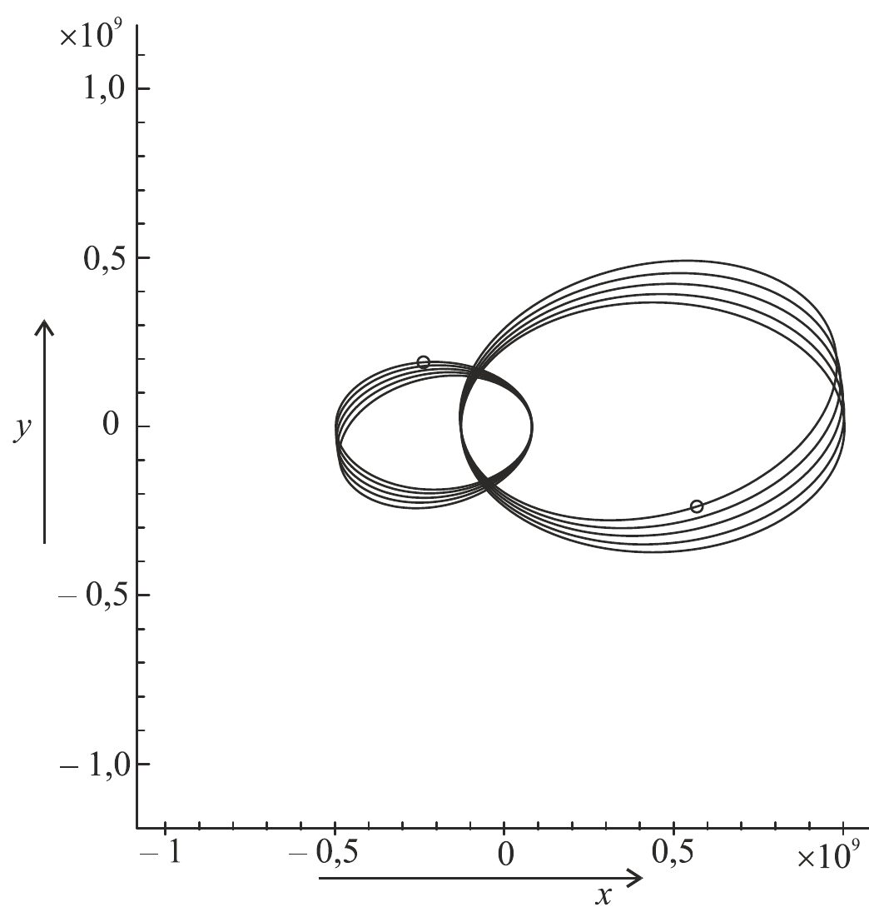
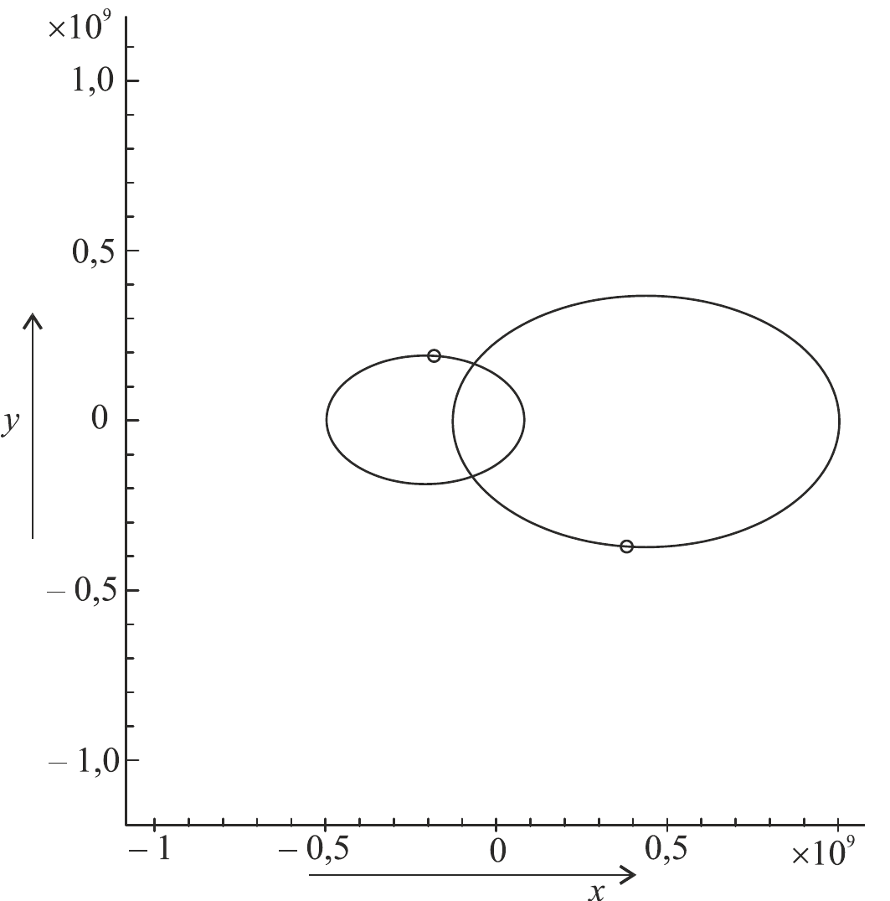
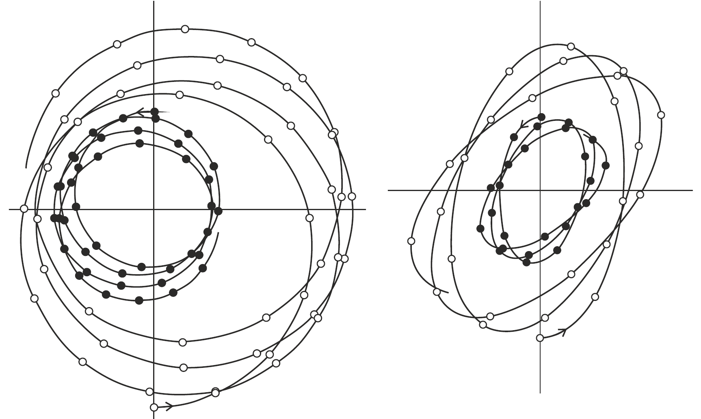

# Mechanika soustavy částic

vektory někdy značím $\vec v$ a někdy $\mathbf v$

# Zákony zachování

Mějme $N$ částic (hmotných bodů) a často se označují $\alpha, \beta, \ldots$ → každá z částic má svoji hmotnost, polohový vektor, rychlost a hybnost

$$
m_\alpha,\mathbf r_\alpha, \mathbf v_\alpha, \mathbf p_\alpha\qquad \alpha = 1\ldots N
$$

Částice mohou být volné či vázané

Soustava $N$ volných částic má $s=3N$ **stupňů volnosti** - je třeba znát 3 souřadnice každé částice, abychom znali rozložení v prostoru (u vázaných částic se snižuje ten počet) 

Předpokládá se, že **VS** (v níž studujeme částice) **je inerciální** (působí jen *pravé síly* → vnitřní  či vnější) → pokud na soustavu nepůsobí vnější síly → izolovaná soustava → pro pravé síly v IVS jde použít NZ

Zákon síly pro každou částici lze zapsat tak, že rozdělíme zápis sil na vnitřní 

$$
\mathbf F_{\alpha}^{(i)} = \sum_{\beta=1}^{N} \mathbf F_{\alpha\beta}
$$

($\alpha\beta$ - částice $\beta$ působí na částici $\alpha$) a vnější $\mathbf F^{(e)}_{\alpha}$:

$$
\dfrac{d\mathbf p_\alpha}{dt} = \mathbf F_\alpha^{(i)} + \mathbf F^{(e)}_{\alpha}
$$

Celková hybnost částic a výslednice vnějších sil působících na soustavu se označí

$$
\mathbf P = \sum_{\alpha=1}^N \mathbf p_\alpha\qquad \mathbf F^{(e)}= \sum_{\alpha=1}^N  \mathbf F^{(e)}_\alpha
$$

<aside>
1️⃣

## 1. věta impulsová - ZZH

Pokud si uvědomíme, že ze zákona akce a reakce se vnitřní síly v soustavě vyruší → $\mathbf F_{\alpha\beta } = \mathbf -F_{\beta \alpha}$ pak

$$
\sum_{\alpha,\beta=1}^N \mathbf F_{\alpha\beta} = \frac{1}{2} \sum_{\alpha,\beta=1}^N (F_{\alpha\beta} - F_{\alpha\beta} ) = \mathbf 0
$$

nakonec tedy

$$
\frac{d \mathbf P}{dt} = \dot{ \mathbf P} = \mathbf F^{(e)}
$$

Což to je matematické vyjádření 1. věty impulzové, věta o hybnosti soustavy částic.

**Časová změna celkové hybnosti soustavy částic je rovna výslednici vnějších sil**

Je-li soustava izolovaná (nejsou vnější síly), pak platí **zákon zachování celkové hybnosti izolované soustavy - ZZH**

$$
\mathbf P = \mathbf{konst}
$$

**celková hybnost izolované soustavy se zachovává**

Jak se změní celková hybnost, když přejdeme k jiné VS S$^\prime$

### Přechod k jiné soustavě

Jiná soustava se oproti původní pohybuje rychlostí $\mathbf V(t)$ (osy zachovávají svoji orientaci) → nová soustava již nemusí být inerciální → nutnost transformovat rychlosti všech částic $\mathbf v_\alpha = \mathbf v_\alpha^\prime + \mathbf V$ ⇒ celková hybnost pak bude

$$
\mathbf P = \sum_{\alpha=1}^N \mathbf p_\alpha = \sum_{\alpha=1}^N m_\alpha\mathbf v_\alpha = \sum_{\alpha=1}^N m_\alpha\mathbf v_\alpha^\prime + \mathbf V \sum_{\alpha=1}^N m_\alpha
$$

Poslední sumu označíme jako celkovou hmotnost soustavy → značíme $M$ 

$$
\mathbf P = \mathbf P^\prime + M\mathbf V
$$

$\mathbf P^\prime$ se položí rovno 0 (v těžišťovém systému), pak 

$$
\mathbf V = \frac{\mathbf P}{M}
$$

→ v soustavě existuje myšlený bod - **hmotný střed/střed hmotnosti/ těžiště** o polohovém vektoru

$$
\mathbf R = \dfrac{\sum_{\alpha=1}^N m_\alpha\mathbf r_\alpha}{M}
$$

→ tento bod se pohybuje rychlostí $\mathbf V$ (chová se,  jako by v něm byla soustředěna celá hmotnost soustavy)

$$
\mathbf P = M\mathbf V, \quad \frac{d\mathbf P}{dt} = M \frac{d\mathbf V}{dt} = \mathbf F^{(e)}
$$

Ve vztažné soustavě spojené s hmotným středem je celková hybnost  $\mathbf P^\prime$ nulová.

V izolované soustavě → **rychlost těžiště zůstává konstantní** → **zákon zachování rychlosti těžiště v izolované soustavě**

Při přechodu od jedné IVS k druhé bude platit

$$
\frac{d\mathbf P}{dt}= \frac{d\mathbf P^\prime}{dt}= \mathbf F^{(e)}
$$

První věta impulsová platí ve všech IS → hybnost izolované soustavy částic je v každé z nich jiná (v těžišti nulová)

</aside>

<aside>
2️⃣

## 2. věta impulsová - ZZ celkového momentu hybnosti

Pohybová rovnice každé částice se vektorově vynásobí s polohovým vektorem → poté se opět sečte přes všechny částice

$$
\sum_{\alpha=1}^N \left( \mathbf r_\alpha \times \frac{d\mathbf p_\alpha}{dt} \right) = \sum_{\alpha,\beta=1}^N (\mathbf r_\alpha \times \mathbf F_{\alpha,\beta}) + \sum_{\alpha=1}^N \left(\mathbf r_\alpha \times \mathbf F_\alpha^{(e)}\right)
$$

**Levá strana** se upraví na

$$
\frac{d}{dt} \sum_{\alpha=1}^N \mathbf r_\alpha \times \mathbf p_\alpha - \sum_{\alpha=1}^N \mathbf v_\alpha\times \mathbf p_\alpha
$$

Tady je $\mathbf v_\alpha\times \mathbf p_\alpha =0$ jelikož to jsou vektory rovnoběžné.

Zavádí se **moment hybnosti částice** $\mathbf l_\alpha = \mathbf r_\alpha \times \mathbf p_\alpha$ a **celkový moment hybnosti soustavy částic** 

$$
\mathbf L = \sum_{\alpha=1}^N\mathbf l_\alpha =\sum_{\alpha=1}^N \mathbf r_\alpha \times \mathbf p_\alpha
$$

Teď se upraví Pravá strana první rovnice a zavede se **výsledný moment vnějších sil**

$$
\mathbf N^{(e)} = \sum (\mathbf r_\alpha \times \mathbf F^{(e)}_\alpha)
$$

Pravá strana se upravila na tvar (využití zákona akce a reakce)

$$
\frac{1}{2} \sum_{\alpha,\beta=1}^N (\mathbf r_\alpha - \mathbf r_\beta)\times \mathbf F_{\alpha \beta} + \mathbf N^{(e)}
$$

Dále se předpokládá, že síly působící mezi částicemi jsou centrální → což vede na to, že 

$$
\mathbf r_\alpha - \mathbf r_\beta \,\vert\vert\, \mathbf F_{\alpha\beta}
$$

Pak tedy se dospěje k rovnici

$$
\frac{d\mathbf L}{dt} = \mathbf N^{(e)},
$$

která je **matematickým vyjádřením druhé věty impulsové - věta momentu hybnosti soustavy částic**

**Časová změna celkového momentu hybnosti soustavy částic je rovna výslednému momentu vnějších sil**

Je-li soustava izolovaná + výsledný moment vnějších sil je nulový (ty dvě věci nemusí nutně souviset) → platí zákon zachování celkového momentu hybnosti izolované soustavy částic

<aside>
🧠

### Přechod k jiné soustavě

Jak se změní celkový moment hybnosti soustavy částic, budeme-li jej vztahovat k jinému počátku $O^\prime$ (pohybuje se rychlostí $\mathbf V$) → polohový vektor je $\mathbf r(O^\prime) = \mathbf r_0 + \mathbf V t$

Zase se provede transformace polohových vektorů všech částic ($\mathbf r_\alpha = \mathbf r_\alpha^\prime + \mathbf r_0 + \mathbf V t$) 

Celkový moment hybnosti

$$
\mathbf L = \mathbf L^\prime - \mathbf V \times \sum_{\alpha=1}^N m_\alpha\mathbf r_\alpha^ \prime + \mathbf r_0\times \mathbf P^\prime + \mathbf r_0 \times M\mathbf V + \mathbf Vt\times \mathbf P^\prime
$$

Pokud jsou oba počátky nehybné

$$
\mathbf L = \mathbf L^\prime + \mathbf r_0\times \mathbf P ^\prime = \mathbf L^\prime + \mathbf r_0\times \mathbf P 
$$

Půjde-li navíc o těžišťovou soustavu kde $\mathbf P = \mathbf P^\prime =0$ , pak $\mathbf L = \mathbf L^ \prime$ a celkový moment hybnosti soustavy částic nezávisí na volbě počátku.

Je-li výslednice vnějších sil nulová, tj. časová změna hybnosti je nulová → **druhá věta impulzová platí stejně ve všech IVS**

</aside>

</aside>

<aside>
🔋

## Věta o energii soustavy částic

Začíná se tak, že vynásobíme pohybovou rovnici každé částice její rychlostí  a pak se sčítá přes všechny částice

$$
\begin{split}\sum_{\alpha=1}^N \frac{d\mathbf p_\alpha}{dt} \cdot \mathbf v_\alpha &= \sum_{\alpha=1}^N\mathbf F^{(i)}_\alpha \cdot \mathbf v_\alpha + \sum_{\alpha=1}^N \mathbf F_{\alpha}^{(e)}\cdot \mathbf v_\alpha\\
LS&\to \sum_{\alpha=1}^N m_\alpha \frac{d\mathbf v_\alpha}{dt} \cdot \mathbf v_\alpha = \frac{dT}{dt}\\PS&\to \sum_{\alpha=1}^N\mathbf F^{(i)}_\alpha \cdot \mathbf v_\alpha + Q^{(e)}
\end{split}
$$

Symbol $T$ značí celkovou kinetickou energii soustavy částic a $Q^{(e)}$ je výkon vnějších sil

Jsou-li **síly konzervativní** → zavádí se potenciální energie soustavy částic

$$
\mathbf F_\alpha^{(i)} = - \frac{\partial U}{\partial \mathbf r_\alpha}
$$

Pak označíme celkovou energii soustavy částic jako $E= T+U$ →získá se věta o energii soustavy částic

$$
\frac{d E}{dt} = Q^{(e)}
$$

**Časová změna celkové energie soustavy částic je rovna celkovému výkonu vnějších sil.**

Pro izolovanou soustavu máme PS nulovou → ZZE 

<aside>
🇩🇪

### Konigöva věta

Přejdeme-li ke vztažné soustavě $S^\prime$, jejíž počátek se od normal soustavy pohybuje rychlostí $\mathbf V$ (osy souřadnic zachovávají orientaci)

Kinetická energie soustavy se bude transformovat do 

$$
\begin{split}T &= \frac{1}{2} \sum_{\alpha=1}^N m_\alpha \cdot \mathbf v_\alpha^2 = \frac{1}{2} \sum_{\alpha=1}^N m_\alpha \cdot (\mathbf v_\alpha^\prime + \mathbf V)^2\\  &= \frac{1}{2} MV^2 + \mathbf V\cdot \mathbf P^\prime + T^\prime\end{split}
$$

Je-li soustava těžišťová ($\mathbf P^\prime=0$) pak

$$
T = \frac{1}{2} M V^2 + T^\prime
$$

**Kinetická energie soustavy částic je rovna součtu kinetické energie jejího těžiště  a vnitřní kinetické energie (kinetická energie v těžišťové vztažné soustavě)**

Je-li soustava izolovaná, bude její celková energie dána součtem kinetické energie těžiště a celkové vnitřní energie (tj. kinetická a potenciální energie v těžišťové soustavě)

Obecně tedy ($U$ je stejný jak $U^\prime$)

$$
E = T^\prime + U^\prime + \mathbf P^\prime\cdot \mathbf C + \frac{1}{2}MV^2
$$

</aside>

</aside>

<aside>
🔟

## 10 ZZ v izolované soustavě částic

- Pro 1 částici: 7 ZZ → $\mathbf p$ (1. NZ), $\mathbf l$ (moment hybnosti částice) a $E$ (pro konzervativní pole)
- Pro N částic: 10 ZZ → $\mathbf P$ (1. VI ZZ celkové hybnosti), $\mathbf V_T$  (ZZ rychlosti těžiště), $\mathbf L$ (ZZ celkového momentu hybnosti), $E$ … tzv integrály pohybu (definici z TEF dodám)
- 2 částice: $\vec v_{1/2}, \vec r_{1/2}$, 12 PP, 10 ZZ → je možné řešit
- 3 částice: $\vec v_{1/2/3}, \vec r_{1/2/3}$, 18 PP, 10 ZZ → nelze řešit analyticky (větší počet →začně se používat statistických metod)

Znalost těch 10 ZZ nám usnadňuje integrování pohybových rovnic

- ZZ celkové hybnosti souvisí s homogenitou prostoru (symetrie vůči translaci v prostoru)
- ZZ celkového momentu hybnosti souvisí s izotropií prostoru (symetrie vůči rotaci v prostoru)
- ZZ energie souvisí s homogenitou času (symetrie vůči translaci v čase)
- ZZ rychlosti těžiště souvisí s Galileiho transformacemi (symetrie vůči přechodu od jedné inerciální soustavy k druhé)

Jsou i další ZZ - elektrický náboj …

</aside>

# Keplerova úloha

<aside>
🙂

## Pohyb v centrálním poli - úvod

Pohyb částice v prostoru, kdy na ní působí silové pole → je-li pole homogenní → síla je v každém bodě konstantní

Homogenní silové pole v celém nekonečném vesmíru nemůže existovat → aproximace lokálního pole 

**Centrální silové** pole je buzeno bodovými/sféricky symetrickými částicemi a tělesy → předpokládá se, že existuje silové centrum, s nímž se dá spojit počátek IVS

Při řešení se klasická pohybová rovnice vynásobí vektorově polohovým vektorem $\mathbf r$

$$
\begin{split}LS &=\mathbf r \times \frac{d\mathbf p}{dt} = \frac{d}{dt}(\mathbf r\times \mathbf p) - \frac{d\mathbf r}{dt}\times \mathbf p = \frac{d\mathbf l}{dt} - \mathbf v \times \mathbf p\\PS &= \mathbf r \times \mathbf F = 0
\end{split}
$$

Nuly se získávají z rovnoběžnosti daných vektorů → $\frac{d\mathbf l}{dt} = 0$ a tedy → $\mathbf l = konst$ →zachování momentu hybnosti částice v centrálním pole → $\mathbf r$ a $\mathbf p$ jsou stále ve stejný rovině → částice dělá rovinný pohyb → stačí dvě souřadnice $\varphi$ a $r$

Země se pohybuje v centrálním silovém poli sluneční gravitace → její pohyb je v **rovině ekliptiky**

Krom zachování směru momentu hybnosti → nutnost zachovat i jeho velikost → ZZ velikosti momentu hybnosti planety pohybující se v gravitačním poli Slunce objevil Kepler (*tehdy to byl zákon stálosti plošné rychlosti planety*)

Izotropní centrální pole → síla bude záviset jen na vzdálenosti od počátku → bude konzervativní, pak 

$$
F_r = -\frac{dU(r)}{dr}
$$

Zadefinovává se efektivní potenciální energie

$$
U_{ef} = U(r) + \frac{l^2}{2mr^2}
$$

→ měli jsme 1 integrál pohybu (moment hybnosti $l=mr^2\dot \varphi = konst$) a chtěli jsme druhý → energii

$$
E = \frac{1}{2}m\dot r^2 + U_{ef}(r) = konst
$$

→ soustava rovnice se řeší separací proměnných →získá se trajektorie (závislost $\varphi$ na $r$) ….

</aside>

<aside>
🏐

## Společné vlastnosti pohybu v centrálních izotropních polích

- Pohyb je rovinný
- Plošná rychlost pohybu je konstantní
- Úhel $\varphi$ se mění v čase monotónně, částice musí obíhat centrum stále v témž smyslu a nemůže se vracet → $mr^2\dot \varphi = konst$ a derivace úhlu podle času nemůže změnit znaménka
- Při $\dot r= 0$ tzv. body obratu ( částice se přestává vzdalovat a začíná se opět přibližovat k centru) → časový průběh pohybu i tvar trajektorie jsou symetrické vzhledem k okamžikům a směrům bodů obratu
- Pohyb částice je možný pouze za podmínky $E\geq U_{ef}(r)$ a podle průběhu funkce $U_{ef}(r)$ může být buď **infinitní** (částice se může vzdalovat od centra do nekonečna) nebo **finitní** (probíhat v jámě efektivní potenciální energie)
- Obecně je důležitá otázka tzv. **pádu na centrum**, tj. vyjasnění podmínek, za nichž se částice může neomezeně přibližovat silovému centru (spadnout na ně)  → z rovnic pro energii se dostane nerovnost
    
    $$
    r^2U(r)+ \frac{l^2}{2m} \leq r^2E
    $$
    
    - Podmínka pádu vyžaduje → $r$ a PS mohla jít neomezeně k nule → rozlišuje se několik případu
        - $l=0, U(r)<0$ → síla musí být přitažlivá a moment hybnosti nulový (nastane, když částice dostane počáteční rychlost buď nulovou a nebo radiální)
        - $r^2U(r)< - \frac{l^2}{2m} < 0$ → nastává když
        
        $$
        U(r)= -\frac{\alpha}{r^2}, \, \alpha>\frac{l^2}{2m}\,\vee\, U(r)= -\frac{\alpha}{r^n}, \, \alpha>\frac{l^2}{2m}, n>2
        $$
        
        - Newtonova gravitační síla je $U(r)= -\frac{\alpha}{r}, \, \alpha=GmM>0$ → k pádu Země či planety na Slunce nemůže dojít (velký přiblížení - zanedbání moc moc)
- Kdy je trajektorie částice v centrálním izotropním poli tvořena uzavřenou křivkou? → Když potenciální energie klesá nepřímo úměrně první mocnině vzdálenosti (Keplerova úloha) nebo když roste se čtvercem vzdálenosti (Izotropní oscilátor) → v obou případech se jedná o eliptickou trajektorii
</aside>

Úloha o pohybu tělesa (planety) v centrální gravitačním poli  → hledání trajektorie

Potenciální energie klesá nepřímo úměrně první mocnině vzdálenosti $U(r) = -\frac{\alpha}{r}, \alpha>0$ (jeden ze dvou případů pohybu v centrálním poli , kdy je trajektorie křivkou)

Efektivní potenciál je

$$
U_{ef} (r) = \frac{l^2}{2mr^2} \pm \frac{\alpha}{r}
$$

Z průběhu potenciální energie → pohyb tělesa jen když $E\geq U_{ef/min}$ → minimální energie odpovídá vzdálenosti od centra $r_0$

Při záporné energii

$$
E_1 = U_{ef/min}=- \frac{\alpha^2 m}{2l^2}, \, \alpha = GmM
$$

bude vzdálenost od centra neměnná a pohyb bude probíhat po kružnici o poloměru $r_0=\frac{l^2}{\alpha m}$ → perioda bude $\propto r_0^{3/2}$

Bude-li energie $0 > E_2 > U_{ef/min}$ → pohyb finitní (pohyb v mezikruží ohraničený dvěma poloměry)

Při hodnotě E_3 = 0 → pohyb infinitní → těleso se může přiblížit z nekonečna k centru na vzdálenost

$$
r_{min}^\prime = \frac{l^2}{2Gm^2M}
$$

Průběh potenciální energie + jsou vidět různé energetické hladiny; pro E< 0 - finitní pohyb, Síla míří k centru

Výsledky nahoře se odvodili bez znalosti trajektorie

Obecný tvar trajektorie v centrální izotropním pole (po dosazení efektivní potenciální energie) 

$$
\varphi(r) +\varphi_0=\pm \int \frac{\frac{l}{r^2}}{\sqrt{2m(E-U_{ef})}} dr
$$

→ vypadne z toho

$$
\varphi = \arccos\frac{u}{u_0} + \varphi_0\qquad u= \frac{l}{r}-\frac{\alpha m }{l} \qquad u_0^2 = 2mE + \left(\frac{\alpha m}{l}\right)^2
$$

a $\varphi_0$ je nutné zjistit z počáteční polohy polární osy, kdy $\varphi=0$ → rovnice se upraví a získá se rovnice polární kuželosečky 

$$
\frac{p}{\varepsilon} \frac{1}{r} = \frac{1}{\varepsilon} + \cos \varphi \qquad p = \frac{l^2}{\alpha m }\qquad \varepsilon = \sqrt{1+\frac{2El^2}{m\alpha^2}}
$$

Toto je tedy obecná rovnice trajektorie při pohybu tělesa v Newtonově gravitačním poli nebo nabité částice v přitažlivém Coulombově elektrostatickém poli 

Dále se rozlišuje trajektorie podle energie

1. $\varepsilon = 0, E=E_{min}$ - pohyb po kružnici
2. $0<\varepsilon <1, E_{min} <E<0$ - pohyb po elipse s ohniskem v silovém centru (dají se odvodit vzorce pro perihelium, afelium)
3. $\varepsilon = 1, E=0$ - pohyb po parabole
4. $\varepsilon > 1, E>1$ - pohyb po bližší větvi hyperboly 

<aside>
⚖️

## Keplerovy zákony

1. Planety obíhají kolem Slunce po eliptických drahách a Slunce leží v jejich společném ohnisku
2. Plochy opsané průvodičem planety za stejné doby jsou stejné
3. Čtverce oběžných dob planet jsou úměrné třetím mocninám velkých poloos 
    
    $$
    \frac{A^3}{T^2} = konst
    $$
    

Slunce bylo považováno za nehybné →IVS

</aside>

# Úloha dvou těles

Přesně matematicky jde řešit pouze tahle úloha (z řešení pohybových rovnic soustavy částic)

Dvě částice $m_{1/2},\mathbf r_{1/2}$ → řešení soustavy 6 DR 2.řádu pro souřadnice polohových vektorů těchto částic a řešení bude záviset na 12 integračních konstantách (počáteční polohy a rychlosti) → ZZ  dávají 10 integračních konstant (integrálů pohybu) →z PP chceme určit 2 konstanty → řešení v kvadraturách

Dvě částice se pohybují pod vlivem vzájemného silového působení (např. gravitační) → ZZ → energie soustavy

$$
E = \frac{1}{2}m_1v_1^2 + \frac{1}{2} m_2v_2^2 + U(\vert \mathbf r_1-\mathbf r_2 \vert)
$$

Využití ZZ rychlosti těžiště a celkové hybnosti soustavy ⇒ snížení počtu potřebných integračních konstant z 12 na 6 → zvolí se počátek v těžišti (VS bude pořád IVS) → pro polohové vektory máme

$$
m_1\mathbf r_{1s}+m_2\mathbf r_{2s}= \mathbf 0 \qquad \mathbf r_{1s} - \mathbf r_{2s} = \mathbf r
$$

Schéma tohoto problému

V těžišťové soustavě jsou oba polohové vektory vždy kolineární, částice musí v každém okamžiku ležet na opačných stranách od těžiště

$\mathbf r$ značí vektor spojující obě částice (označí se $\mathbf v = \frac{d\mathbf r }{dt}$)

Řešením [soustavy](12Soustava_castic.md) rovnic →

$$
\begin{split}\mathbf r_{1s} &= \frac{m_2}{m_1+m_2} \mathbf r \\\mathbf r_{2s} &= -\frac{m_1}{m_1+m_2} \mathbf r \\\mathbf v_{1s} &= \mathbf v_1 - \mathbf v_s = \frac{m_2}{m_1+m_2} \mathbf v\\\mathbf v_{12s} &= \mathbf v_2 - \mathbf v_s = -\frac{m_1}{m_1+m_2} \mathbf v\\\mathbf v_s &= \frac{m_1\mathbf v_1 + m_2\mathbf v_2}{m_1 + m_2}
\end{split}
$$

$\mathbf v_s$ představuje rychlost těžiště v původní soustavě

Energie v těžišťové soustavě (vnitřní energie soustavy) bude integrálem pohybu 

$$
E_s = \frac{1}{2} m_1 v_{1s}^2 + \frac{1}{2} m_2 v_{2s}^2 + U(r) = \frac{1}{2} m_r v^2 + U(r) \qquad m_r = \frac{m_1m_2}{m_1+m_2}
$$

Dosadili jsme polohové vektory a rychlosti [ZDE](12Soustava_castic.md) a zavedli jsme redukovanou hmotnost $m_r$

**Převedení úlohy 2 těles na úlohu o pohybu 1 tělesa o redukované hmotnosti pohybujícího se v centrálním silovém poli $U(r)$**

Polohový vektor a rychlost tohoto tělesa je

$$
\mathbf r = \mathbf r_1 - \mathbf r_2 \qquad \mathbf v = \mathbf v_1 - \mathbf v_2
$$

V případě gravitačních sil takhle vypadala Keplerova úloha →využije se jeho řešení a chceme-li se přejít k původní IVS →stačí transformovat

$$
\mathbf v_1 = \mathbf v_{1s} + \mathbf v_{s} \qquad \mathbf v_2 = \mathbf v_{2s} + \mathbf v_{s} 
$$

Rozlišují se dva případy

## Jedno těleso je mnohem těžší

Když $m_1>>m_2$, pak $m_r \approx m_2$ → v limitě se dostává případ nehybného Slunce a planety obíhající kolem ní.

Těžiště zůstává nehybné v blízkosti středu těžkého tělesa → nicméně Slunce se taky pohybuje → dělá složité periodické pohyby kolem těžiště Sluneční soustavy (pohyb vrhače sportovního kladiva)

## Stejně těžká tělesa

Redukovaná hmotnost pak bude $m_r = \frac{1}{2}m$ ($m$ je teď jedna hmotnost obou těles) → třeba [dvojhvězdy](12Soustava_castic.md)

Bude-li vzdálenost mezi tělesy konstantní → budou se stíhat po obvodu kružnice

Uzavřená trajektorie může existovat jen v případě gravitační přitažlivé síly (přesně $1/r^2$) → působí-li na těleso další poruchy → dojde ke stáčení perihelia a bude to vypadat nějak [takhle](12Soustava_castic.md)

Příklad takového pohybu

Pokud síly jsou třeba $1/r^{2.5}$ či $1/r^{1.5}$ → tak to udělá

## Jak se změní Keplerova úloha

Končí předpoklad, že Slunce je nehybné a spojíme počátek IVS s těžištěm sluneční soustavy.

Třetí Keplerův zákon byl 

$$
T = 2\pi \sqrt{\frac{m_p}{\alpha}}a^{3/2}
$$

kde $m_p$ představuje hmotnost planety a $\alpha$ je interakční konstanta ($\alpha = Gm_pM_S$) → musí se přidat redukovaná hmotnost (místo hmotnosti planety)

Pak to vypadá

$$
T = 2\pi \sqrt{\frac{1}{G(m_p + M_S)}}a^{3/2}
$$