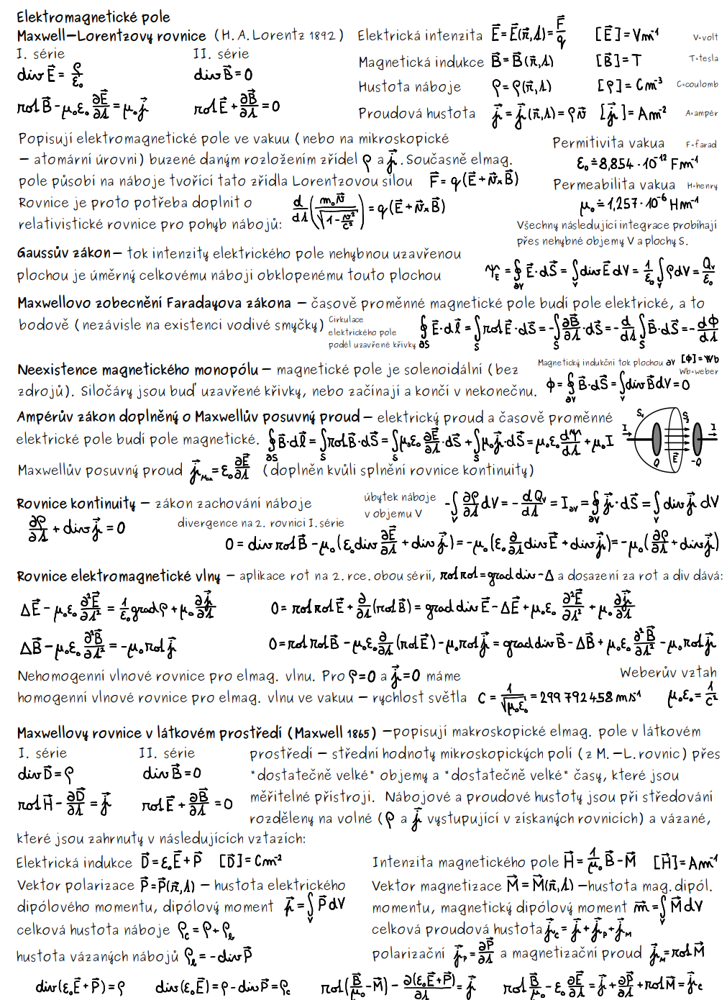
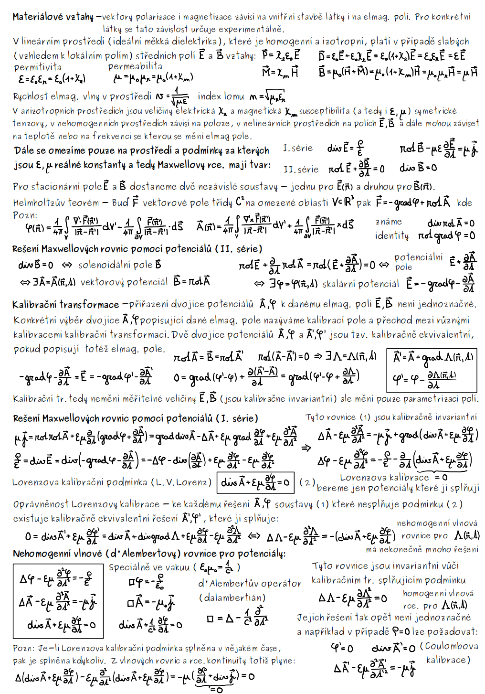

# Maxwellovy rovnice

**Formulují prostorové a časové vztahy mezi základními makroskopickými veličinami v obecném prostředí**

Často se využívají Gaussova věta o divergenci a Stokesova věta o rotaci 

$$
\oint_S \vec F d\vec S =\int_V \nabla\cdot\vec F dV \qquad \oint_l \vec F d \vec l = \int_S \nabla\times\vec F d\vec S
$$

# Ve vakuu - mikroskopické

Popisují nestacionární elektromagnetické pole buzené pohybujícími se nabitými částicemi (buzené rozložením zřídel $\rho$ a $\vec J$ - pohyblivými nabitými částicemi)

Tyto částice jsou popsány rozložením mikroskopických nábojových a proudových hustot

→ určují prostorové a časové změny elektromagnetického pole buzeného ve vakuu částicemi při určené hustotě elektrického náboje a proudové hustotě

Jsou lineární, obsahují první mocniny veličin a lineární operátory → platí princip superpozice.

<aside>
😮

## **Diferenciální tvar**

$$
\begin{split}  
\text{1. série}&\,- \,\nabla \times \mathcal{E} + \dfrac{\partial \mathcal{B}}{\partial t} = 0 \qquad \qquad \quad \, \nabla \cdot \mathcal B  =0 \\
\text{2. série}&\,- \,\nabla \times \mathcal{B} - \mu_0 \varepsilon_0\dfrac{\partial \mathcal{E}}{\partial t} =\mu_0 \mathcal J \qquad  \nabla \cdot \mathcal E  =\dfrac{\rho}{\varepsilon_0}\\
\end{split}
$$

</aside>

<aside>
😮

## Integrální tvar

$$
\begin{split}  \oint_l \mathcal E \cdot dl &= -\frac{\partial}{\partial t}\int_S \mathcal B \cdot dS\\\oint_l \mathcal B \cdot dl &= \mu_0\int_S \left( \mathcal J + \varepsilon_0 \dfrac{\partial \mathcal E}{\partial t}  \right) \cdot dS\\\oint_S \mathcal E \cdot dS &= \frac{1}{\varepsilon_0}\int_V \rho  \cdot dV\\\oint_S \mathcal B \cdot dS &= 0\end{split}
$$

</aside>

**Faradayův zákon, Ampérův zákon a poslední dvě jsou stejné vyjádření Gaussova zákona.**

- $\varepsilon_0$ - permitivita vakua $8.85\cdot 10^{-12}$ C$\cdot$N$^{-1}\cdot$ m$^{-2}$
- $\mathcal E$ - intenzita elektrické pole - V/m
- $\mathcal B$ - magnetická intenzita - $\text{Wb/m}$$^2$ (nebo jen tesla)
- $\mu_0$ - permeabilita vakua $1.257\cdot 10^{-6}$ N$\cdot$A$^{-2}$
- $\mathcal J$ - proudová hustota - $\text{A/m}^2$ - dělí se na magnetizační, polarizační… TEF2
- $\rho$ - hustota náboje - $\text{C/m}^3$
- $\varepsilon\mu_0 = 1/c^2$ - Weberův vztah

# V prostoru - makroskopické

Makroskopické se dostávají středováním mikroskopických přes lokální pole (malé oblasti  - pořád obsahují dostatečný počet molekul)

Ve stacionárním případě jsou soustavy nezávislé → jedna popisuje elektrické a druhá magnetické pole

<aside>
😮

## Diferenciální tvar

$$
\begin{split}  
\text{1. série}&\,- \,\nabla \times \mathcal{H} - \dfrac{\partial \mathcal{D}}{\partial t} = \mathcal J_{free} \qquad  \nabla \cdot \mathcal E  =\rho_{free} \\\text{2. série}&\,- \,\nabla \times \mathcal{E} + \dfrac{\partial \mathcal{B}}{\partial t} = 0 \qquad \qquad \quad \, \nabla \cdot \mathcal B  = 0 \\

\end{split}
$$

</aside>

<aside>
😮

## Integrální tvar

$$
\begin{aligned}\oint_{l}\,\mathcal{E}\cdot d\mathbf{l}&= -\,\frac{\partial}{\partial t}\,\int_{S}\mathcal{B}\cdot d\mathbf{S},\\[4pt]\oint_{l}\,\mathcal{H}\cdot d\mathbf{l}&= \int_{S}\!\left(\mathcal{J}_{\mathrm {free}}+\frac{\partial \mathcal{D}}{\partial t}\right)\cdot d\mathbf{S},\\[4pt]\oint_{S}\,\mathcal{D}\cdot d\mathbf{S}&= \int_{V}\rho_{\mathrm {free}}\, dV,\\[4pt]\oint_{S}\,\mathcal{B}\cdot d\mathbf{S}&= 0.\end{aligned}
$$

</aside>

- $\mathcal D$ - elektrická indukce - $\text{C/m}^2$
- $\mathcal H$ - intenzita magnetického pole - $\text{A/m}$ (charakterizuje i vliv vázaných proudů indukovaných v látce)
- $\mathcal J_{free}$ - proudová hustota volných nábojů - $\text{A/m}^2$
- $\rho_{free}$ - hustota volných nábojů - $\text{C/m}^3$

V první sérii se nachází zobecněný Ampérův zákon a Gaussův zákon elektrického pole. V druhé sérii je Faradayův indukční zákon a Gaussův zákon magnetického pole.

Divergenční rovnice mají význam **počátečních podmínek** (na rotační rovnice hodíme divergenci a dostaneme, že divergenční rovnice nezávisí na čase - **divergenční rovnice platí v každém čase**).

Z první série lze odvodit **rovnici kontinuity**

$$
\nabla\cdot \mathcal J + \dfrac{\partial \rho}{\partial t} = 0.
$$

Vlastnosti prostředí svazují základní veličiny polí

$$
\begin{split}
\mathcal D &= \varepsilon_0\mathcal E + \mathcal P = \varepsilon_0 \overset{\leftrightarrow }{\varepsilon} \mathcal E \\
\mathcal B &= \mu_0(\mathcal H + \mathcal M) = \mu_0 \overset{\leftrightarrow}{\mu}\mathcal H\\
\mathcal J &= \overset{\leftrightarrow}{\sigma}\mathcal E\\
\mathcal P &= \varepsilon_0 (\overset{\leftrightarrow}{\varepsilon}-1)\mathcal E = \varepsilon_0\overset{\leftrightarrow}{\chi}\mathcal E
\end{split}
$$

- $\mathcal P$ - polarizace prostředí (vektor polarizace) - celkový elektrický dipólový moment jednotky objemu
- $\mathcal M$ - magnetizace prostředí (vektor magnetizace) - udává celkový magnetický dipólový moment jednotky objemu
- $\overset{\leftrightarrow}{\chi}$ - bezrozměrný tenzor dielektrické susceptibility
- $\overset{\leftrightarrow}{\sigma}$ - tenzor vodivosti prostředí
- $\overset{\leftrightarrow}{\varepsilon}$ -bezrozměrný tenzor dielektrické permitivity
- $\overset{\leftrightarrow}{\mu}$ - bezrozměrný tenzor relativní magnetické permeability

Vztah mezi vektorem magnetizace a intenzitou magnetického prostředí je 

$$
\vec H = \chi_M \vec H
$$

Vztah mezi vektorem elektrickým polem a vektorem polarizace prostředí není jednoduchej → tyto dvě veličiny nemají stejný rozměr → ALE  $\vec P\thicksim \varepsilon \vec E$  pak se to charakterizuje vztahem

$$
\vec P = \chi_e \varepsilon_0 \vec E
$$

<aside>
⚡

## Gaussův zákon elektrostatiky

$$
\begin{split}&\text{v prostoru: }\oint_{S}\,\mathcal{D}\cdot d\mathbf{S}= \int_{V}\rho_{\mathrm {free}}\, dV \\&\text{ve vakuu: } \oint_S \mathcal E \cdot dS = \frac{1}{\varepsilon_0}\int_V \rho  \cdot dV\end{split}
$$

Popisuje vznik elektrického pole buzeného volnými náboji.

Tok intenzity elektrického pole libovolnou uzavřenou plochou je roven celkovému náboji obklopenému touto plochou dělenému $\varepsilon_0$

</aside>

<aside>
⚡

## Neexistence magnetického monopólu

$$
\oint_{S}\,\mathcal{B}\cdot d\mathbf{S}= 0
$$

Magnetické siločáry jsou buď uzavřené, nebo probíhají z nekonečna

Magnetické pole je solenoidální (bez zdrojů)

Tok magnetické intenzity uzavřenou plochou je nulový

</aside>

<aside>
⚡

## Faradayův zákon elektromagnetické indukce

Elektromagnetická indukce - časové změny magnetického indukčního toku způsobují ve vodiči vznik indukovaného elektromotorického napětí

Faradayův zákon elmag. indukce je $\mathcal E_{ind} = -\frac{d \Phi}{dt};\Phi = \int_S \vec B d\vec S$ 

Maxwelka

$$
\oint_l \mathcal E \cdot dl = -\frac{\partial}{\partial t}\int_S \mathcal B \cdot dS
$$

Časově proměnné magnetické pole budí elektrické.

</aside>

<aside>
⚡

## Ampérův zákon

$$
\begin{split}&\text{v prostoru: }\oint_{l}\,\mathcal{H}\cdot d\mathbf{l}= \int_{S}\!\left(\mathcal{J}_{\mathrm {free}}+\frac{\partial \mathcal{D}}{\partial t}\right)\cdot d\mathbf{S} \\&\text{ve vakuu: } \oint_l \mathcal B \cdot dl = \mu_0\int_S \left( \mathcal J + \varepsilon_0 \dfrac{\partial \mathcal E}{\partial t}  \right) \cdot dS \end{split}
$$

Vznik magnetického pole buzeného volnými elektrickými proudy doplněným o Maxwellův posuvný proud, který není spojen s přenosem nábojů (je nutný pro platnost rovnice kontinuity - zákon zachování náboje)

</aside>

# Lorentzova síla

Krom MR potřebujeme i vztah pro Lorentzovu sílu (+ pohybovou rovnici v relativistickém tvaru)

$$
F = e (\mathcal E + v\times \mathcal B) =\frac{d }{dt} \left( \dfrac{m_0 v}{\sqrt{1-\left(\frac{v}{c}\right)^2}} \right) 

$$

# Vektorový a skalární potenciál

TEF2

Metoda potenciálů převádí MR na rovnice PDR 2. řádu → jedna série (1. ) MR nezávisí na zřídlech ($\rho, \mathcal J$) a udává čistě vztahy pro  $\vec E,\vec B$

Vektorový potenciál $\vec A$: $\nabla\times \vec A = \vec B$ splněna podmínka $\nabla \cdot\vec B = 0$  (je solenoidální); 

Druhou MR lze splnit zavedením skalárního potenciálu $-\nabla \varphi = \vec E + \frac{\partial \vec A}{\partial t}$ - potenciály jsou obecně libovolné funkce

Konkrétní výběr dvojice potenciálů popisující elmag pole → nazýváme kalibrací pole →přechod mezi různýma kalibracema → kalibrační transformace → dvě dvojice potenciálů jsou kalibračně ekvivalentní, pokud popisují totéž elmag pole

V homogenním izotropním prostředí/vakuu: vektorový potenciál lze změnit o gradient libovolné skalární funkce $\Lambda(\vec r,t)$ 

Řešení rovnice lze zjednodušit Lorenzovou podmínkou 

$$
\nabla\cdot \vec A + \varepsilon \mu \frac{\partial \varphi}{\partial t} =0
$$

→ rovnice nebudou svázány a vznikají vlnové rovnice pro potenciály

Trocha TEF2

