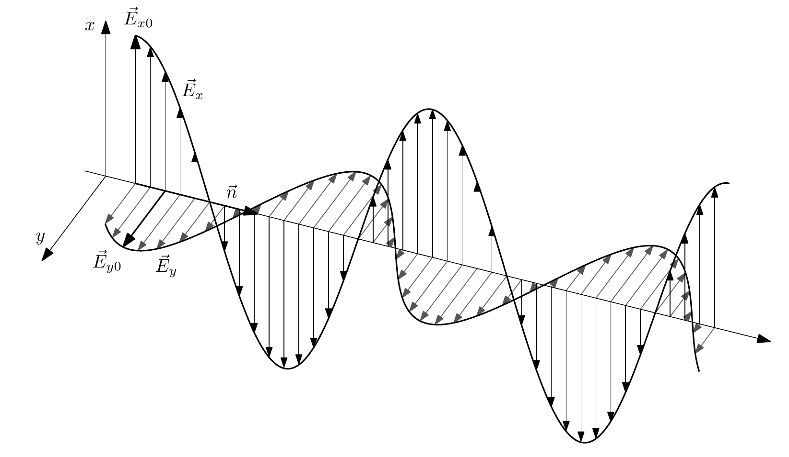
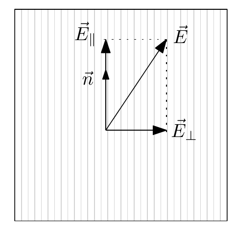
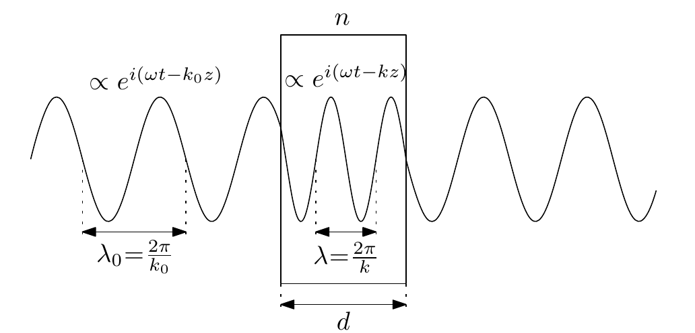
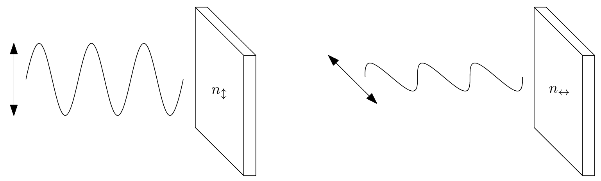
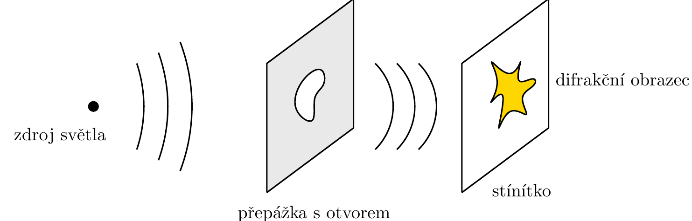

# Elektromagnetické vlny

# Rovinná elektromagnetická vlna

Pro odvození vlnových rovnic pro vektor elektrického pole a vektor magnetické indukce se vychází z MR → uvažuje se homogenní prostředí tvořené lineární dielektrikem a lineárním magnetikem → popisuju pomocí permitivity a permeability

MR bez volných nábojů a proudů v tomto prostředí jsou

$$
\begin{matrix}
\text{div}\vec E=\nabla\cdot \vec E = 0  & \text{Gaussův zákon} \\ \text{rot}\vec E = \nabla\times \vec E =  -\frac{\partial \vec B}{\partial t} & \text{Faradayův zákon}\\

\text{div}\vec B=\nabla\cdot \vec B = 0  & \text{Solenoidální pole}\\ \text{rot}\vec B = \nabla\times \vec B =  \varepsilon\mu\frac{\partial \vec E}{\partial t} & \text{Ampér-Maxwellův zákon}\\

\end{matrix}
$$

Na rotační rovnice se aplikuje znova rotace (využije se $rot \,rot = grad\, div - \Delta$)

$$
 \frac{\partial ^2  \vec E}{\partial t^2}= \frac{1}{\varepsilon \mu}\Delta \vec E \qquad  \frac{\partial ^2  \vec B}{\partial t^2}= \frac{1}{\varepsilon \mu}\Delta \vec B \qquad v_\varphi = \frac{1}{\sqrt{\varepsilon \mu}}
$$

→ 6 nezávislých rovnice pro tyto vektory → řešení těchto rovnic nemusí řešit MR (ale řešení MR bude řešit vlnový rovnice) → odvodili jsme totiž vlnové rovnice za předpokladu platnosti MR

Dále se dá zadefinovat index lomu

$$
n = \frac{c}{v_\varphi}= \sqrt{\varepsilon_r \mu_r}
$$

Uvažuje se pak příklad elektrické a magnetické rovinné postupné vlny jakožto řešení vlnových rovnic

$$
\vec E =\vec E_0 F(\vec n \cdot \vec r - vt) \qquad \vec B = \ldots
$$

→ dosadí se to do MR a kouká se kdy to bude platit 

- $\vec E_0 \cdot \vec n = 0$
- $\vec B_0 \cdot \vec n = 0$

Z toho plyne, že elektromagnetická vlna bude příčná → výchylky jsou kolmé na směr šíření

Nakonec se z Faradayova zákona (+Ampérova-Maxwellova) dostane

$$
\vec n \times \vec E _0  = v \vec B_0
$$

**VEKTOR $B_0$ JE KOLMÝ NA VEKTOR $E_0$**

Soubor $(\vec E, \vec B, \vec n)$ tvoří **pravotočivý ortogonální systém**

# Energetické veličiny v EM poli

<aside>
🔋

## Hustota energie

Pro  ELMAG pole je hustota energie (lineární látkové prostředí)

$$
w = \frac{1}{2} \left( \varepsilon\vec E ^2 + \frac{1}{\mu} \vec B^2\right)
$$

</aside>

<aside>
🤦‍♂️

## Tok energie / Poynting

Tvar toku energie se odvozuje tak, že se kouknu na změnu hustoty energie v čase

$$
\frac{\partial w}{\partial t} = \varepsilon\frac{\partial \vec E }{\partial t} \cdot \vec E + \frac{1}{\mu} \frac{\partial \vec B }{\partial t} \cdot \vec B
$$

Časový derivace se nahradí rotacemi (z MR) → upraví se to na rovnici kontinuity (diferenciální tvar zákona zachování energie)

$$
\frac{\partial w}{\partial t} +\text{div}\left(\frac{1}{\mu} \vec E \times \vec B \right)=0\qquad \vec S = \frac{1}{\mu} \vec E \times \vec B
$$

Vypadl nám tam vektor toku energií → Poyntigův vektor (W$\cdot$m$^{-2}$)

Může se pak odvodit vztah pro množství energie $dE$, které proteče ploškou $dA$ s normálovým vektorem $\vec n$ z čas $dt$

$$
dE = (\vec s \cdot \vec n)dtdA
$$

Integrální tvar rovnice kontinuity 

$$
\frac{d}{dt} \int_V w dV = -\int_A \vec S \cdot d\vec A
$$

Změna množství energie pole v objemu $V$ je dána celkovým tokem energie skrze hranici $A$

</aside>

<aside>
🔥

## Energetické veličiny rovinné postupné vlny

Vztah mezi velikostmi polí bude $E = vB$

Hustota energie a Poynting budou

$$
\begin{split}w &= \varepsilon E^2 \\\vec S &= \sqrt{\frac{\varepsilon}{\mu}}E^2 \vec n\end{split}
$$

Pro harmonickou rovinnou postupnou vlnu (tvar s kosinem) budou jejich časové střední hodnoty

$$
\langle w\rangle = \frac{1}{2}\varepsilon E^2_0\qquad \langle \vec S \rangle = \frac{1}{2}\sqrt{\frac{\varepsilon}{\mu}}E^2_0 \vec z
$$

Intenzita bude $I = \langle \vert \vec S \vert \rangle$

**Energetické veličiny elektromagnetického pole jsou kvadratické v polích**

</aside>

# Polarizace

Elektromagnetická vlna je příčná → díky kolmosti magnetického a elektrického pole na směr šíření

Existují dva nezávislé směry pro vektory magnetického a elektrického pole → dvě polarizace

Ze vztahu 

$$
\vec B = \frac{1}{v} \vec s \times \vec E
$$

se dá odvodit jak to bude pro magnetický pole → zkoumání jen elektrického 

Pokud směr šíření dáme  $\vec n =\vec z$, pak elektrická složka jde rozložit na

$$
 \vec E = E_x \vec x+ E_y \vec y
$$

Bude-li se uvažovat harmonický postupná vlna

$$
\vec E (\vec r , t) = E_{x0} e^{i(\omega t - kz + \varphi_1)} \vec x+E_{y0} e^{i(\omega t - kz + \varphi_2)}\vec y
$$

Fázový rozdíl je obvykle značí 

$$
\delta \varphi = \varphi_1-\varphi_2
$$

**Nezávisí na místě ani čase!**

Intenzita vlny závisí pouze na amplitudách

Elektromagnetická vlna je obecně elipticky polarizovaná →blíže popsané to je [ZDE](Formy%20popisu%20sv%C4%9Btla,%20Vliv%20materi%C3%A1lu,%20rovinn%C3%A9%20vlny%20249ae1c2f20880f7b60fdd56f0c24ccd.md)

<aside>
🔥

## Polarizátor

optický element, který dovoluje průchod pouze takové složce elektrického pole, která kmitá ve směru osy polarizátoru →osa propustnosti $\vec n$

Vstupní pole se rozloží do rovnoběžné a kolmé složky → výstupní bude jen ta rovnoběžný

$$
\vec E_{out} = (\vec E_{in}\cdot \vec n)\vec n
$$

Když dopadá lineární polarizovaná vlna na polarizátor →její výstup se bude měnit podle úhlu stočení →Malusův zákon

$$
I_{out} = I_{in}\cos^2\theta
$$

.

</aside>

<aside>
🖥️

## Vlnová destička

Dokáže měnit fázový rozdíl mezi jednotlivými kolmými složkami elektrického pole

Díky tomu, že vlna prochází materiálem s určitým indexem lomu → $k$ je dáno disperzním vztahem → fáze bude posunutá o $-kd$ než před destičkou

Pro plnohodnotné využití je nutné mít dvojlomný materiál → polarizované vlny v různém směru cítí jiný index lomu

Fázový posun je dán

$$
\Delta \varphi = \frac{2\pi}{\lambda_0}(n_2-n_1)d
$$

Schématicky jak to vypadá

Fázový posun se pak přičítá k  vlně, jíž odpovídá index lomu $n_1$  →je to validní → jelikož k oběma fázím přičítáme člen $k_2d$ (jen tak se vše zachová) → v první vlně to vytvoří tenhle fázový posun a v druhé vlně se to odečte

- Čtvrtvlnová destička → $\Delta \varphi = \frac{\pi}{2}$
- Půlvlnová destička → $\Delta \varphi = \pi$

.

</aside>

<aside>
🥼

## Měření polarizace

Úhlová frekvence je většinou tak velká → blbě se měří samotný průběh elektrického pole → měření pouze časových středních hodnot

Měří se často 

$$
I_{x/y} = \langle E^2_{x/y}\rangle \quad I_{xy} = \langle E_xE_y\rangle \quad I_{\overline{xy}} = \langle E_x( \omega t - \pi/2) E_y\rangle
$$

První dvě intenzity se změří vložením polarizátoru s osou propustnosti $\vec x / \vec y$ →další intenzitu změříme tak, že do cesty dáme polarizátor s osou propustnosti $\frac{\vec x + \vec y}{\sqrt{2}}$ →intenzita na výstupu bude

$$
I_{out} = \frac{1}{2}(I_x+I_y) + I_{xy}
$$

Poslední se změří tak, že do cesty dáme čtvrtvlnovou destičku s osou $\vec n_1 = \vec y$ (fázový posun $\pi/2$ do složky $E_y$) → pak polarizátor s osou propustnosti $\frac{\vec x + \vec y}{\sqrt{2}}$

$$
I_{out} = \frac{1}{2}(I_x+I_y) + I_{\overline{xy}}
$$

Měří se to i pomocí Stokesových parametrů

$$
P_1 = \frac{I_x - I_y}{I_x+I_y} \quad P_2 = \frac{2I_{xy}}{I_x+I_y} \quad P_3 = \frac{2I_{\overline{xy}}}{I_x+I_y}
$$

.

</aside>

<aside>
🚫

### Nepolarizované světlo

Světlo, jehož polarizace se náhodně mění v čase

</aside>

# Interference

Linearita MR → lineární kombinace dvou řešení je taky řešení → energetické veličiny jsou kvadratické → objevuje se interferenční člen

Blíž to je [ZDE](Jevy%20optick%C3%A9,%20interference%20a%20difrakce%20249ae1c2f208804b8e6fc9274f8e981e.md) i k difrakci

# Difrakce

Odklon vlny, který neproběhl v důsledku lomu nebo odrazu

Schématický obrázek je

→ Zajímá nás difrakční obrazec → rozložení intenzity vlny dopadající na stínítko v závislosti na poloze stínítka

<aside>
🐡

## Babinetův princip

Jak vlastně funguje neprůhledná přepážka → dopadá vlna a ta interaguje s atomy přepážky a ty vyzařují/indukují  jiné pole → za plnohodnotnou přepážkou se musí superponovat na 0

Přepážka se rozdělí na dvě oblasti (vyzařování pole přepážky bude součet jednotlivých členů z obou oblastí)

Odstraní se jedna část → jaký bude pole za přepážkou (vymizelo indukované pole z odstraněné částí) → za přepážkou bude $\vec E_A = \vec E_{dop} + E_{ind A}$ → Pole za stínítkem bude dáno $-\vec E_{ind B}$ - indukované pole neexistující překážky 

→ Pole za překážkou bude stejné jako pole, kdybychom nechali jen tu odstraněnou část

Platí to přibližně, páč indukované pole jsou vzájemně propojené

Díky tomu máme komplementární překážky → difrakční obrazce jsou stejné

.

</aside>

<aside>
🔑

## Huygensův-Fresnelův princip

Výsledné pole za přepážkou je superpozice sférických vln ze sekundárních zdrojů (body štěrbiny) (pole v bodě $P$, přepážka velikost $B$)

$$
\vec E_P = \vec E_0 \int_B \frac{1}{r} e^{i(\omega t - kr)}dS
$$

</aside>

<aside>
🔑

## Fraunhoferova difrakce

Stínítko je dostatečně vzdálené a otvor není moc malý $D^2 <<\lambda L$

Difrakční obrazec na stínítku je 2D FT charakteristické funkce přepážky

</aside>