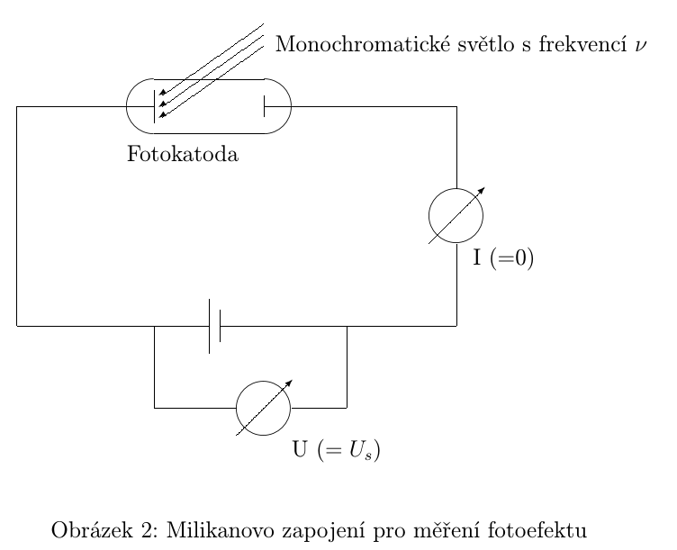
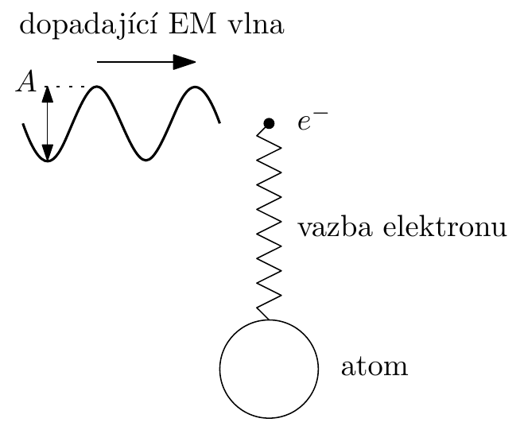
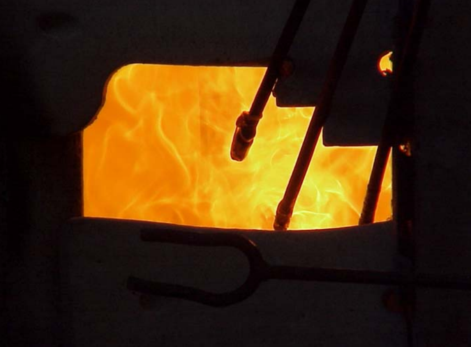
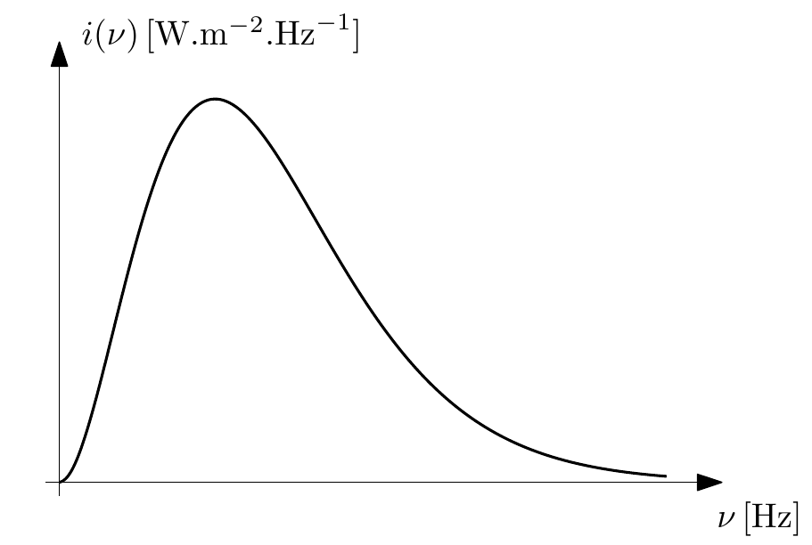
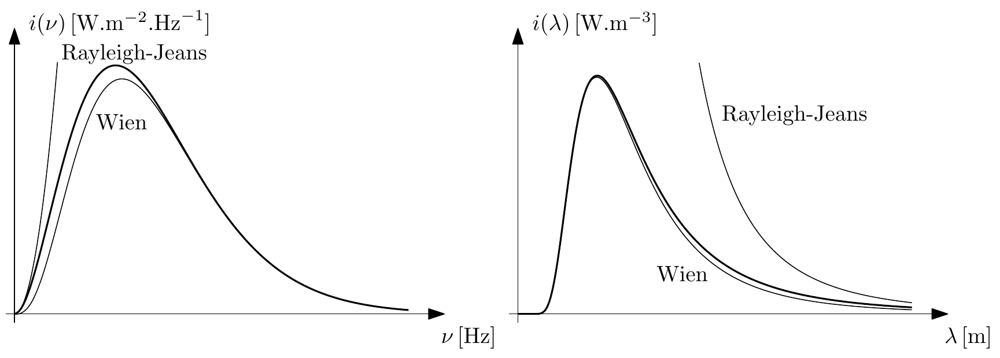
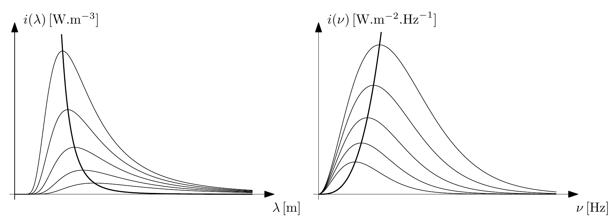

# Atomová fyzika

# Fotoelektrický jev

Proces, při kterém světlo dopadající na určitý materiál uvolňuje elektrony z jeho povrchu

Existuje i vnitřní fotoefekt - nárůst vodivosti polovodičů po dopadu světla

Konfigurace takového experimentu může vypadat následovně

→ dopadá monochromatické světlo → postupně se mění → světlo produkuje elektrický proud → zdroj stejnosměrného napětí vytváří elektrické pole, které vrací emitované elektrony zpět → pro jisté velikosti napětí $U_s$ přestane proud procházet →experimentálně dokázána lineární závislost na frekvenci 

$$
U_s = \frac{h}{e} (\nu -\nu_0)
$$

→ Einstein → od jisté frekvence níž už nejsou fotokatodou emitovány žádné elektrony →kvanta

$$
E_{kin} = E_{foton} - E_{ion}
$$

Pro frekvence nižší než $\nu_0 = E_{ion}/h$ , kde $E_{ion}$ je ionizační energie materiálu fotokatody → nedochází k emisi elektronů, ani při vyšších intenzitách

Při vyšších frekvencí → uvolnění elektronů probíhá pro jakékoliv intenzity → počet emitovaných elektronů je lineárně závislý na intenzitě → energie záření, větší jak vazební energie $W$, se přeměňuje na kinetickou energii elektronu

Základní rovnice fotoefektu je

$$
h\nu = W + E_{kin}
$$

<aside>
👌

### Závěr

Existuje kvantum záření - foton → působí v elementárním procesu uvolňující jeden elektron → energie jednoho fotonu je $h\nu$

Hybnost fotonu je

$$
p = \frac{h\nu}{c} = \frac{E}{c}
$$

</aside>

<aside>
🧓

## Klasická představa

Dopadá ELMAG vlna → rozkmitá vázaný elektron (buzené kmitání) → jakmile kinetická energie elektronu  překročí vazbovou energii → elektron letí →charakter tohoto jevu by měl být dán vlastnostmi rezonanční křivky → při nízké energii dopadající vlny se nic neuvolní (nedostatečné rozkmitání) → čím blíže rezonanční frekvenci → tím menší stačí amplituda dopadající vlny →BLBĚ

</aside>

# de Broglieho hypotéza

Díky poznatkům o duálním charakteru světla (Comptův rozptyl, fotoefekt) → 1923 De Broglie → Dualismus je vlastností všech mikroskopických objektů (nejen ELMAG záření), ale i hmotné částice mají tuhle vlastnost (chování jako vlna/částice podle toho jak je zkoumáme)

<aside>
📖

## Hypotéza

Pro popis jevů na atomární úrovni je třeba přiřadit volným kvantovým částicím s hybností $\vec p$ a energií $E$ - nikoliv bod fázového prostoru, ale rovinou monochromatickou vlnu  $\psi_{\vec p , E},$ jejíž frekvence je úměrná energii a jejíž vlnová délka je nepřímo úměrná hybnosti částice

$$
\psi_{\vec p , E} = Ae^{\frac{i}{
\hbar }(\vec p \cdot \vec x - Et)}
$$

</aside>

Máme-li vztah mezi energií a hybností jako u klasické volné částice

$$
E = \frac{\vec p^2}{2m} = \sqrt{\vec p ^2 c^2 + m^2 c^4}
$$

pak de Broglieova vlna nesplňuje vlnovou rovnice → splňuje Schrodingerovu rovnici (s potenciálovým polem $V$)

$$
i\hbar \frac{\partial \psi}{\partial t} = - \frac{\hbar^2}{2m} \Delta \psi + V(\vec x)\psi = \hat H \psi
$$

Jejím řešením je mnoho komplexních funkcí čtyř proměnných (mnoho dalších řešení) → rovnice je lineární  → superpozice jejích řešení je také její řešení

## Bornova interpretace vlnové funkce

Řešil fyzikální interpretaci řešení Schrodingerovy rovnice → náročný páč rovnice je v komplexním oboru 

<aside>
📖

### Bornův postulát

1926 - Max Born

**Řešení SR udává časový vývoj pravděpodobnosti nalezení částice v různých oblastech prostoru.**

**Je-li $\psi(x,y,z,t)$ řešení SR popisující kvantovou částici → kvadrát její absolutní hodnoty $\vert\psi(x,y,z,t)\vert ^2$ je úměrný hustotě pravděpodobnosti nalezení částice v okamžiku $t$ v místě s kartézskými souřadnicemi $(x,y,z)$.**

</aside>

Bornův postulát nám klade omezení na SR → požadujeme, aby pravděpodobnost nalezení částice “kdekoliv” se rovnala jedné → hustota pravděpodobnosti se musí rovnat

$$
w(x,y,z,t) = A(\psi)^{-1}\vert \psi \vert ^2 \qquad A(\psi) = \int_{\mathbb R^3}\vert \psi \vert^2 dxdydz
$$

Druhý integrál musí existovat.

# Záření absolutně černého tělesa

Absolutně černé těleso = veškeré dopadající záření je vcelku pohlceno a následně toto těleso vyzařuje tepelné záření (závisející pouze na teplotě $T$) (oscilací atomů stěn dutiny se v dutině vytváří ELMAG pole) 

Model černého tělesa - dutina s černými matnými stěnami s malým otvorem na pozorování, udržovaná při konstantní teplotě. Dopadající paprsky jsou zcela pohlceny a nemohou ovlivnit vlastní emisi černého tělesa

Praktickou realizací je například sklářská pec

<aside>
👱‍♂️

## Jak popisujeme těleso

Krom teploty ho popisujeme 

- emisivita  $\varepsilon$  → udává poměr mezi skutečně emitovaným výkonem záření a zářením emitovaným absolutně černým tělesem
- absorptivita $\alpha$ → udává poměr mezi skutečně pohlceným výkonem a celkovým výkonem záření dopadajícího na těleso

Kirchhoffův zákon tepelného záření říká, že se tyto dvě veličiny rovnají → tudíž je emisivita $\leq 1$

Emisivita může záviset na frekvenci vyzařovaného záření  → každá frekvence se může vyzařovat v různém poměru k záření tělesa

Známe-li intenzitu záření černého tělesa → vyzařovaný výkon bude 

$$
\varepsilon I(T)
$$

Pokud máme emisivitu závislou na frekvenci, je nutné znát **spektrální hustotu** $i(\nu,T)$ (jednotka je W$\cdot$ m$^{-2}\cdot$ Hz $^{-1}$), která v předchozím vzorci nahradí intenzitu →

Pro celkovou intenzitu musím integrovat přes všechny frekvence

.

</aside>

<aside>
🔥

## Tepelné záření

Vzniká přeměnou energie tepelného pohybu částic tělesa na energii záření

</aside>

## Planckův vyzařovací zákon

Udává spektrální hustotu záření černého tělesa 

$$
i(\nu,T) = \dfrac{2\pi h \nu^3}{c^2} \dfrac{1}{e^{\frac{h\nu}{kT}}-1}
$$

Jde ho taky převést do tvaru s vlnovýma délkama

$$
i(\lambda,T) = \frac{2\pi hc^2}{\lambda^5} \frac{1}{e^{\frac{hc}{\lambda k T}}-1}
$$

Obecně se spektrální hustota skládá z dvou veličin

- hustota počtu módů ELMAG pole v rozsahu frekvencí $\langle \nu, \nu+d\nu\rangle$
- střední hodnota energie jednoho elektromagnetického módu v dutině

Planck to vylepšil tím, že energetické hladiny daného módu ELMAG pole musí být kvantovány (spojitá energie ELMAG pole je špatně - vedlo to třeba na Ray-Jean zákon)

Když sledujeme Planckův zákon při nízkých frekvencí → získá se Rayleighův-Jeansův zákon (vede to na nekonečnou vyzářenou energii za jednotku času - UV katastrofa)

$$
i(\nu,T) \approx \frac{2\pi k T \nu^2}{c^2}
$$

Při vysokých frekvencích → Wienův zákon

$$

i(\nu,T) \approx \frac{2\pi k \nu^3}{c^2}e^{-\frac{h\nu}{kT}}

$$

Porovnání těchto dvou zákonů jak ve frekvenční tak vlnové oblasti

## Wienův posunovací zákon

Zajímali se o to, jak se bude vyvíjet $\lambda_{max}$ (tam kde je největší spektrální hustota) →

$$
\lambda_{max} = \frac{2898}{T} \qquad \frac{\nu_{max}}{T} = 0.058789 \,\text{THz}\cdot\text{K}^{-1}
$$

(aby tenhle vzorec platit, tak vlnové délky uvažujeme v $\mu$ m)

Průběh maxim spektrálních hustot (pro různé teploty)

## Stefan-Boltzmannův zákon

Tento zákon nám říká, že energie vyzářená černým tělesem za jednotku času z jednotkové plochy je přímo úměrná čtvrté mocnině absolutní teploty 

$$
I = \sigma T^4 \qquad \sigma=\frac{2k^4\pi^5}{15c^2h^3}\dot = 5.67\cdot 10^{-8}\, \text{Wm}^{-2}\text{K}^{-4}
$$

konstanta úměrnosti se nazývá Stefan-Boltzmannova konstanta → z Plancka to vychází