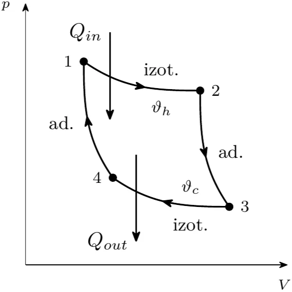
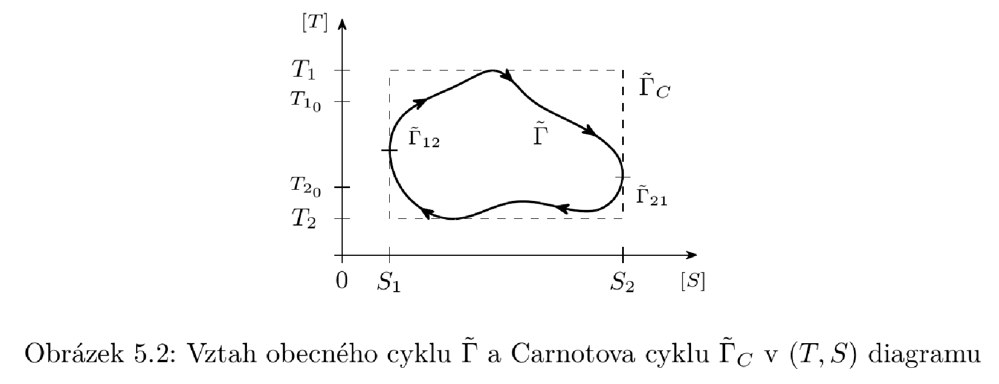
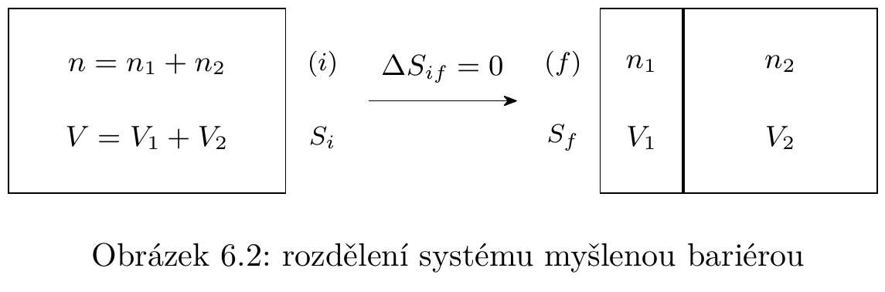

# Termodynamika

Tohle se bralo z Kvasnici - Termodynamika

<aside>
❓

# Termodynamika

Studium procesů probíhajících v tělesech, které si s okolím vyměňují teplo a působí na ně vnější síly 

Nauka o obecných zákonitostech, jimiž se řídí transformace celkové energie makroskopických systémů v různé její formy.

Zkoumání obecných vlastností makroskopických systémů v rovnováze, obecnými zákonitostí makroskopických procesů, vlastností systémů v nerovnovážných stavech a zákonitostmi přechodu do rovnovážného stavu

Je to věda **fenomenologická** → zabývá se jedy a né příčinami → nevšímá si mikroskopické struktury látky

Založena na 4 základních principech (jsou i další axiomy, například: předpoklad o vlastnostech rovnovážných systémů)

Popisuje přenos energie mezi stavy makroskopického systému a jeho vlivu na změnu vlastností

</aside>

<aside>
😮

### Co je to stav?

Sada hodnot odpovídajících veličin (systém stavových proměnných - nezávislé vnitřní/vnější parametry)

Vývoj systému - posloupnosti stavů veličin

Typy procesů (proces - změna hodnot veličin)

- kvazistatické (nekonečně pomalé, vždy v termodynamické rovnováze)
- nestatické (konečné trvání)
- vratné (směr lze obrátit bez vlivu na systém a okolí) - všechny jsou kvazistatické (je to implikace)
- nevratné (zbytek)

. 

</aside>

<aside>
🤦‍♂️

## Termodynamické proměnné

Neobsahují předpoklady o atomové či molekulové struktuře objektů →jsou měřitelné

Hodnota nezávisí na minulosti 

Dělí se na vnitřní vnější (podle původu), stavové (popisující stav $U,S,T,V,p$), procesní (popisují změnu stavu - $W, Q$), extensivní/aditivní ( hodnota úměrná velikosti systému - $m,V,U,S,C$) a intensivní (nezávisí na velikosti systému - $\rho,p,T,c$)

<aside>
❓

### Vnější a vnitřní parametry

Při zkoumání fyzikálního systému se postupuje:

- oddělí se zkoumaný systém od všech okolních těles a určí se potřebné vlastnosti daného systému (hustota, chemické složení,…) a udají se podmínky , v nichž daný systém je

Souhrn všech vnějších podmínek, v nichž se zkoumaný systém nachází, a souhrn jeho nezávislých vlastností určuje stav tohoto systému

Ve fenomenologické teorii se místo vlastností a stavů jednotlivých částic → vnější a vnitřní parametry (můžou mezi nima existovat vztahy)

Vnější parametry - takové makroskopické veličiny, které jsou funkcemi pouze zobecněných souřadnic vnějších těles, s nimiž je zkoumaný systém v interakci (silová pole, objem - i to je “výsledek působení silového pole”)

Vnitřní parametry - makroskopické veličiny, které jsou při stejných vnějších parametrech charakteristické pro daný systém (hustota, chemické složení, elektrická polarizace…)

.

</aside>

.

</aside>

<aside>
😮

## Termodynamická rovnováha

Každý makroskopický systém, který od jistého časového okamžiku v daných (časově neměnných) vnějších podmínkách, nevyhnutelně dospěje do stavu zvaného stav termodynamické rovnováhy, v němž neexistují žádné makroskopické procesy a změny. 

Ve stavu termodynamické rovnováhy mají všechny makroskopické stavové parametry časově konstantní hodnoty.

Po vzniku termodynamické rovnováhy je jakákoli další změna makroskopického stavu možná pouze následkem nového vnějšího zásahu.

Dá se i říct - Stav TR je takový stav makroskopického systému, v němž makroskopické veličiny jsou rovny svým časově středním hodnotám.

</aside>

# Principy termodynamiky

<aside>
0️⃣

## Nultý princip termodynamiky

- teplo je změna vnitřní energie termodynamického systému, která nastala beze změny vnějších parametrů (tohle je definice navíc)

Jsou-li systém 1 a systém 2 v tepelné rovnováze se systémem 3 → jsou i navzájem v tepelné rovnováze

Jedná se o tranzitivitu vzájemné tepelné rovnováhy

<aside>
➕

### Extra

Můžeme stavům, místo vnitřní energie, přiřadit teplotu (empirická a absolutní)

- empirická teplota - rozdíl mezi dvěma stavy se stejnými vnějšími parametry a různou vnitřní energií
- absolutní teplota - popsána v 2. PT

Teplota je intenzivní; Teplota a vnitřní energie mohou s vnějšími parametry jednoznačně charakterizovat rovnovážné stavy

Definuje se veličina tepelná kapacita

$$
C_v = \left(\frac{\partial U}{\partial T}\right)_{V,N_1\ldots N_r} = \left(\frac{\partial Q}{\partial T}\right)_{V,N_1\ldots N_r} >0
$$

→ říká nám, kolik tepla je třeba dodat, aby se změnila teplota o jednotku 

</aside>

</aside>

<aside>
1️⃣

## První princip termodynamiky

<aside>
➕

### Kvasnica - Univerzální fyzikální princip

První princip termodynamiky představuje univerzální zákon zachování energie pro makroskopické systémy

Často se to formuluje: Je-li dán soubor systémů (zkoumaný systém a okolí,…) který je izolován od všech ostatních těles, pak při libovolné interakci těchto systémů zůstává součet jejich energií konstantní

</aside>

<aside>
➕

### James Prescott Joule - jinak řečeno

**Každý uzavřený systém** (*nevyměňuje částice s okolím, ale teplo a práci jo*), **který je adiabaticky izolovaný, a který  nekoná práci, má konstantní úhrnou energii, ať v systému probíhají libovolné mechanické a termické děje.**

**Adiabatický:** Není-li možno stav systému změnit jinak než změnou jeho vnějších parametrů, mluvíme o adiabaticky izolovaném systému; proces, který v takovém systému probíhá, se nazývá adiabatický

</aside>

Změna vnitřní energie soustavy je rovna součtu energií vyměněných s okolím prostřednictvím práce a prostřednictvím tepelného přenosu

$$
dU= \delta Q - \delta W
$$

Energie se zachovává, práce ani teplo nevznikají (z ničeho) ani nezanikají

Dá se to zapsat i ve tvaru

$$
dU = \left(\frac{\partial U}{\partial T}\right)_{V,N}dT + \left(\frac{\partial U}{\partial V}\right)_{T,N}dV + \left(\frac{\partial U}{\partial N}\right)_{V,T}dN
$$

<aside>
🔎

### Co z toho plyne

Je-li soustava izolovaná ([rovnice](19Termodynamika.md) je rovna 0) →vnitřní energie zůstává v této soustavě konstantní (ať si probíhají děje nebo ne)

Je-li soustava adiabatická ($\delta Q = 0$) → koná adiabaticky práci na úkor vnitřní energie

Pouze na tomto principu → možnost sestrojit periodický pracující stroj, který by nic jiného nedělal, než odnímal jednomu tělesu teplo a tohoto tepla nestále využíval k vykonávání kladné práce → při cyklickém procesu se systém vrací do původního stavu → kdyby se ochlazovalo jedno těleso → perpetuum mobile druhého řádu (pracuje na 1 PT, trvale koná kladnou práci jako následek ochlazování jednoho tělesa)

</aside>

.

</aside>

<aside>
2️⃣

## Druhý princip termodynamiky

Vyjadřuje, že je nemožné sestrojit perpetuum mobile druhého druhu →mnohoo formulací

<aside>
🗣

### Formulace

- **Clausiův princip (1854)**
    
    Je nemožné přenášet cyklickým procesem teplo z chladnějšího tělesa na teplejší, aniž se přitom jisté množství práce změní na teplo
    
    **Lord Kelvin to řekl** - Je nemožné cyklickým procesem odnímat jednomu tělesu (tepelné lázni, termostatu) teplo a měnit je v kladnou práci, aniž přitom přijde jisté množství tepla z tělesa teplejšího na chladnější
    
- **Thompsonův princip (1853)**
    
    Je nemožné trvale vykonávat kladnou práci pouze tím, že bychom ochlazovali jedno tělesa na teplotu nižší, než je teplota nejchladnější části jeho okolí
    
- **Planckův princip (1930)**
    
    Je nemožné sestrojit periodicky pracující stroj, který by trvale vykonával kladnou mechanickou práci pouze ochlazováním jednoho tělesa, aniž přitom dochází k jiným změnám v ostatních tělesech
    
- **Carathéodoryho princip (1909)**
    
    V každém libovolném okolí libovolně daného počátečního stavu termicky homogenního systému existují stavy, k nimž se není možno libovolně přiblížit adiabatickou změnou stavových parametrů
    
</aside>

Poslední formulace je nejvíc výhodný na matematický popis → dává omezení na termicky homogenní systémy → systémy bez adiabatických přepážek (mají všude stejnou teplotu) → jinak by nešlo pracovat s izotermickým procesem → z tohoto principu taky plyne, že adiabaty příslušné termicky homogennímu systému se nemohou protínat → kdyby se mohly protínat, pak by byl možný přechod mezi dvěma adiabatama bez dodání tepla

<aside>
🚲

### Carnotův cyklus

Nejvýznamnější cyklus s kladnou prací je konán Carnotovým tepelným strojem → v $(p,V)$  diagramu vypadá následovně

Skládá se ze 4 dějů

- 1→2: Izotermická expanze, systém přijme teplo $Q_{in}>0$ od tělesa s teplotou $\vartheta_h$
- 2→3: Adiabatická expanze, ochlazení systému na teplotu $\vartheta_c$, teplo je nulový $Q_{23}$=0
- 3→4: Izotermická komprese, systém odevzdává teplo $Q_{out}<0$ chladiči s teplotou $\vartheta_c$
- 4→1: Adiabatická komprese, zpět do počátečního stavu, teplo je nulový $Q_{41}=0$

Celková práce $W$ je dána pouze příspěvky z $Q_{12}$ (in) a $Q_{34}$ (out)

Účinnost Carnotova cyklu je 

$$
\eta = \frac{W}{Q_{12}} = 1+\frac{Q_{34}}{Q_{12}}= 1- \frac{T_c}{T_h}\leq 1
$$

Předposlední rovnost se získala, díky vlastnostem rovnice adiabaty 

$$
\begin{split}T_h V_2^{\kappa -1 } &= T_c V_3^{\kappa -1 } \\T_h V_1^{\kappa -1 } &= T_c V_4^{\kappa -1 } \\\end{split}
$$

Žádný stroj operující mezi dvěma danými teplotami není účinnější než Carnotův.

Jediná možnost pro maximální účinnost je mít $Q_{34}$ (out) = 0 → to nejde (3. PT)

Účinnost se zvětší ochlazením chladiče

V $(T,S)$ diagramu to vypadá

To šrafovaný je Carnotův cyklus

.

</aside>

.

</aside>

<aside>
😮

## Carnotův teorém $\mathbf {II}$

Uvažuje-li se nevratný Carnotův cyklus (někde na křivce je bod nespojitosti) → jeho účinnost bude

$$
\eta =  1+\frac{Q_{34}}{Q_{12}}\leq 1 - \frac{T_C}{T_h}
$$

→ nerovnost tam je díky bodu nespojitosti → někde musí dojít k přidání/odebrání více tepla 

<aside>
😮

### Clausiova rovnost

Libovolný kruhový děj lze zapsat jako součet Carnotových cyklů → **Clausiova rovnost** (diskrétně a spojitě)

$$
\sum_{j=1}^{N} \frac{Q_j}{T_j} = 0 \qquad \int_\Gamma \frac{\delta Q}{T} = 0
$$

$\Gamma$ je uzavřený reverzibilní děj

</aside>

Z Clausiovy rovnosti jde odvodit Clausiova nerovnost →

$$
\sum_{j=1}^{N} \frac{Q_j}{T_j} \leq 0 \qquad \int_\Gamma \frac{\delta Q}{T} \leq 0
$$

---

Carnotův teorém $\mathbf{II}$ → pro každý vratný/reverzibilní Carnotův cyklus $\Gamma_r$ platí Clausiova rovnost

$$
\int_{\Gamma_r} \frac{\delta Q}{T} = 0
$$

<aside>
💣

### Co se získá → Entropie

Získal se integrál přes uzavřenou křivku, který je roven 0 → vnitřek integrálu musí být exaktní → existuje pro ní funkce $f$, která $df = \frac{\delta Q}{T}$ → funkce $f$ se nazývá **entropie** a značí se $S$

$$
dS = \frac{\delta Q}{T}
$$

Je to exaktní diferenciální forma → stavová funkce → dále je **zavedena pouze pro vratné procesy**

Reguluje přeměny a jejich směry → charakterizuje směrovost, kvantifikuje jednosměrné změny v makroskopických systémech

Při adiabatických procesech se entropie neměnní

$$
dQ = TdS \to dU = TdS - pdV + \mu_k dN_k
$$

Pro nevratný děj entropie roste, pro vratný děj entropie roste či zůstává konstantní.

.

</aside>

.

</aside>

<aside>
💣

### Gibbsův paradox (pro IP)

Entropie nezávisí na historii, ale pouze na momentálním stavu → integrační konstanta entropie nemůže záviset na stavových proměnných

$$
S(T,V) = nC_V \ln T + nR\ln V + S_0 
$$

Konstanta $S_0$ nezávisí na $T,V$ →jedná se o absolutní konstantu (nezávislá i na $n$)?

Kdyby tedy nebyla závislá na látkovém množství $n$ → dělá se myšlenkový experiment

Změna entropie by měla být nulová (makroskopicky nedochází ke změně - bariéra je myšlená) → když se to rozepíše → $\Delta S_{if}\neq 0$  (pro nenulové $n_1,n_2$) → **Gibbsův paradox**

→ řešením je to, že S_0 není konstanta

$$
S_0 = -nR\ln n + nk 
$$

$k$ už je absolutní konstanta

.

</aside>

<aside>
🐡

### Různé typy entropie

Termodynamická entropie daného systému je mírou užitečné energie, která v tomto stavu není dosažitelná a zvýšení entropie odráží ztrátu užitečné energie

---

**Statistická entropie** reprezentuje potenciálnost, měří počet mikrostavů daného makrosystému, které jsou v souhlase s danými makroskopickými pozorovatelnými

---

**Informační entropie** reprezentuje míru neurčitosti (minimální počet binárních ano/ne otázek, které nás přivedou od naší znalosti systému až k určitosti → v chaotičnějším systému se musíme víc ptát)

</aside>

<aside>
3️⃣

## Třetí princip termodynamiky

Absolutní entropie ideálního krystalu je při teplotě absolutní nuly rovna 0, při teplotě jdoucí k 0 mají všechny chemicky čisté látky stejnou konstantní entropii a tu lze položit rovnou nule.

V blízkosti nulové teploty probíhají vratné izotermy beze změny entropie - nulová izoterma splývá s vratnou adiabatou

Bod nulové teploty je bod, k němuž se lze libovolně přiblížit, ale nelze jej dosáhnout konečným počtem procesů

Vnitřní energie a entropie mají v absolutně stabilním stavu svoji minimální  hodnotu, kterou lze normovat k nule

Pokud je minimální vnitřní energie, tak je minimální i entropie, ale tuto implikaci nelze obrátit.

---

Při teplotě jdoucí k 0 mají všechny látky stejnou entropii a tu lze položit rovnou 0, pro jakýkoliv systém je ale nemožné se do takového stavu dostat v konečném počtu kroků.

---

Z tohoto principu plyne, že každá tepelná kapacita při absolutní nule musí vymizet, koeficient izobarické roztažnosti a izochorické rozpínavosti jsou rovny 0 (při nulové teplotě)

</aside>

<aside>
🤖

## Fundamentální stavová rovnice

Nese veškerou informaci o rovnovážném stavu 

Veškeré termodynamické veličiny jako funkce tří nezávislých extensivních proměnných ($S,V,N$), které mají každá svou intenzivní sdruženou proměnnou $T,p,\mu$

</aside>

# Maxwellovy vztahy a termodynamické potenciály

**Stavové veličiny s rozměrem energie a obsahující celou termodynamickou informaci o systému zde označujeme jako - termodynamické potenciály - extensivní funkce → představují řešení fundamentální stavové rovnice, nebo i jiných stavových rovnic *(mezi kterými se chodí díky Legendrově transformaci)***

**Změny termodynamických potenciálů vyjadřují množství vykonané práce či dodané teplo při nějakém termodynamickém ději (*podobně jako změna potenciální energie v mechanice vyjadřuje práci*)**

<aside>
♻️

## Legendrova (duální) transformace

Když chceme přejít od funkce, která vyjádřena v proměnných se kterýma zrovna neumíme pracovat, ke stejné funkci, ale v jiných proměnných, které budou stejně informativní → chceme aby se informační hodnota nezměnila →využijeme **Legendrovu transformaci, která volí novou funkci g, jako**

$$
g(u) = f(\hat x(u)) - u\hat x(u) \qquad u = \frac{df}{dx} = \hat u(x)
$$

Funkce $f$ je ta naše původní → po LT bude v nových proměnných → $u$ je ta nová proměnná a je definovaná jako derivace původní funkce podle té proměnné, kterou chceme změnit 

</aside>

<aside>
1️⃣

## Vnitřní energie $U$

Uvažuje se kvazistatický proces (termodynamický systém prochází postupně posloupností infinitizimálně blízkých rovnovážných stavů) → $\delta Q = TdS$ (aktuální teplota a úplný diferenciál entropie) 

→ uvažuje se mechanická práce → $\delta W = pdV$ (vykonává se při změně objemu proti vnějšímu tlaku) 

→ soustava může vyměňovat částice s okolím → přidá se člen popisující změnu energie v závislosti na změně počtu částic ($\mu$ je chemický potenciál - *odpovídá množství energie dodané systému, pokud do něj přidáme jednu částici adiabatickou-izochorickou cestou*)

$$
dU = TdS - pdV + \mu dN
$$

Jelikož je $dU$ exaktní diferenciál →existuje vnitřní energie $U$ jako stavová funkce s přirozenými proměnnými $S,V,N$ →dostaneme první část první série Maxwellových vztahů

$$
\left( \frac{\partial U}{\partial S}\right)_{V,N} = T, \qquad \left( \frac{\partial U}{\partial V}\right)_{S,N} = -p, \qquad \left( \frac{\partial U}{\partial N}\right)_{S,V} = \mu
$$

.

</aside>

<aside>
2️⃣

## Volná energie $F$

Přecházíme od proměnných vnitřní energie k proměnným $(T,V,N)$ 

**Její význam je při izotermickém ději s konstantním počtem částic →soustava koná práci na úkor volné energie** $dW = -dF$ 

Podle LT 

$$
F = U - \left( \frac{\partial U}{\partial S}\right)_{V,N} S = U-TS
$$

Diferenciál bude (diferenciál vnitřní energie známe - [výše](19Termodynamika.md))

$$
dF = dU -d(TS) = -SdT - pdV + \mu dN
$$

Další část první série

$$
\left( \frac{\partial F}{\partial T}\right)_{V,N} = -S, \qquad \left( \frac{\partial F}{\partial V}\right)_{T,N} = -p, \qquad \left( \frac{\partial F}{\partial N}\right)_{T,V} = \mu
$$

.

</aside>

<aside>
3️⃣

## Entalpie $H$

Přecházíme od proměnných vnitřní energie k proměnným $(S,P,N)$

**Změna entalpie při izobarickém ději s konst. počtem částic je rovna množství tepla dodaného do systému při tomto ději.**

Podle LT 

$$
H = U - \left( \frac{\partial U}{\partial V}\right)_{S,N} V = U+pV
$$

Diferenciál bude (diferenciál vnitřní energie známe - [výše](19Termodynamika.md))

$$
dH = dU +d(pV) = TdS + Vdp + \mu dN
$$

Další část první série

$$
\left( \frac{\partial H}{\partial S}\right)_{p,N} = T, \qquad \left( \frac{\partial H}{\partial p}\right)_{S,N} = V, \qquad \left( \frac{\partial H}{\partial N}\right)_{S,p} = \mu
$$

 

</aside>

<aside>
4️⃣

## Gibbsův potenciál $G$

Přecházíme od proměnných vnitřní energie k proměnným $(T,p,N)$

**Gibbsův potenciál je chemický potenciál na jednu částici → energie potřebná na zvýšení počtu částic systému o jednu při dané teplotě**

Podle LT 

$$
G = U - \left( \frac{\partial U}{\partial S}\right)_{V,N} S - \left( \frac{\partial U}{\partial V}\right)_{S,N} V = U- TS + pV
$$

Diferenciál bude (diferenciál vnitřní energie známe - [výše](19Termodynamika.md))

$$
dG = dU -d(TS)+ d(pV) = -SdT + Vdp + \mu dN
$$

Další část první série

$$
\left( \frac{\partial G}{\partial T}\right)_{p,N} = -S, \qquad \left( \frac{\partial G}{\partial p}\right)_{T,N} = V, \qquad \left( \frac{\partial G}{\partial N}\right)_{T,p} = \mu
$$

</aside>

<aside>
5️⃣

## Grandkanonický potenciál $\Omega$

Přecházíme od proměnných vnitřní energie k proměnným $(T,V,\mu)$

**Je fundamentální v kvantové statistické fyzice →významný, když chemický potenciál je 0 → nezachovává se počet částic**

Podle LT 

$$
\Omega = U - \left( \frac{\partial U}{\partial S}\right)_{V,N} S - \left( \frac{\partial U}{\partial N}\right)_{S,V} V = U- TS  - \mu N
$$

Diferenciál bude (diferenciál vnitřní energie známe - [výše](19Termodynamika.md))

$$
d\Omega = dU -d(TS)- d(\mu N) = -SdT - pdV - N d\mu
$$

Další část první série

$$
\left( \frac{\partial \Omega}{\partial T}\right)_{V,\mu} = -S, \qquad \left( \frac{\partial \Omega}{\partial V}\right)_{T,\mu} = -p, \qquad \left( \frac{\partial \Omega}{\partial \mu}\right)_{T,V} = -N
$$

</aside>

<aside>
🤑

## První série Maxwellových vztahů

$$
\begin{split}

T  &= \,\,\,\,\left( \frac{\partial U}{\partial S}\right)_{V,N} = \left( \frac{\partial H}{\partial S}\right)_{p,N}  \\
V  &= \,\,\,\,\left( \frac{\partial H}{\partial p}\right)_{S,N} = \left( \frac{\partial G}{\partial p}\right)_{T,N}  \\
\mu&= \,\,\,\,\left( \frac{\partial U}{\partial N}\right)_{S,V} = \left( \frac{\partial F}{\partial N}\right)_{T,V} = \left( \frac{\partial H}{\partial N}\right)_{S,p} =  \left( \frac{\partial G}{\partial N}\right)_{T,p} \\
p  &= -\left( \frac{\partial U}{\partial V}\right)_{S,N} = - \left( \frac{\partial F}{\partial V}\right)_{T,N} = - \left( \frac{\partial \Omega}{\partial V}\right)_{T,\mu}  \\
S  &= - \left( \frac{\partial F}{\partial T}\right)_{V,N} = - \left( \frac{\partial G}{\partial T}\right)_{p,N} = - \left( \frac{\partial \Omega}{\partial T}\right)_{V,\mu}  \\
N  &=  - \left( \frac{\partial \Omega}{\partial \mu}\right)_{T,V} \\

\end{split}
$$

</aside>

<aside>
🤑

## Druhá série Maxwellových vztahů

Pokud jsou potenciály dostatečně hladké funkce → ze záměnnosti druhých parciálních rovnic se získá

$$
\begin{split}dU &=> \left( \frac{\partial T}{\partial V} \right)_{S,N} = -\left( \frac{\partial p}{\partial S} \right)_{V,N}  \\
dG &=> \left( \frac{\partial S}{\partial p} \right)_{T,N} = -\left( \frac{\partial V}{\partial T} \right)_{p,N}\\
dF &=> \left( \frac{\partial S}{\partial V} \right)_{T,N} = \,\,\,\,\, \left( \frac{\partial p}{\partial T} \right)_{V,N}\\
dH &=> \left( \frac{\partial T}{\partial p} \right)_{S,N} = \,\,\,\,\, \left( \frac{\partial V}{\partial S} \right)_{p,N}\\

\end{split}
$$

Odvozuje se to stylem

$$
\begin{split}\left( \frac{\partial ^ 2 U}{\partial S \partial V}\right)_N &= \frac{\partial}{\partial S} \left(\frac{\partial U}{\partial V}\right)_{S,N} = -\left(\frac{\partial p}{\partial S}\right)_{V,N} \\
\left( \frac{\partial ^ 2 U}{\partial V \partial S}\right)_N &= \frac{\partial}{\partial V} \left(\frac{\partial U}{\partial S}\right)_{V,N} = \left(\frac{\partial T}{\partial V}\right)_{S,N} \\\end{split}
$$

</aside>

# Ideální plyn

Je to jeden ze základních homogenních chemických systémů → předpokládá se

- rozměry molekul jsou ve srovnání se střední vzdáleností molekul od sebe zanedbatelné
- molekuly IP na sebe navzájem nepůsobí silami (kromě okamžiku vzájemných srážek)
- Molekuly se pohybují neuspořádaně a rovnoměrně vyplňují dostupný prostor
- vzájemné srážky molekul IP a srážky těchto molekul se stěnami nádoby jsou dokonale pružné
- Teplota plynu je mírou střední kinetické energie translačního pohybu molekul

$$
\langle Ek\rangle =\frac{3}{2}k_BT
$$

- Stavová rovnice ideálního plynu

$$
pV=nRT=Nk_BT
$$

<aside>
🤖

### Podle CHATGPT

- **Bodové částice bez vnitřní struktury**
    
    Molekuly ideálního plynu jsou modelovány jako hmotné body bez vlastního objemu a vnitřních sil působících mezi nimi (tj. zanedbává se velikost částic i mezimolekulové interakce). Tento předpoklad je validní pouze při dostatečně nízkých hustotách a vysokých teplotách, kdy se molekuly prakticky „nepotkávají“.
    
- **Absence potenciální energie**
    
    Celková energie soustavy je dána pouze kinetickou energií translačního pohybu částic. Potenciální energie interakce mezi molekulami je nulová.
    
- **Dokonale pružné srážky**
    
    Srážky mezi molekulami a se stěnami nádoby jsou elastické, což zajišťuje zachování celkové mechanické energie i hybnosti v každé srážce. Tlak plynu na stěny nádoby lze tak interpretovat čistě jako důsledek změny hybnosti částic při těchto srážkách.
    
- **Statistická povaha popisu**
    
    Vlastnosti plynu nejsou popsány trajektoriemi jednotlivých částic, ale statistickými veličinami. Rozdělení rychlostí částic je popsáno **Maxwellovým–Boltzmannovým rozdělením**, z něhož plyne vztah mezi teplotou a střední kinetickou energií částic:
    
    **$\langle E_k \rangle = \frac{3}{2}k_B T$**
    
- **Stavová rovnice**
    
    Makroskopický stav plynu je určen **stavovou rovnicí ideálního plynu**:
    
    $pV = nRT = Nk_BT$,
    
    která propojuje tlak $p$, objem $V$, teplotu $T$ a látkové množství $n$ či počet částic $N$. Tato rovnice je speciálním případem obecnějších stavových rovnic reálných plynů (např. Van der Waalsovy).
    
- **Nezávislost specifických tepelných kapacit na teplotě**
    
    Pro ideální plyn platí (v rámci klasické fyziky a tzv. ekvipartičního teorému), že molární tepelné kapacity $C_V$ a $C_p$ jsou konstantní a splňují Mayerův vztah:
    
    $C_p - C_V = R$
    
    To vyplývá z faktu, že energie plynu je čistě kinetická a její rozdělení je lineární v teplotě.
    
- **Homogenita a izotropie**
    
    Ideální plyn je považován za **statisticky homogenní** (vlastnosti nezávisejí na poloze) a **izotropní** (neexistuje preferovaný směr pohybu částic).
    
</aside>