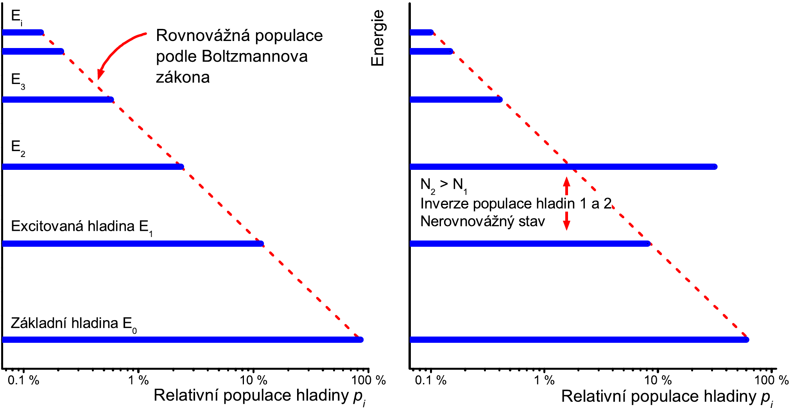
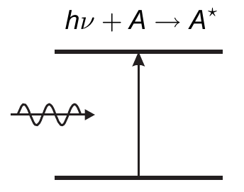
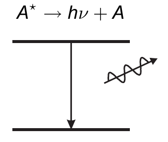
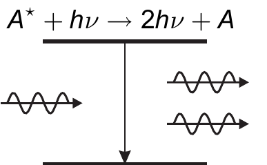

# Principy laserů

Mělo by to pokrývat: **základy interakce záření s látkou , Einsteinovy koeficienty, stimulovaná emise, inverze populace hladin, zesilování záření, prahová podmínka laseru, rychlostní rovnice**

# Základní interakce záření s látkou

**Stavební jednotkou látkové hmoty jsou atomy** (ionty), jejichž vnitřní strukturu a projevy nelze vysvětlit klasickou fyzikou a je nutné využít **kvantovou mechaniku**, kde energie a další měřitelné veličiny se mohou měnit pouze po **diskrétních hodnotách** (kvantech)

<aside>
💡

## Měřitelná (pozorovatelná) veličina

Fyzikální veličina, kterou lze experimentálně naměřit a je relevantní pro systém (poloha, hybnost, energie …)

</aside>

<aside>
💡

## Látka (atomy, ionty, molekuly) a Kvantové soustavy

Látka je soubor kvantových soustav (KS) skládající se z vázaných elektronů, protonů a neutronů.

Kvantová soustava je mikroskopický systém vázaných částic, které spolu interagují.

</aside>

Pro izolovanou **KS** z kvantové teorie plyne:

- **KS se může vyskytovat v různých vnitřních stavech** (různé umístění elektronů v elektronovém obalu …)
- Ve **stacionárním stavu každé konfiguraci izolované KS přísluší přesně definovaná vnitřní energie.**
    - Tato energie je **kvantována (nabývá diskrétních hodnot  $E_i$  ) a říkáme, že soustava se nachází na $i-$té energetické hladině**
- Existuje **minimální energie** KS $E_0$ (základní hladina) a ostatní jsou hladiny excitované
- Energie KS může dosahovat **maximální energie,** která odpovídá rozpadu KS na jednodušší systémy - nazývá se *disociační energií*
- Pokud si KS vyměňuje energii s okolím (porušení izolace), mění se její stacionární stav a změnu stacionárního stavu KS nazýváme **kvantový přechod**. Do té doby se její stav nemění

<aside>
💡

## Stav a degenerace KS

**Stav** - konfigurace elektronového obalu (hlavní, vedlejší, magnetické číslo)

**Degenerace** - počet různých konfigurací se stejnou vnitřní energií

</aside>

<aside>
💡

## Zářivé a nezářivé kvantové přechody

**Zářivé** - KS vyměňuje s okolím energii ve formě Elektromagnetického pole (fotonů)

**Nezářivé** - výměna energie probíhá v jiné formě

</aside>

Pravděpodobnost kvantového přechodu závisí na vlastnostech KS a interakce s okolím.  Obecně není povolen přechod mezi libovolnými dvěma stavy KS a ty nepovolené se nazývají **zakázané.**

## Základní model látkového prostředí

je soubor $N$  stejných (*nemusí být ve stejných kvantových stavech*) nezávislých kvantových soustav ($N \approx \times 10^{25}$ - tzv. Loschmidtovo číslo - hustota částic ideálního plynu při normálních fyzikálních podmínkách)

Na $i$-té energetické hladině se z celého souboru KS nachází jen určité množství a statistická střední hodnota tohoto počtu vztažená na jednotku objemu se označuje $N_i$ - **POPULACE $i$-TÉ ENERGETICKÉ HLADINY - její velikost závisí na stavu celého souboru (makroskop. podmínkách)**

Každé energetické hladině lze v daném systému přiřadit její populaci a součet všech populací musí opět dát $N$ 

Ve stavu **termodynamické rovnováhy** neprobíhají žádné makroskopické změny (procesy) a všechny veličiny mají v tomto stavu časově neproměnné hodnoty. **V tomto stavu soustava (ani její části) nemění své makroskopické vlastnosti (takže se nemění ani populace hladin).**

### Boltzmannovo rozdělení

Udává pravděpodobnost $p_i$, že jedna libovolná KS makroskopické soustavy v termodynamické rovnováze bude ve stavu s energií $E_i$. 

$$
p(i) = \dfrac{N_i}{N} = \dfrac{1}{Z}e^{-\dfrac{E_i}{kT}}, \quad Z = \sum^{\infty}_{i=0} e^{-\dfrac{E_i}{kT}}
$$

Populace vybrané energetické soustavy se získá $N_i = N \cdot p(i)$  a tato populace monotónně klesá s rostoucí energií hladiny $E_i$.

Při stavu termo. rovn. je 

$$
\dfrac{N_2}{N_1} = e^{-\dfrac{E_2-E_1}{kT}} <1
$$

neboli $E_2>E_1$.

Při inverzi populace hladin je tomu naopak a bude tam existovat energetická hladina, která bude více obsazená než méně energetická hladina.

Ukázka populací hladin při termodynamické rovnováze a při inverzi populace hladin

Inverze bude popsána stejný vztahem jako výše → nicméně tam bude opačné < → to vede na to, že “teplota musí být záporná” →nerovnovážný stav 

**Inverze populace hladin je nutná podmínka pro zesilování světla** a je možná pouze v termodynamicky nerovnovážném stavu (je tam více energie než daná soustava uvolňuje).

Občas se inverze populace hladin popisuje pomocí **záporné teploty** - značí to prostě systém s inverzí populace hladin.

<aside>
🔋

## Buzení kvantových soustav a Relaxace

Buzení je způsob jak u souboru KS dosáhnout inverze populace hladin - specifické udržování termodynamicky nerovnovážného stavu

Dělá se to přeměnou jisté formy energie na excitační

- Energie elektromagnetická, kinetická, chemických vazeb, elektrická, jaderná

Definuje rychlost buzení $W_i$ jakožto přírůstek populace $i$-té hladiny za jednotku času

Jakmile zastavíme buzení, tak převládnou procesy (označujeme je jako **relaxace**), které systém uvedou do termodynamické rovnováhy s okolím

</aside>

<aside>
⏰

## Doba života KS na jisté energetické hladině

Je to doba, za kterou pravděpodobnost výskytu soustavy na této hladině poklesne  na 1/e (na asi 37%)

$$
\tau_i = \frac{1}{A_i}
$$

$A_i$ **je pravděpodobnost relaxačního kvantového přechodu z $i$-té energetické hladiny za jednotku času** 

$$
N_i(t) = N_i(0)\cdot e^{-\dfrac{t}{\tau_i}}
$$

Jak pravděpodobnost $A_i$, tak $\tau_i$ se rozdělují na zářivé (radiační, **fluorescenční**) a nezářivé složky

</aside>

<aside>
👉

## Šířka energetické hladiny

Izolovaná soustava má přesně určené energie stacionárního stavu ve kterém může setrvat nekonečně dlouho - toto je idealizovaný stav

Real systém ale reaguje s okolím a doba života na hladině je konečná a díky Heisenbergovi 🧑‍🔬 (relace neurčitosti) nelze hodnotu energie kvantového stavu systému určit a míra neurčitosti je dána $\Delta E_i \approx \frac{h}{\tau_i}$

Přirozená šířka čáry je dána **neurčitostí energie** přechodu mezi dvěma stavy 

$$
\Delta \nu_{ij}\approx \dfrac{\Delta E_i + \Delta E_j}{h} \approx \frac{1}{\tau_i} + \frac{1}{\tau_j}
$$

Čára je taky ovlivněna charakterem souboru KS a jejich interakcí s okolím.

Každá spektrální čára je **částečně rozšířená** (nehledě na podmínky, ve kterých se nachází) - **Přirozená šířka čáry**

Šířka a tvar čáry atom. přechodu závisí na typu rozšíření čáry.

**V PLYNECH** mohou být optické frekvenční přechody rozšířeny působením *doby života, srážkami, Dopler. rozšířením*

**V PEVNÝCH LÁTKÁCH** to je dáno *dobou života, termálními jevy a náhodnými nehomogenitami*

Rozšíření spektrální čáry se dále dělí na

<aside>
🤔

### HOMOGENNÍ

takové rozšíření, při kterém jsou zářící KS, vzhledem ke spektru záření, nerozlišitelné

Každá KS se podílí stejně na vzniku **celé** spektrální čáry

srážkové/dipolární/termální rozšíření

Lorentzovo rozdělení

</aside>

<aside>
🤔

### NEHOMOGENNÍ

takové rozšíření, při kterém zářící KS už jsou rozlišitelné

Doplerovské rozšíření a rozšíření dané nehomogenitami

Gaussovo rozdělení (vyšší a širší než Lorentz, ale pomaleji roste)

</aside>

</aside>

# Interakce optického záření s látkou

### Klasický přístup

Záření = elektromagnetická vlna 

Látka se skládá z elektricky nabitých částic

Vzájemný kontakt popisují Maxwellovy rovnice

Velikost silového působení určuje náboj a intenzita pole

### Kvantový přístup

Záření = proud fotonů

Látka je tvořena souborem KS

**Foton** = kvantum elektromagnetického záření

Interakci popisuje Schrödingerova rovince

Pro nás je důležitá tzv. **Poloklasická teorie - látka je popsána kvantově, ale záření je popsáno klasicky jako elektromagnetická vlna a energie se předává po kvantech.**

<aside>
⚠️

## Podmínka rezonance

Energie fotonu $E = h\nu$ se musí rovnat rozdílu energie počátečního a koncového stavu KS a výchozí stav musí být obsazen a přechod musí být povolen

Často se zapisuje pomocí Bohrova vztahu 

$$
\nu_{mn} = \dfrac{E_n - E_m}{h}
$$

Je to podmínka NUTNÁ pro základní procesy interakce

</aside>

## Elementární procesy

**Tři základní procesy, které nastávají při interakci KS s ELMAG pole (zářivé přechody) jsou** 

- **Absorpce fotonu KS**
- **Spontánní emise fotonu KS**
- **Stimulovaná emise fotonu KS**

<aside>
🧑‍🔬

### Absorpce

Dojde-li k pohlcení fotonu při interakci s KS

**Naprosté pohlcení energie a proto musí existovat takový energetický přechod**

Energie KS se zvýší

</aside>

<aside>
🔥

### Spontánní emise

Při deexcitaci je energie KS uvolněna formou ELMAG záření

1 Deexcitační přechod = 1 uvolněný foton

Tento foton má zcela náhodné vlastnosti — až na energii

</aside>

<aside>
👌

### Stimulovaná emise

Vyzáření fotonu excitovanou KS, které je vyvoláno interakcí s fotonem vnějšího záření

Energie fotonu se musí rovnat rozdílu energetických hladin

Všechny vlastnosti emitovaného a stimulujícího fotonu jsou stejné 

</aside>

Pravděpodobnost těchto dějů (v případě splnění  [REZONANCE](1Principy_laseru.md)) lze stanovit pomocí **EINSTENOVÝCH KOEFICIENTŮ** (SOUČINITELŮ)

### Koeficient spontánní emise $A_{nm}$

$A_{nm}\cdot N_{n}$ udává změnu (pokles) populace této hladiny za jednotku času (spontánní emise a přechod na nižší hladinu $m$)

Tím pádem obsazení vyšší energetické hladiny klesá a obsazení nižší zase roste

$\left(  \dfrac{dN_{m}}{dt} \right)_{n\to m} = + A_{nm}\cdot N_{n} = -\left( \dfrac{dN_{n}}{dt}\right)_{n\to m}$

Každému přechodu odpovídá emise jednoho fotonu, tím je hustota spontánně emitovaných fotonu úměrná $A_{nm}\cdot N_{n}$. Pak je intenzita čar v emisním spektru úměrná obsazení výchozí hladiny a příslušnému koeficientu

### Koeficient absorpce $B_{mn}$

Zde si nadefinujeme pojem **Objemové spektrální hustoty záření $u(\nu)$** , což  je **energie záření z jednotkového intervalu frekvencí v jednotkovém objemu prostoru**

Počet KS, které budou excitovány, je úměrný $B_{mn}N_{m}u(\nu_{mn})$ ($\nu_{mn} = \nu_{nm}$ je rezonanční frekvence)

$$
\left(  \dfrac{dN_{n}}{dt} \right)_{m\to n} = + B_{mn}\cdot N_{m}\cdot u(\nu_{mn}) = -\left( \dfrac{dN_{m}}{dt}\right)_{m\to n}
$$

Každému přechodu odpovídá úbytek fotonu z ELMAG spektra, což vede na absorpční spektrum

### Koeficient stimulované emise $B_{nm}$

Počet KS, které změní svůj stav, je úměrný $B_{nm}N_{n}u(\nu_{mn})$

$$
\left(  \dfrac{dN_{m}}{dt} \right)_{n\to m} = + B_{nm}\cdot N_{n}\cdot u(\nu_{mn}) = -\left( \dfrac{dN_{n}}{dt}\right)_{n\to m}
$$

Tento proces vede k zesilování světla.

<aside>
🔥

### Perličky ke koeficientům

Dá se nyní jinak nadefinovat doba života na n-té hladině $\frac{1}{\tau_{n}} = \sum_{0\leq m < n}A_{nm}$

Vzájemné vztahy mezi koeficienty se dají odvodit díky vlastnostem rovnovážného záření (záření Ideálního absolutně černého tělesa) - odvození ULTB

$B_{mn} = B_{nm} \quad  \quad A_{mn} = \frac{8\pi h \nu_{nm}^3}{c^3} B_{nm}$ 

Platí to jen, když jsou energetické hladiny nedegenerované.

Pokud je máme degenerace hladin $g_n$ a $g_m$, pak vztah mezi stimulovanými ději je 

$$
B_{nm}g_n = B_{mn}g_m
$$

</aside>

# LASER

Je to **kvantový generátor** (tedy jsou důležité principy QM) a zesilovač **koherentního** záření (vnitřně uspořádaného, sfázovaného) - dále je důležitá monochromatičnost, nízká rozbíhavost a vysoká hustota přenášeného výkonu.

Každý laser má vždy aktivní prostředí, buzení a rezonátor

## Buzení

Dodává se energie pro excitaci AP a tím získáváme inverzi populace hladin, která zvětšuje pravděpodobnost stimulované emise nad absorpcí.

Rozdílná buzení jsou popsána u typů laserů.

## Laserový (otevřený rezonátor)

Zajišťuje **akumulaci energie a kladnou zpětnou vazbu** mezi zářením a aktivním prostředí.

Soustava dvou a více zrcadel.

# Zesilování v aktivním prostředí

***ULTB(Princip činnosti laseru) a LT1 (Oscilátor, Zesilovač 1/2)***

Buzení udržuje v AP dostatek vybuzených KS. Poté co jistá KS přejde spontánní emisí na nižší energetickou hladinu, tak tohle kvantum může dále stimulovat další KS…

Část fotonů bude zase absorbována, nicméně pokud bude více excitovaných KS, pak s větší pravděpodobností bude  docházet k stimulované emisi a tím se **záření zesílí.**

---

Odvozování zesilování a rychlostních rovnic se provádí na systému se **dvěma nedegen. energ. hladinami** - ($N_1, N_2, E_1, E_2, \nu_{21}$).

Do prostředí vstupuje záření s intenzitou $I_0$ a rezonanční frekvencí.

Když na krátkém úseku se intenzita posune o $\Delta z$, pak uvolněná energie z KS bude v důsledku stimulované emise z objemu $V$  se rovnat $\Delta E = - \Delta N_2 V h \nu_{21}$. Emitované fotony se přidají k svazku a postupují **stejným směrem.**

Intenzita se zvýší o $\Delta I = \frac{h\nu}{c}B_{21}N_2 I \Delta z$.

Dále můžeme rozdělit jednotlivé příspěvky (do intenzit) všech **tří procesů**.

**Pravděpodobnost absorpce a stimulované emise udává účinný průřez**, který je úměrný 

$$
\sigma = h \nu B/ c \quad B = B_{21}= B_{12}
$$

Z těchto dvou procesů jsou přírůstky/úbytky intenzity dané vztahem $\pm \sigma N_{2/1}I\Delta z$.

Spontánní emise přispívá $\Delta I = + k A_{21}N_2\Delta z$ - ale to je pro nás zanedbatelné.

Celková změna intenzity pak bude 

$$
\Delta I = \Delta z (N_2 - N_1)\sigma I
$$

Když se limitně budeme koukat na malilinkatý úsek tak dostaneme krásnou diferenciální rovnici (jejíž řešení, když prostředí bude homogenní)

$$
\frac{d I}{dz } = \sigma (N_2 - N_1)I \to I(z)= I_0 e^{(\alpha-\beta) z}
$$

Nadefinovali jsme pojem **Součinitel zesílení $\alpha = \sigma(N_2-N_1)$ a** $[\alpha] = cm^{-1}$  a a **součinitel ztrát** (reálné prostředí) $\beta$.

Z tohoto vyplývá, že je-li prostředí v inverzi populace hladin (a součinitel zesílení je větší jak součinitel ztrát), tak se záření při průchodu exponenciálně zesiluje.

# Prahová podmínka laseru

Teď se budeme koukat na soustavu laserového generátoru světla (AP + rezonátor).

Pro **kompenzaci činných ztrát** (způsobené odvodem fotonů z rezonátoru - v podobě laserového záření) musí zesílení AP dosahovat prahové hodnoty (jen $\alpha > \beta$ nestačí).

Tato prahová podmínka se odvozuje na systému s rezonátorem, který má 2 zrcadla ($R_1, R_2$).

Po oběhu rezonátorem se musí **nová intenzita** rovnat (nebo být větší)  **originální intenzitě**

$$
I_{nová} = R_1R_2G^2I_0 = I_0 \rightarrow R_1R_2G^2 \overset{!}{\geq}1 \rightarrow R_1R_2e^{(\alpha-\beta) 2L} \overset{!}{\geq}1
$$

Proměnná $G = e^{(\alpha-\beta) z}$ je **zesílení** (místo $z$ budeme mít délku rezonátoru $L$).

**Prahová podmínka odpovídá rovnosti!**

Jiné dvě vyjádření jsou 

$$
\begin{split} \alpha_{práh} &= \beta + \frac{1}{2L}\ln{\frac{1}{R_1R_2}} \\ (N_2-N_1)_{práh} &= \frac{1}{\sigma}\left( \beta + \frac{1}{2L}\ln{\frac{1}{R_1R_2}}\right)  \end{split} 
$$

Proto, aby laser generoval záření je nutná minimálně taková hodnota výkonu buzení, která zajistí dosazení prahové inverze populace hladin.

Pokud je rovnice splněna s >, pak bude záření rychle narůstat, až dosáhne hodnoty, kdy stimulované přechody budou **depopulovat horní hladinu** laserového přechodu a dojde tak ke **snižování inverze** populace v aktivním materiálu a ke **snížení hodnoty $\alpha$.**

Ustálený stav bude dosažen, jestliže zisk na 1 průchod bude vyvažovat ztráty - dochází k saturaci zisku.

# Ztrátové mechanismy v rezonátoru

Reflexe, rozptyl, absorpční ztráty na zrcadlech a v zesilujícím médiu

Difrakční ztráty.

Všechny tyhle ztráty shrnuju parametrem **součinitel ztrát** (reálné prostředí) $\beta$ a někdy ho paní profesorka označuje jako absorpční koeficient na jednotku délky - pak ho ale značí $\alpha$

# Rychlostní rovnice

**Přenos energie čerpání do laserového záření a s tím spojené změny hustoty populace hladin AP udávají rychlostní rovnice.**

**Představují soustavu simultánních diferenciálních rovnic, která popisuje inverzní obsazení hladin a hustotu záření uvnitř rezonátoru.**

## **Co z nich dostaneme**

**Prahovou podmínku laserového záření**

**Relaxační oscilace laseru**

**Zisk v laserovém zesilovači**

**Střední a špičkový výkon generovaného záření**

**Tvar obálky Q-spínaného pulsu**

**Prahové podmínky**

## **Co z nich nedostaneme**

**Určení rozložení laserové emise ve spektru, prostoru a čase!**

<aside>
🔥

## Obecný tvar

Zaprvé se můžeme bavit o rychlostní rovnicích pro 3-hladinnový a 4-hladinový systém -  ale lepší je napsat obecný tvar a pak ho specifikovat pro jednotlivé systémy.

$$
\begin{split} \frac{dn}{dt} &= -\gamma c \sigma n \phi - \dfrac{n + n_{tot}(\gamma-1)}{\tau_f} + W_p (n_{tot}-n),\\  \frac{d\phi}{dt} &= c\sigma n \phi - \frac{\phi}{\tau_c} + S,\end{split}
$$

- $\tau_c$
    
    útlum fotonů v optickém rezonátoru (doba života)
    
- $S$
    
    rychlost spontánní emise
    
- $\phi$
    
    hustota fotonů - nebo střední intenzita záření v rezonátoru
    
- $\tau_f$
    
    doba života KS na horní laserové hladině
    

- $\gamma$
    
    **faktor redukce inverze populace hladin**
    
- $n$
    
    hustota inverze populace hladin v AP (hustota inverzního obsazení)
    
- $\sigma$
    
    účinný průřez pro stimulovanou emisi
    
- $\mu_0$
    
    účinnost čerpání 
    
- $W_p$
    
    rychlost buzení
    

<aside>
3️⃣

### 3-hladinový systém

$\gamma = 1 + \frac{g_1}{g_2}$ ($g_i$ - degenerace i-té hladiny)

$\tau_f = \tau_{21}$

$W_p= \mu_0 W_{13}$

Pak $n_{tot} = n_1 + n_2$

</aside>

<aside>
4️⃣

### 4-hladinový systém

$\gamma = 1$

$\tau_f = \dfrac{1}{\frac{1}{\tau_{21}} +\frac{1}{\tau_{20}}}$

$W_p = \mu_0 W_{03}$ 

předpokládáme, že doba relaxace z 1 energetické hladiny na základní je vpodstatě nulová a hustota obsazení 1 hladiny je taky nulová

Pak $n_{tot} = n_0 + n_2$

</aside>

</aside>