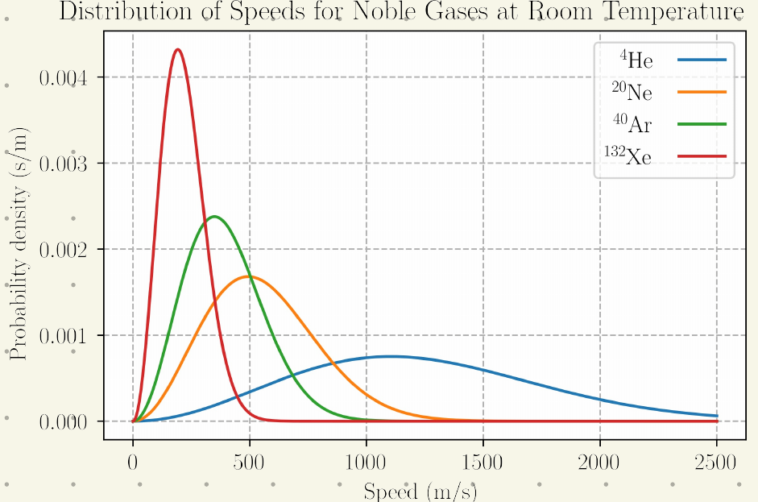

# Statistická fyzika

Cílem této úžasné fyziky je vysvětlit makroskopické vlastnosti látky na základě mikroskopických vlastností jejich elementů pomocí statistiky a pravděpodobnosti (proč principy termodynamiky)

Mikrostav může být zadán 

- **klasicky** (3N zobecněných souřadnic a hybností na 6N rozměrném fázovém prostoru / hustota pravděpodobnosti na 6N fázovém prostoru)
- kvantově (vlnová funkce 3N proměnných )

Ve statistické fyzice se výsledek náhodného pokusu, tj. elementární náhodný jev, nazývá mikrostav (může to být rychlost, poloha částic…).

Stav je vektor v Hilbertově prostoru → je to dané pravděpodobností rozdělení jeho mi/makrostavů

Stav systému určuje střední hodnoty všech relevantních náhodných veličin(makroskopické hodnoty pozorovatelných)

mikrostavy mají příliš mnoho informace; množina mikrostavů s určitou společnou vlastností = makrostav → statistický pohled

Mikrostav je dán tím, jaký náhodný pokus uvažujeme

Hlavním úkolem statistické fyziky je nalezení rozdělení mikrostavů odpovídající makroskopickým vlastnostem statického systému → rozdělení musí splňovat

- Stav systému je v souladu se zadanou informací o systému, tedy v souladu se známými středními hodnotami náhodných veličin
- Stav systému maximalizuje neznalost o systému
    - vysvětlení: Střední hodnoty zadaných náhodných pozorovatelných představují jedinou informaci, kterou o statistickém systému máme → kdyby stav systému obsahoval více informace než nezbytné minimum odpovídající první vlastnosti →o stavu systému bychom věděli více → takový další znalosti/informace nepředpokládáme a tedy stav systému musí v jistém smyslu minimalizovat znalost o systému a tedy maximalizovat neznalost o něm
    - nezbytný předpoklad této vlastnosti je →existuje způsob, jak tuto neznalost kvantifikovat

<aside>
😮

## Hilbertův prostor

Nechť je dán vektorový prostor  $\mathcal V$ se skalárním součinem $\langle .\vert .\rangle$.

Nechť $\Vert . \Vert$ je norma generovaná zadaným skalárním součine a $\rho(x,y)$ metrika generovaná výše uvedenou normou.

Nechť navíc $\left\{ \mathcal V, \rho\right\}$ je úplným metrickým prostorem (každá cauchyovská posloupnost je v něm konvergentní).

Prostor $\mathcal H := \left\{ \mathcal V, \langle .\vert .\rangle , \Vert . \Vert, \rho  \right\}$ nazýváme Hilbertovým prostorem.

<aside>
😮

## Cauchyovská posloupnost

Nechť máme metrický prostor $\left\{ M, \rho \right\}$ s libovolnou metrikou. Řekneme, že posloupnost $\left(x_n \right)_{n=1}^{+\infty}$ prvků z $M$ je cauchyovská v tomto metrickém prostoru, jestliže

$$
(\forall \varepsilon>0)(\exist n_0\in \mathbb N)(\forall m,n\geq n_0) (\rho(x_n,x_m)\leq \varepsilon)
$$

</aside>

<aside>
🛻

## Metrika

Nechť $M$ je libovolná neprázdná metrika. Zobrazení $\rho:M\times M \to \mathbb R$ nazveme metrikou, splňuje-li

- nulovost: $\rho(x,y) = 0$, když $x=y$
- symetrii: $\forall x,y\in M \qquad \rho(x,y) =\rho(y,x)$
- trojúhelníkovou nerovnost: $\forall x,y,z\in M \qquad \rho(x,z)\leq  \rho(x,y) + \rho(y,z)$
</aside>

<aside>
🛻

## Norma

Nechť $\mathcal V$ je vektorový prostor na tělesem $\mathbb C$. Zobrazení $\Vert . \Vert:\mathcal V \to \mathbb R$ nazveme normou, splňuje-li

- nulovost: $\Vert \vec x \Vert \,\Leftrightarrow\, \vec x = \vec 0$
- Minkovského nerovnost: $\forall \vec x,\vec y\in \mathcal V \qquad \Vert \vec x + \vec y\Vert \leq \Vert \vec x \Vert + \Vert \vec y \Vert$
- homogenitu: $\forall \vec x \in \mathcal V, \forall \lambda\in \mathbb C \quad \Vert \lambda \vec x \Vert = \vert \lambda \vert \Vert \vec x\Vert$
</aside>

<aside>
🛻

## Skalární součin

Nechť $\mathcal V$ je vektorový prostor na tělesem $\mathbb C$. Zobrazení $\langle . \vert . \rangle:\mathcal V\times \mathcal V \to \mathbb C$ nazveme skalárním součinem, splňuje-li

- levá linearita: $\forall \vec x,\vec y, \vec z\in \mathcal V, \forall \alpha \in \mathbb C \quad \langle\alpha \vec x + \vec y \vert \vec z\rangle = \alpha\langle\vec x \vert\vec z \rangle + \langle \vec y \vert \vec z \rangle$
- hermiticita: $\forall \vec x,\vec y\in \mathcal V \quad  \langle \vec x \vert  \vec y\rangle = \langle\vec y \vert \vec x \rangle^*$
- pozitivní definitnost: $\forall \vec x \in \mathcal V \quad \langle \vec x\vert\vec x \rangle \geq 0$ a $\langle\vec x \vert\vec x \rangle = 0 \Leftrightarrow \vec x = \vec 0$
</aside>

</aside>

<aside>
ℹ️

## Míra informace $I$

Funkce, která každému mikrostavu přiřazuje hodnotu udávající množství informace ($A$ je náhodný jev) → míra informace daného jevu je pouze funkcí pravděpodobnosti tohoto jevu

$$
I(A) = I(P(A))
$$

Vlastnosti: 

- $I(p)\geq 0$
- $I(1) = 0$ - jistý jev nepřinese žádnou informaci (realizace zase málo pravděpodobného jevu → maximální informace)
- $I(p)$ je klesající funkce
- Pro dvě nezávislé opakování náhodného pokusu  $I(A,B) = I(A) + I(B)$

Míru neznalosti stavu statistického systému se definuje jako střední hodnota míry informace pro tento náhodný pokus → takové míře neznalosti systému se říká entropie $S$

$$
S = \langle I\rangle
$$

</aside>

# Nejpravděpodobnější rozdělení

Chceme, aby hledané rozdělení mikrostavů dávalo pozorované střední hodnoty veličin (rozdělení by mělo odpovídat makroskopickým vlastnostem statistického systému)

Známe $k$ takových veličin → veličiny $A_k$ → naměříme jejich střední hodnoty přes celý systém, které nám tedy neřeknou nic o mikrostavech

Chceme aby to rozdělení bylo jinak co nejurčitější a normované → hledáme za těchto podmínek extrém (maximum) entropie → vázané extrémy

$$
w_\gamma = \frac{1}{Z}\exp \left( - \sum_{l=1}^k \lambda_l A_{l_{\gamma}}\right) \qquad Z = \sum_\gamma\exp \left( - \sum_{l=1}^k \lambda_l A_{l_{\gamma}}\right) 
$$

Funkce $Z$ se nazývá → partiční funkce, $\gamma$ je mikrostav, $w$ je hustota pravděpodobnosti a  $\lambda_l$ Lagrangův multiplikátor, jehož význam určuje daná fyzikální aplikace

Nejpravděpodobnější rozdělení je za daných podmínek to, při kterém entropie nabývá svého maxima vzhledem k množině mikrostavů splňující zadané podmínky

Pokud máme spojitou hustotu mikrostavů → dělá se variační počet k hledání hustoty pravděpodobnosti → vzorec pro hustotu bude stejný → partiční suma bude integrál přes všechny stavy

$$
Z = \int_\chi \exp\left(- \sum_j \lambda_j A_j(x) \right) dx
$$

## Maxwellovo rozdělení rychlostí

Pravděpodobnostní rozdělení rychlostí částic v ideálním plynu

Nejpravděpodobnější rozdělení rychlostí atomů IP (jednoatomový) v nádobě, která je v **klidu**

Rychlost všech částic se zapíše $\vec v = (\vec v_1, \ldots , \vec v_N)$ a $\langle \vec v \rangle = 0 = \gamma$ (střední hodnota) - jedna složka rychlosti má nejpravděpodobnější rozdělení jako Gaussovo normální rozdělení

$$
w(x) = \frac{1}{2\pi \sigma^2} \exp \left( -\frac{(x-\mu)^2}{2\sigma^2}\right)
$$

Hustota pravděpodobnosti $i$-tého atomu je

$$
w_i(\vec v_i) = \overline w_1(v_{i_1})\overline w_2(v_{i_2})\overline w_3(v_{i_3})
$$

jednotlivé směry jsou rovnocenné → jednotlivé složky jsou stejné → nutné nalezení rozdělení jen jedné složky 

Střední hodnota kinetické energie se určí z ekvipartičního teorému  a  zní se určí střední hodnota čtverce rychlosti → nejpravděpodobnější rozdělení

$$
w(\vec v) =\left( \frac{m}{2\pi k T}\right)^{3/2} \exp \left( -\frac{mv^2}{2kT}\right)
$$

Tohle se nazývá Maxwellovo rozdělení rychlosti molekul ideálního plynu

S vyšší teplotou roste počet částic s vysokými rychlostmi  → graf pravděpodobnosti se zmenšuje a pík se pík se posouvá k vyšším rychlostem

Ze znalosti tohoto rozdělení jde určit nejpravděpodobnější hodnotu rychlosti, střední hodnotu velikosti rychlosti a  střední kvadratickou rychlost → řádově jsou stejné

<aside>
ℹ️

## Ekvipartiční teorém

Kvantitativní spojení teploty systému s průměrnou energií jednotlivých stupňů volnosti 

Lze použít pro libovolný klasický systém v termodynamické rovnováze

Ekvipartiční = rovnoměrné dělení → Na každý stupeň volnosti připadá stejná průměrná energie

Pro ideální plyn: průměrná energie1 částice $\langle E_{kin}\rangle = \frac{3}{2} kT$, 3 stupně volnosti → na každý připadá $(1/2) kT$ (Hamiltonián volné částice je $H = \frac{p^2}{2m}$ → homogenní funkce 2 řádu)

Každému stupni volnosti zastoupeném v Hamiltoniánu prostřednictvím homogenní funkce $s$-tého řádu odpovídá střední energie $(k_B T)/s$

</aside>

# Partiční suma

Partiční sumu pro diskrétní a spojitý soubor jsme si představili [ZDE](20Stat_Fyzika.md)

Je to tedy funkce Lagrangeových multiplikátorů a dalších funkci

Většinu informací o systémů lze získat bez znalosti nejpravděpodobnějšího rozdělení → přímo z partiční sumy

- Střední hodnotu veličin popisujících systém

$$
\langle A_i\rangle = - \frac{\partial \ln Z}{\partial \lambda_i}
$$

- Diferenciál entropie
    - změna entropie mezi dvěma infinitizimálně blízkými rovnovážnými stavy → změna statistické entropie při kvazistatickém procesu

$$
S = k \ln Z + k \sum_{l=1}^{n}\lambda_l \langle A_l\rangle \qquad dS = k \sum_{l=1}^n \lambda_l d \langle A_l \rangle
$$

Když se ztotožní statistická entropie s termodynamickou  

$$
\delta Q = TdS = \sum_j kT\lambda_j d\langle A_j \rangle
$$

→ popisujeme, jak se infinitizimální množství tepla dodaného při kvazistatickému procesu přerozdělí na změny extensivních veličin

Podle 1. PT lze určit Lagrangeovy multiplikátory 

$$
k \lambda = \frac{\partial S}{\partial\langle A\rangle}
$$

Pomocí partiční sumy můžeme určit **kovarianci** (míra závislosti dvou pozorovatelných veličin) a **varianci** (kvadrát střední odchylky - speciální případ kovariance)

$$
\frac{\partial ^2 \ln Z }{\partial \lambda_i \lambda_j} = \langle A_iA_j\rangle - \langle A_i\rangle\langle A_j\rangle\qquad  \frac{\partial ^2 \ln Z }{\partial \lambda_i^2} = \langle A_i^2\rangle - \langle A_i \rangle^2  = (\Delta A_i)^2
$$

Partiční suma podsystému, které jsou nezávislé a jejich direktní součin tvoří celkový systém 

$$
Z = \prod_q Z_q 
$$

a dále platí

$$
S = \sum_q S_q
$$

# (Grand)kanonický soubor

<aside>
ℹ️

## Statistické soubory

Hledáme rozdělení pravděpodobností pro stacionární soubory → rozdělení je funkce nezávislých integrálů pohybu

Obecně má uzavřený mechanický systém 10 IP, ale volbou souřadnic (vyloučením pohybu) zbude jediný → energie → pro uzavřený systém $w=w(E)$

</aside>

<aside>
ℹ️

## Soubory

Mikrokanonický (dokonale izolovaný → ZZE →v nejpravděpodobnějším rozdělení mají všechny mikrostavy stejnou pravděpodobnost a přípustné mikrostavy určuje celková energie)  →kanonický a grandkanonický

</aside>

<aside>
🌋

## Kanonický

Systém si s okolím vyměňuje energii ve formě tepla (v rovnováze s okolám) → energie je jediná měnící (fluktující kolem střední hodnoty) se (náhodná) veličina, ostatní jsou konst (považovány za konst.)

$\gamma$ je mikrostav (každý mikrostav má energii) → $E_\gamma$ je energie mikrostavu

Předpokládá se, že zná,e střední hodnotu energie (vnitřní energii $U$), příslušný Lagrangeoův multiplikátor označujeme jako $\beta$

$$
U = \langle E \rangle = \sum_\gamma E_\gamma w_\gamma
$$

Rovnovážné kanonické rozdělení bude mít tvar

$$
w_{\gamma, N} = \frac{1}{Z_C} e^{ -\beta E_{\gamma}} \qquad Z_C = \sum_{\gamma}e^{ -\beta E_{\gamma}} 
$$

$Z_c$ je kanonická partiční suma

Střední hodnotu energie lze určit vlastností partiční sumy

$$
U = - \frac{\partial \ln Z_C }{\partial \beta}
$$

Význam $\beta$ se určí z 1 PT ($\partial Q = T dS = dU$ ) a  $dS = k\beta dU$→ inverzní teplota

$$
\beta = \frac{1}{kT} \quad [\beta] = \text{J}^{-1}
$$

Pokud má systém určený tlak i objem, tak lze stavovou rovnicí z Maxwellova vztahu spojujícího tlak a vlnou energii ( $F= - kT\ln Z_C$ )

</aside>

<aside>
🌋

## Grandkanonický

Otevřený systém (s okolím si vyměňuje teplo i částice) → energie fluktuje kolem $U$ a počet částic kolem $\langle N \rangle$  (rozsah počtu částic je dán fyzikálním systémem)

Příklad: molekuly ulpívají na stěnách nádoby těsnění…

Lze reprezentovat pomocí množiny kanonických souborů s konstantními počty částic, které dohromady tvoří grandkanonický soubor →pokud zvolíme počet částic GS, dostaneme KS

Rovnovážné rozdělení je ($Z_G$ je grandkanonická partiční suma)

$$
w_{\gamma, N} = \frac{1}{Z_G} e^{\left( -\beta E_{\gamma, N} + \alpha N \right)} \quad Z_G = \sum_{\gamma,N }e^{\left( -\beta E_{\gamma, N} + \alpha N \right)} = \sum_N e^{\alpha N }Z_C(N)
$$

Střední hodnotu vnitřní energie a počet částic lze určit z vlastností partiční sumy

$$
U= - \left(\frac{\partial \ln Z_G}{\partial \beta} \right)_{\alpha } \qquad N=  \left(\frac{\partial \ln Z_G}{\partial \alpha} \right)_{\beta }
$$

Význam $\alpha$  ($dS = k\beta dU - k\alpha dN$ a $\delta Q = TdS = dU -\mu dN$)

$$
\alpha = \frac{\mu}{kT}
$$

Je bezrozměrný a odpovídá na střední počet částic

Stavovou rovnici lze určit pomocí Grandkanonického potenciálu $(pV = kT\ln Z_G)$

Pro klasický IP lze partiční sumu zapsat jako 

$$
Z_G = \exp(z e^\alpha)
$$

Souvislost mezi kanonickým a grandkanonickým → v limitě pro $N\to \infty$ dávají všechny soubory stejně předpovědí

Pro klasický IP: N identických neinteragujících částic

$$
Z_k = \frac{1}{N!} z^N
$$

</aside>