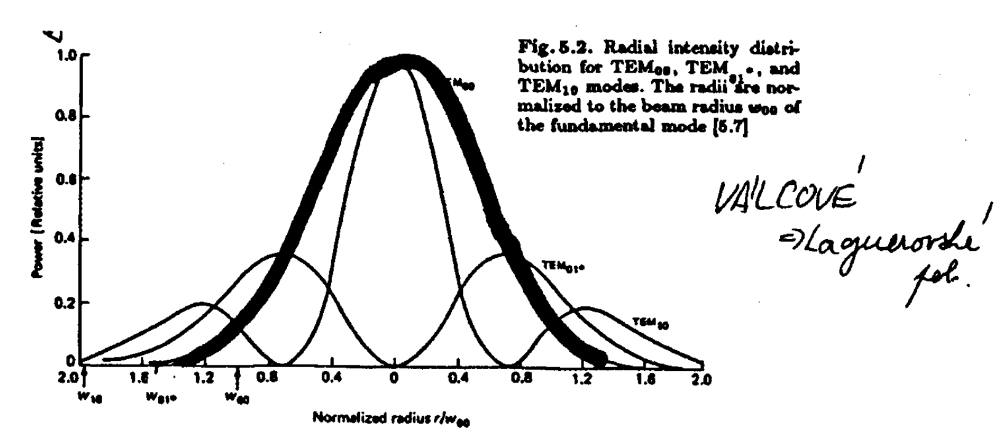

# Otevřené rezonátory

Základní části laseru jsou aktivní prostředí, čerpací proces a **optický zpětnovazební element**.

Zpětná vazba je v realizována zrcadly, mezi nimiž je AP. Zrcadla jsou nastavena tak, aby ELMAG. vlnění po odrazu na jednom zrcadle dopadlo na zrcadlo druhé.

<aside>

- **Co určuje rezonátor/oscilátor?**
    
    Spektrální, směrové a prostorové charakteristiky výstupního záření.
    
    Šířka impulzu, divergence…
    
</aside>

---

---

**Uzavření rezonátory (dutinové)** - využívané pro ELMAG. vlny v mikrovlnné oblasti; tvar třídimenzionálních dutin s vodivými stěnami. 

Když se chtělo přejí do optických oblastí, tak tam už ty rozměry byly nereálné. Nakonec se začali využívat OTEVŘENÉ REZONÁTORY (analogie Fabry-Perotova rezonátoru - dvě planparalelní rovinná zrcadla co jsou nekonečně velká).

# Otevřené rezonátory

Otevřené rezonátory značně snižují počet módů, které mohou oscilovat uvnitř (bez značných ztrát) - oproti dutinovým.

Otevřené rezonátory mají nevyhnutelné difrakční ztráty ELMAG. pole  - část energie odchází ze stranách dutiny…

<aside>

- **Odlišení od dutinových rezonátorů**
    - **Velikosti rezonátoru jsou mnohem větší jak velikosti laserových vlnových délek** - *kdyby byly srovnatelné, tak by měly moc malý zisk*
    - Nejsou boční plochy - není to zavřený
</aside>

<aside>

- **Příklad He-Ne**
    
    Budeme-li brát rezonátor s délkou 50 cm a základní vlastnosti He-Ne laseru (vlnová délka, šířka čáry).
    
    Pak u otevřeného rezonátoru bude oscilovat 6 “málo-ztrátových” módů.
    
    U dutinového rezonátoru bude oscilovat okolo $10^9$ módů…
    
</aside>

Máme-li mód ELMAG. pole 

$$
E(\mathbf{r},t)= E_0 \mathbf{u(r)}\exp\left( -\frac{t}{2\tau_c} + j\omega t \right),
$$

kde $\tau_c$ je “*cavity photon decay time*” a zesílení (v jedné dimenzi a nehledíme na čas)

$$
E(z)= E(0)\exp\left( \alpha_m z \right),
$$

kde $\alpha_m$ je koeficient zesílení aktivního média (výkon - kvadrát pole - roste s dvojnásobkem tohoto koeficientu).

Pak můžeme odvodit podmínku ustáleného stavu (prahovou podmínku).

## Prahové podmínky → Podélné módy

Vlna po dvojnásobném průchodu rezonátorem (délky  $L$) je identická s původní vlnou. Pokud zanedbáme celkově ztráty v rezonátoru pak dostaneme dvě rovnice, kde první bude rovnice pro amplitudu a druhá pro fázi 

$$
\begin{split} r_1r_2\exp(2\alpha_mL_m) = 1, \\   \exp(-2j\omega \frac{L}{c})= 1,  \end{split}
$$

kde $r_i$ jsou amplitudové koeficienty reflexe zrcadel rezonátoru.

Z první se získává podmínka pro součinitele zisku.

Druhou rovnici (podmínka pro fázi a frekvence v rezonátoru) lze rozepsat 

$$
\exp(-2j\omega \frac{L}{c})= 1 \to \left(2\omega\frac{L}{c} \right)= 2\pi q,
$$

kde $q$ je celé číslo. Vlny, těchto ekvidistantně ($\frac{\pi c}{L}$) vzdálených frekvencích, nazýváme **podélné módy otevřeného rezonátoru**.

Ta ekvidistantnost má několik tvarů

$$
\Delta \lambda = \frac{\lambda_0^2}{2L} \quad \Delta \nu = \frac{c}{2L}
$$

Nicméně vzdálenost bude záviset i na typu módu - pro obecný mód ve válcových souřadnicích je frekvenční vzdálenost ($R$ - křivost zrcadel)

$$
\Delta \nu = \frac{c}{2L} \left[ \Delta q +\frac{1}{\pi}\Delta(2p+l)\arccos(1-\frac{L}{R})\right]
$$

Rezonátor připouští oscilace všech módů, ale ty, které se budou zesilovat, vybírá aktivní prostředí. (Módy takových frekvencí, kde zisk bude větší jak ztráty.)

Různé podélné módy.

Zobrazení ve frekvenční doméně

## Příčné módy

Pokud bychom počítali pouze s podélnými módy, tak by stačilo uvažovat pole ve tvaru rovinné vlny. Bohužel tahle vlna má v důsledku konečného rozměru zrcadel velké ztráty difrakcí (+ se mění i příčný a fázový profil). **Musíme uvažovat i změny optického pole ve směru kolmém (příčném) na osu rezonátoru.**

Týpci *Fox* a *Li* ukázali, že v rezonátoru (pro určité konfigurace rezonátorů) **lze najít diskrétní soubory amplitudových příčných a fázových konfigurací cirkulujícího pole v rezonátoru, které se po dvojnásobných průchodech reprodukují (s jinou amplitudou)**.

Tyhle repro. konfigurace se nazývají **příčné módy otevřeného rezonátoru**.

<aside>

### Označení

Jednotlivé módy lze charakterizovat

$$
\text{TEM}_{mnq} \quad \text{nebo} \quad \text{TEM}_{plq},
$$

kde TEM - transverzálně elektromagnetická vlna, $mn$ - indexy označující příčné módy (pravoúhlé souřadnice), $pl$ - indexy označující příčné módy (válcové souřadnice), $q$ - index označující podélný mód

</aside>

<aside>

### Definice

**Příčné módy otevřeného rezonátoru = ustálené konfigurace pole v rezonátoru, které po dvojnásobném průběhu vlny rezonátorem nemění rozložení intenzity pole ve směru příčném.**

</aside>

<aside>

### Význam indexů

$m,n$ - odpovídají počtu nul intenzity ve směru kolmé na osu rezonátoru (x,y)

$p$ - počet nul v radiálním směru

$l$ - počet nul v axiálním směru

</aside>

<aside>

### Průběh intenzity příčného módu

V pravoúhlých souřadnicích máme vzorec pro intenzitu

$$
I_{m,n} (x,y,z) = I_0\left[ H_m\left(\dfrac{\sqrt{2}}{w(z)}\cdot x\right)\exp\left(\dfrac{-x^2}{w^2(z)}\right)  \right]\cdot \left[H_n\left(\dfrac{\sqrt{2}}{w(z)}\cdot y\right)\exp\left(\dfrac{-y^2}{w^2(z)}\right)   \right],
$$

kde $w(z)$ je poloměr svazku základního příčného módu, (Intenzita klesne na hodnotu $\frac{1}{e^2}$ maximální hodnoty).

<aside>

- **Ukázka Hermitových polynomů**
    
    
    
</aside>

<aside>

- **Profily módů v pravoúhlých souřadnicích**
    
    
    
</aside>

Pro základní mód nám vypadne tvar intenzity

$$
I_{0,0} = I_0 \exp\left( \dfrac{-2r^2}{w^2(z)} \right), \quad r^2 = x^2 + y^2.
$$

Pokud máme model rezonátoru s kruhovými zrcadly - výhoda válcových souřadnic. Využívá se Laguerových polynomů.

<aside>

- **Profily módů ve válcových souřadnicích**
    
    
    
</aside>

Příčné módy vyšších řádů mají větší příčný rozměry než základní mód.

**Svazek základního příčného módu má v každém bodě osy rezonátoru v příčném směru gaussovský profil. Gaussovský svazek je aproximací základního příčného módu otevřeného rezonátoru.**

</aside>

---

---

<aside>

## Gaussovský svazek

Je to vlastní řešení (eigen solution) paraxiální Helmholtzovy rovnice. Výkon tohoto řešení je soustředěn uvnitř úzkého kužele.

<aside>

- **Proč název Gaussovský svazek?**
    
    Protože intenzitní rozložení svazku v kolmém směru šíření je Gaussovské.
    
    Gaussovská křivka má tvar 
    
    $$
    I(r,z) = I_0\exp\left(\dfrac{-2r^2}{w^2(z)}\right)
    $$
    
</aside>

<aside>

- [**Průběh intenzity gaussovského svazku**](https://www.youtube.com/watch?v=MU4eOJw2sBQ)
    
    
    
</aside>

<aside>

- **Důležité pojmy a  vztahy**
    
    
    
    - FWHM $\approx 1.2 w$
    - $w_0$ velikost poloměru svazku v krčku
    - $R(z)$ poloměr křivosti vlnoplochy (v krčku jde do nekonečna)
    - $b$ konfokální parametr $b = \dfrac{2\pi w^2_0}{\lambda M^2}$
    - $\theta$ divergenční úhel (divergence se občas dává jako právě tento úhel a nebo jeho polovina) - asymptoty hyperboly svírají právě ten poloviční úhel
    - $z_R$ Rayleighova vzdálenost (vzdálenost od krčku, kde se plocha svazku zvětší 2x) - půlka konfokálního parametru
    - $w(z) = w_0\sqrt{1 + \left(\frac{z}{z_R} \right)^2} = w_0\sqrt{1 + \left(\frac{z\lambda M^2}{\pi w_0^2} \right)^2}$
    - Divergence $\theta = \lim_{z\to\infty}\frac{2w(z)}{z} = 1.27 \frac{\lambda}{2w_0}$ ; ve velké vzdálenosti se poloměr svazku zvětšuje lineárně se vzdáleností $z$
    - $M^2$ parametr, který udává jak se měřený svazek odchyluje od ideálního Gaussovského svazku
    - Beam parameter product (BPP) - specifikace kvality svazku BPP $= \frac{M^2\lambda}{\pi}$
</aside>

<aside>

- **Super-Gaussovský profil**
    
    Něco mezi Gaussem a ideálním flat-top profilem
    
    $$
    I(r) = I_p \exp\left(-2\left(\frac{r}{w}\right)^n\right)
    $$
    
    
    
    Generace: základ Gaussovský profil → vhodná optický element
    
</aside>

<aside>

- **Průchod kruhovou aparaturou**
    
    Důležité vědět, kolik energie/výkonu se ztratí při průchodu aparaturou.
    
    Máme-li kruhovou aparaturu (poloměr $a$), pak graf závislosti poměru $a$ ku $w$ je
    
    
    
    | Průměr apertury $d$ | Transmise výkonu |
    | --- | --- |
    | $2w$ | 86.5 % |
    | $\pi w$ | 99 % |
    | $4w$ | 99.9 % |
    
    U aparatury s průměrem $6w$ a víc se daná aparatura považuje za nekonečně velkou.
    
    Využití k selekci základního módu.
    
</aside>

</aside>

---

---

<aside>

## Nalezení zákl. příčného módu (dvouzrc. rezonátor)

Jde to nalézt analyticky pro dvě zrcadla (křivosti $R_1,R_2$; vzdálené $L$) .

***Kogelnik*** a ***Li*** to odvodili vztahy pro poloměry svazku na zrcadlech a ve středu rezonátoru

$$
\begin{split} w^4_1 &= \left(\dfrac{\lambda R_1}{\pi}\right)^2\dfrac{R_2-L}{R_1-L}\left(\dfrac{L}{R_1+R_2-L}\right)  \\ w^4_2 &= \left(\dfrac{\lambda R_2}{\pi}\right)^2\dfrac{R_1-L}{R_2-L}\left(\dfrac{L}{R_1+R_2-L}\right) \\ w^4_0 &= \left(\dfrac{\lambda}{\pi}\right)^2\dfrac{L(R_1-L)(R_2-L)(R_1+R_2-L)}{(R_1 +R_2 +L)^2}\end{split}
$$

Příklady různých konfigurací rezonátoru. Konfokální  - obě ohniska jsou ve stejném místě.

- Pokud $R_1 = R_2 >> L$, pak se průměr svazku mění jen velmi málo
- **sférický** - základní mód má velké rozměry na zrcadlech a difrakčně limitovaný bod
- **konfokální** - nejmenší možný rozměr módu pro danou délku rezonátoru
- **plano-konkávní** - střed svazku je vždy na rovinném zrcadlu
- **plan-paralelní** - takový mód nemá ekvifázovou plochu na zrcadlech a vlivem velkých difrakčních ztrát na hranách zrcadel vzniká velké fázové zpoždění
</aside>

---

---

<aside>

## Stabilita rezonátoru

Existují případy, kdy pro daný výběr $R_1,R_2$ a $L$ neexistují módy o nízkých ztrátách a nelze najít odpovídající základní příčný mód ve tvaru gaussovského svazku.

Podmínka pro nalezení fyzikálního řešení je

$$
0\leq \left(1-\dfrac{L}{R_1}\right)\cdot \left(1-\dfrac{L}{R_2}\right) \leq 1.
$$

Nazývá se to **podmínka stability otevřeného rezonátoru** (odvození snad [ZDE](3Otevrene_rezonatory.md)).

Rezonátory splňující tuto podmínkou jsou tzv. stabilní rezonátory.

**Stabilní a nestabilní rezonátory se liší difrakčními ztrátami.**

Občas se ty závorky nahradí parametry $g_1,g_2$.

Rezonátory, které mají $g_1 =g_2$ se nazývají **symetrické**.

Graficky to může vypadat

Můžete si do grafu vyznačit kde se nacházejí jednotlivé typy rezonátorů.

<aside>

### Difrakční ztráty

Jak jsme zmínili na začátku, tak v rezonátoru s konečnými rozměry zrcadel dochází k úniku částí energie kolem jejich okrajů.

Další neužitečné ztráty se nazývají **činné** - energie vyváděna skrz polopropustné zrcadlo.

Pokud budeme mít zase model dvou sférických zrcadel (tentokrát přidáme příčný rozměr - poloměr $a$), tak velikost difrakčních ztrát závisí na vlnové délce a parametrech  $m, n$, které charakterizují mód a parametrech $g_1$ a $g_2$. Jistou kombinacím těchto parametrů je **Fresnelovo číslo $N = \frac{a^2}{\lambda L}$   .** Při malé hodnotě budou ztráty velké. Při velké hodnotě budou ztráty u stabilních rezonátoru malé a u nestabilních velké.

Mají-li dva rezonátory stejné parametry → mají stejné difrakční ztráty, stejné rezonanční frekvence a stejné příčné módy.

</aside>

</aside>

<aside>

### Aktivní rezonátor

Rezonátor s AP.

Změní se optická dráha a módová struktura (AP vykazuje saturovatelný nehomogenní zisk + čočkový efekt).

Nejvíc ez případ je rezonátor a v něm je čočka (s ohniskovou délkou vnitřní čočky $f$). Pak g-parametry budou

$$
\begin{split}g_1 &= 1-\frac{L_2}{f} - \frac{L_0}{R_1} \\ g_2 &= 1-\frac{L_1}{f} - \frac{L_0}{R_2} \\ L_0 &= L_1 + L_2 - \frac{L_1L_2}{f}\end{split}
$$

Lka označují vzdálenosti zrcadel a čočky

</aside>

<aside>

### Fabry-Perotův rezonátor

Otevřený rezonátor obecně působí i na spektrální vlastnosti záření - působí jako filtr (povoluje záření jen diskrétních frekvencích - podélné módy). - Tyhle selekční vlastnosti se demonstrují na FB rezonátoru (idealizovaný otevřený rezonátor).

Dva rovnoběžné optické povrchy nekonečných rozměrů (”etalon”) → bude to dělat takovou tu více průchodovou/odrazovou interferenci (konstruktivní, když mají interferující složky mají stejnou fázi - všechna energie projde plochou $M_1$)

Fázový rozdíl sousedních odražených/prošlých vln je 

$$
\delta = \frac{2\pi}{\lambda} 2n d \cos\Theta.
$$

Pak pro celkovou transmisi a reflexi dostaneme vztahy

$$
 \begin{split} T &= \left[ 1+\frac{4r}{(1-r)^{-1}}\sin^2\frac{\delta}{2}\right]^{-1} \\ R &= \left[ 1 + \dfrac{(1-r)^2}{4r\sin^2\frac{\delta}{2}}\right]^{-1} \end{split}
$$

r je reflektivita jednotlivých povrchů. Když  $2n d \cos\Theta = m\lambda$ pak bude maximální transmise. Pro maximální hodnotu reflexe stačí ten sinus dát 1.

Definuje se **finesa (jemnost) rezonátoru** jako $F = \frac{\Delta \lambda}{\delta \lambda}$ (význam těch elemetů je vidět z obrázku - $\Delta \lambda$ je šířka spektrálního pásma etalonu)

Poznámka - ta křivka transmise a reflekce se normálně doplňuje - tady jsou vykresleny ale pro dva různý rezonátory (jiný $F$)

Rezonanční podmínka závisí na vlnové délce, optické délce a úhlu lomu.

Pro rezonátory s velkými poloměry křivosti (mnohem větší jak vzdálenost zrcadel) se rezonanční spektrum skládá z hodně blízkých složek ($c/2L$), odpovídajících danému módu (každá je obklopena řadou rezonančních frekvencí odpovídajících příčným módům vyšších řádů).

Pro zužování spektra záření se v pevnolátkových laserech využívá rezonanční reflektor (etalon na místě výstupního zrcadla).

</aside>

---

---

<aside>

## Ztráty v rezonátoru

Popisujeme to následujícími parametry

- celkový koeficient ztrát $\alpha_r = \alpha_s + \frac{1}{2d}\ln\frac{1}{R_1R_2}$ (první člen je absorpční koeficient AP)
- jemnost/finesa jako funkce efektivních ztrát $F = \frac{\pi \exp(-\alpha_r d/2}{1-\exp(-\alpha_rd)}$
- doba života fotonu v rezonátoru $\tau_p = 1/(c\alpha_r)$
- činitel jakosti $Q$
</aside>

---

---

<aside>

## Nestabilní rezonátory

Nesplnění [podmínky](3Otevrene_rezonatory.md) vede na to, že záření uvnitř rezonátoru nemá tvar Gaus. svazku (GS). Rozložení pole v rezonátoru nelze popsat těma klasickýma funkcema.

Nestabilita znamená, že vstupující GS do rezonátoru bude při každém průchodu zvětšovat svůj rozměr (nestabilita řešení). 

Jsou méně citlivé (na rozladění zrcadel) než stabilní rezonátory.

Pro rozdělení se zavádí speciální $G$-parametr $G = 2g_1g_2-1$.

Dělí se na nestabilní rezonátory v **kladné větvi (G>1)** a **záporné větvi (G<-1; v plynových laserech).** (Podle [diagramu](3Otevrene_rezonatory.md))

Ustálené konfigurace pole na zrcadlech lze získat řešením Kirchhoffovy integrální rovnice.

Šíří se v nich reprodukující kulové vlny (poloměry křivosti se reprodukují).

Jedině divergentní vlny (konvergentní neustále snižují poloměry do nějakého minima0 → přemění se na divergentní vlny).

Ztráty vznikají vyvazováním energie ven z rezonátoru → větší ztráty mohou znamenat větší výstupní výkon.

</aside>

---

---

<aside>

# Maticový formalismus

Založeno na popisování optického paprsku pomocí:

- vzdálenosti od optické osy
- směrnici úhlu, který svírá paprsek s optickou osou

Optická soustava je charakterizována čtvercovou maticí → Přenosová matice optické soustavy.

Podmínka harmonické trajektorie je, že paprsek zůstává paraxiální a nediverguje od osy. Pomocí zábavných úprav a následného Sylvestrova kritéria se odvodí 

$$
\dfrac{\vert A + D\vert}{2}\leq 1
$$

Když si složíte matice pro kulové zrcadlo, volný prostor, kulové zrcadlo a volný prostor a pak se kouknete na tu podmínku → jde z toho odvodit známej vztah pro stabilitu rezonátoru.

Nové parametry po přenosové matici získáme z

$$
\begin{bmatrix}y_2 \\ \alpha_2\end{bmatrix} =\begin{bmatrix}A & B \\ C & D\end{bmatrix}\cdot \begin{bmatrix}y_1 \\ \alpha_1\end{bmatrix} 
$$

Různé typy přenosových matic 

Dají se nadefinovat jednotlivé matice rezonátoru a z toho se následně dají spočítat poloměry svazků v libovolných bodech rezonátoru (víc v OREZ - jaký jsou přesně významy ABCD elementů atd…).

Matice se násobí v opačném pořadí než jdou za sebou.

Dá se takhle pracovat i s GS (charakterizuje se poloměrem křivosti a příčným poloměrem svazku). Pak se celý zadefinuje pomocí jednoho parametru $q$. 

</aside>