# Laserový oscilátor a režimy generace

# Laserový oscilátor

Skládá se z dvou základních částí: **optický zesilovač** (zdroj energie) a **optický rezonátor** ([Určuje](Otev%C5%99en%C3%A9%20rezon%C3%A1tory%20241ae1c2f208806cacdbcac45ac21383.md)).

<aside>

## Prahová podmínka

Při každém průchodu rezonátorem intenzita vzroste o faktor e^{gl}

Dochází k **činným ztrátám** (výstupní zrcadlo → $1-R_2$) a **ztráty nedokonalosti odrazných vrste**v ( $1-R_1$).

*Hustota fotonů po průchodu záření laserovým aktivním materiálem (2x) + po odraze od obou zrcadel musí být rovna počáteční hustotě fotonu v daném místě.*

$$
R_1R_2\exp[(g-\alpha)2l] = 1
$$

Zisk na jeden průchod $G = R_1R_2\exp(2gl)$, když zisk bude větší jak jednotka → začne se rychle depopulovat horní hladina laserového přechod → snížení hodnoty $g$.

</aside>

<aside>

## Činitel jakosti rezonátoru

Poměr energie nahromaděné v rezonátoru k výkonu rozptýlenému na jednotku úhlové frekvence $\omega_0$ 

$$
Q = 2\pi \dfrac{1}{1-\exp(-T_0/\tau_c)} \approx 2\pi \nu_0 \tau_c,
$$

kde $\tau_c$ je časová konstanta útlumu záření v pasivním rezonátoru.

Nebo 

$$
Q = \dfrac{2\pi E}{T\left( -\dfrac{d E}{d t}\right)} = \dfrac{2\pi E\nu}{\left( -\dfrac{d E}{d t}\right)} ,
$$

kde $\nu$ je rezonanční frekvence rezonátoru

</aside>

<aside>

## Ztráty

Ztrátové mechanismy vedou k omezení doby života oscilací v rezonátoru a rozšíření rezonanční frekvenční čáry.

Absorpce, rozptyl, difrakční ztráty → vše můžeme vztáhnout ke ztrátám díky nedokonalému odrazu od totálního zrcadla (úbytek fotonů v rezonátoru) → $R_1 = 1-\delta_M$, tyhle ztráty jsou teda ztráty v dutině.

Přidáme k nim ještě ztráty v AP. Ztráty na jeden průchod budou

$$
 \delta = 2\alpha l + \delta_M.
$$

</aside>

<aside>

## Energetická účinnost

Základní přehled vypadá

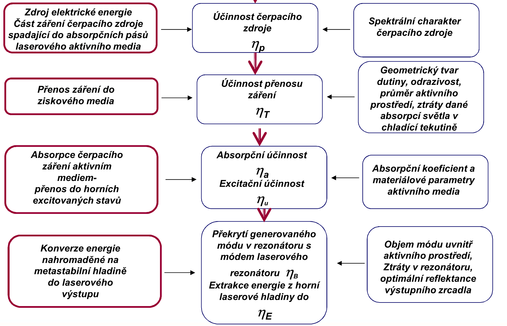

1. Konverze elektrické energie
    1. užitečné čerpací záření - část záření čerpacího zdroje, která spadá do absorpčního pásu laserového AP
    2. $\eta_P = \int_{\lambda_1}^{\lambda_2}P_\lambda d\lambda / P_{EL}$; $P_\lambda$ je zářivý výkon na jednotku vlnové délky a vlnové délky ohraničují pásma absorpce
2. Přenos užitečného čerpacího záření do AP
    1. ovlivněno parametry geometrií aktivního prostředí, *dutiny*, reflektancí různých povrchů
    2. u laserových diod to závisí na ztrátách u fokusační optiky (fakt malý)
3. Absorpce čerpacího záření
    1. pro diodu → $1-\exp(-\alpha_D l)$; máme absorpční koeficient AP (závisí na vlnové délce)
4. Excitace AP
    1. Kvantová účinnost (počet fotonů přispívajících k laserové emisi ku počtu čerpacích fotonů) a Stokesův faktor - poměr energie fotonů na laserovém přechodu ku energii čerpacích fotonů
5. Konverse energie excitovaných hladin do laserového výstupu
    1. Překrytí rezonátorového módu s čerpanou oblastí (překryvový integrály)
    2. Konverse energie nahromaděné na horní laserové hladině do laserového výstupu - $P_{out}/P$ ; kde $P$ je možný dosažitelná výkon
    3. Vazbová účinnost - poměr výstupního výkonu k výkonu absorbovanému v aktivním prostředí

Celková účinnost je daná produktem jednotlivých účinností

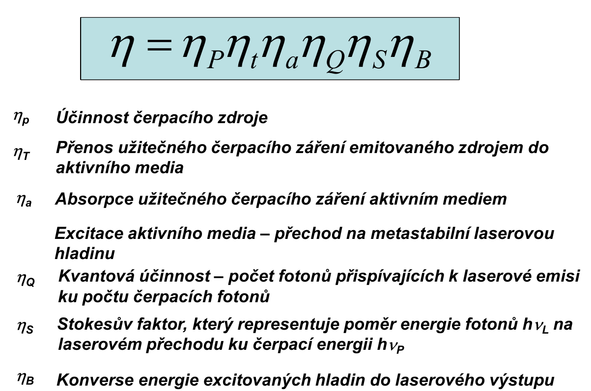

</aside>

<aside>

## Laserový výstup

Tok záření v rezonátoru začne vzrůstat ze šumu (po zapnutí čerpání) → snížení koeficientu podle $g = \dfrac{g_0}{1+2I_{cir}/I_S}$ a následně se stabilizuje na hodnotě $2gl = \delta - \ln R_1$.

Pro výstupní výkon dostaneme krásný vztah 

$$
P_{out} = A I_S \dfrac{1-R}{1+R}\left(\dfrac{2g_0 l}{\delta - \ln R}-1\right),
$$

$A$ je příčný průřez materiálu, $l$ je délka materiálu a $R$ je reflektance výstupního zrcadla

Pomocí různých triků se pro 4-hladinový model odvodí 

$$
P_{out} = \sigma_S (P_{in} - P_{th}),
$$

kde $\sigma_S$ je diferenciální účinnost (úměrná součinu všech účinnostních faktorů laseru)

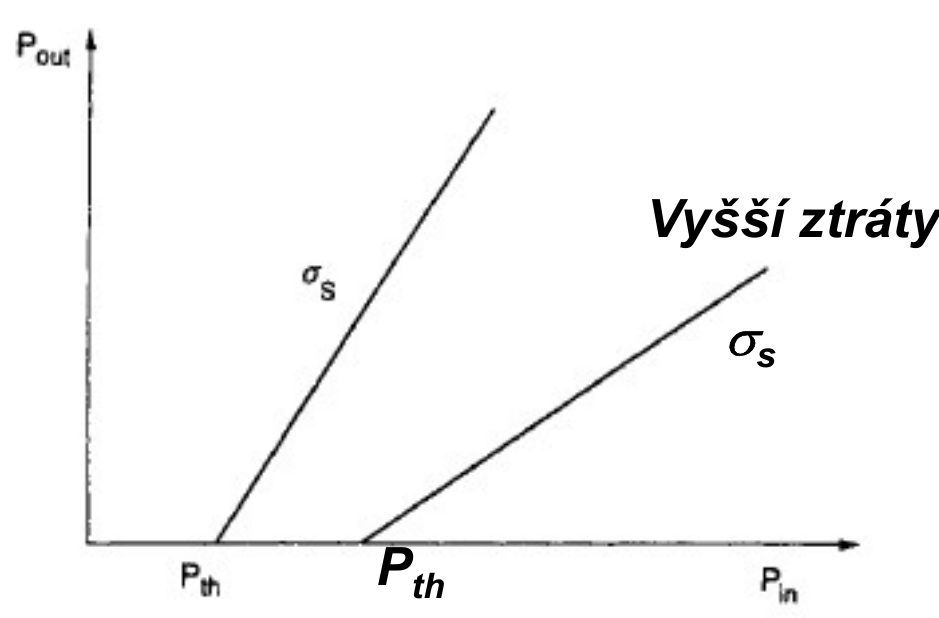

Laserový materiál s větším součinem stimulovaného příčného průřezu a fluorescenční doby života bude mít nižší laserový práh.

**Pro každý systém existuje optimální reflektivita výstupního zrcadla, protože obecný tvar intenzity a výstupního výkonu závisí na reflektivitě výstupního zrcadla**

Z těch složitých vztahů se pak dají vyjádřit vzorce pro prahovou a optimální reflektivitu

$$
R_{th} = \exp(\delta - 2g_0 l)\quad -\ln R_{opt} = (\sqrt{2g_0 l /\delta}-1)\delta 
$$

**Systém s nízkým ziskem musí mít vysokou reflektanci atd.**

Závisí to tedy parametrech AP a ztrátách a zisku rezonátoru

A to není vše… můžeme spočítat i maximální hustotu výkonu a optimální výstupní hustotu výkonu

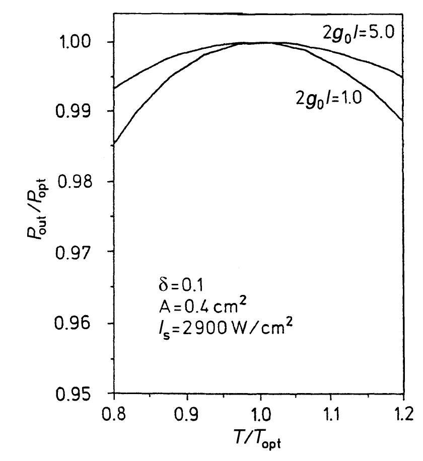

Jde vidět, že lasery pracující vysoko nad prahem nejsou tak citlivé na změnu reflektance/optimální vazby

<aside>

### Findlay-Clay

Určení reálných ztrát 4-hladinového systému. 

Když máme naměřený křivky výstupních výkonů v závislosti na čerpání → můžeme [pomocí](4Rezimy_generace.md) zjistit **prahové výkony**

Pak pomocí vzorce

$$
-\ln R = 2g_0 l -delta = 2KP_{th} -delta,
$$

zjistíme reálné ztráty $\delta$

Jiné vyjádření toho stejného

Známe-li reálné ztráty (ztráty na jeden průchod rezonátorem), tak můžeme znázornit závislost malého signálu na výstupním výkonu

</aside>

---

V 4H systému jsou ztráty - Fresnelovské, residuální absorpční, rozptylové a výstupního zrcadla. Jakmile zisk převýší tyto ztráty → je dosaženo prahu.

V kvazi-3H jsou navíc saturovatelné ztráty - termální populace dolní laserové hladiny (částečná reabsorpce laserového záření)

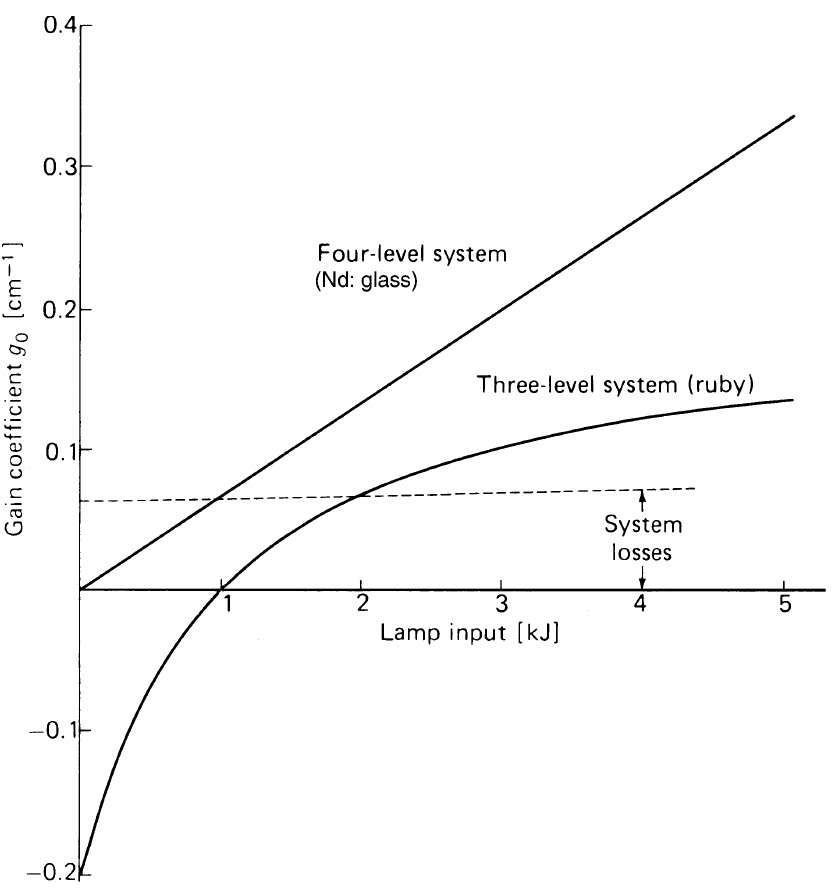

Rozdíl mezi 4H a 3H (kvazi 3H by byla křivka mezi nima)  

</aside>

# Režimy generace

## Režim volné generace - Free-running

Stimulovaná emise “lítá” mezi zrcadly → je zesílená → podle čerpání → kontinuální/pulsní záření vystupuje

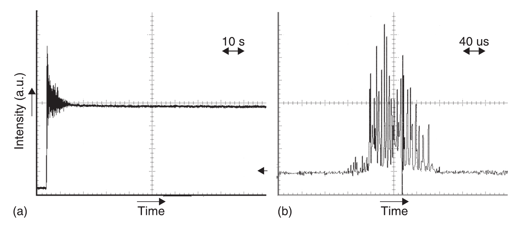

Intenzita na čase

Dochází k přechodovým jevům (intenzita a inverze populace hladin) → spiking

ty divný znaky znamenají, že to je k něčemu normované (často to jsou stacionární hodnoty)

Oscilace přecházejí z vlnění na konst. výstup

Činitel jakosti je stejný.

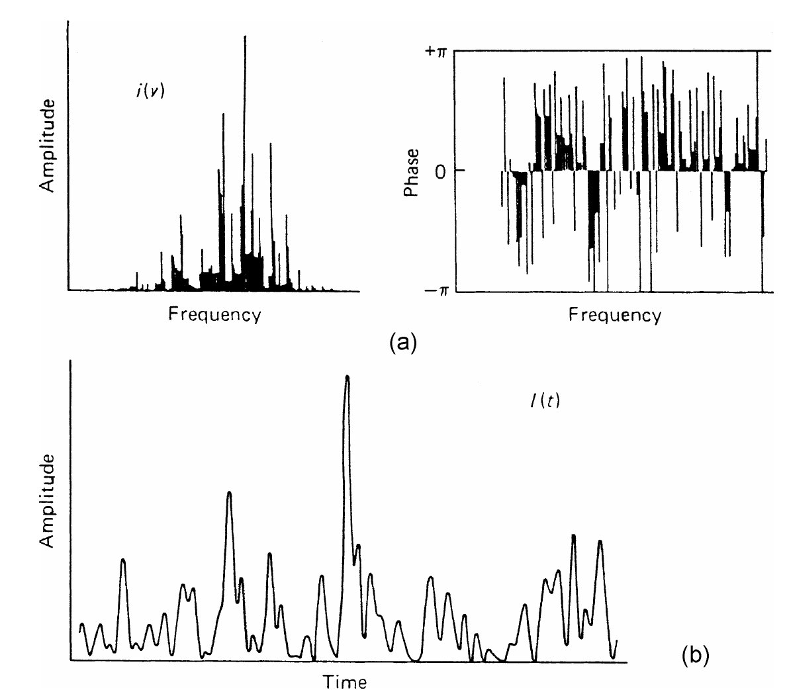

Základní charakteristiky

---

---

## Q-spínání

Zásahem do dějů probíhajících při vzniku stimulované emise lze:

- zabránit relaxačním oscilacím
- zvýšit populaci horní laserové hladiny
- získat nové záření (lepší kvality)

Jde o jednorázové uvolnění energie nahromaděné v horní laserové hladině AP.

Ovlivňujeme [činitele jakosti](4Rezimy_generace.md) Q, což je energie uložená v rezonátoru ku energii ztracené z rezonátoru za $T/2\pi,$ kde $T$ je perioda kmitu optického záření

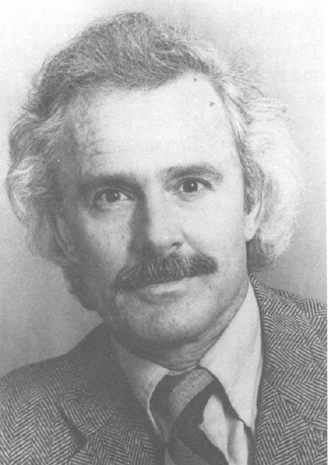

1964-Robert W. Helwarth

<aside>

### Definice

METODA ŘÍZENÍ ČINITELE JAKOSTI OTEVŘENÉHO REZONÁTORU BĚHEM ČINNOSTI LASERU

Provádí se především u laserů, jejichž AP je char. dlouhou dobou života na horní hladině.

</aside>

Důležité průběhy jsou vidět na dvou následujících obrázcích.

Je možné tam přidat graf vykreslující činitele jakosti rezonátoru (jsou to jen obrácené ztráty - nic složitýho)

<aside>

### Průběh

Když pojedeme podle schématických obrázků:

1. Uměle zvýšíme ztráty (snížíme činitele jakosti) → nedochází k oscilacím a generaci
2. Skokově snížíme ztráty → činitel jakosti skočí na maximální hodnotu
3. Poklesne inverze
4. Gigantický impulz začne narůst po jistém čase (hustota záření v rezonátoru exponenciálně narůstá ze šumu)
5. Jakmile inverze dosáhne prahové hodnoty, tak nastane jev kdy se začnou vykazovat spíš ztráty než zisk

Délka je o několik řádů kratší a výkon zase větší.

</aside>

Je možné Q-spínače dělit na několik sekcí

**Podle konstrukce**

- mechanicko-optické
- elektro-optické
- akusto-optické
- satur. abs. (pasivní)

**Podle rychlosti spínání**

- Rychlé
- Pomalé (stovky nanosekund)

Závisí to na rychlosti změny kvality jakosti otevřeného rezonátoru

**Podle typu ztrát**

- Aktivní
- Pasivní

Je-li změna ztrát způsobena vnější silou či nelineární odezvou optického prvku

<aside>
🙈

### Mechanicko-optické

Opticko-mechanický Q-spínač je aktivní závěrka založená na rotačním, translačním nebo oscilačním pohybu optických komponent.

Například rotující disk, hranol.

Pro synchronizaci funkce opticko-mechanické závěrky s okamžikem zapálení impulsních výbojek se používá elektromagnetický nebo fotoelektrický způsobe registrace polohy otáčejícího se hranolu

**Výhody**

- není to složité
- levný
- při odrazu od rotujících elementů se nemění polarizace emitovaného světla (+ nenastávají dvojlomné efekty)

**Nevýhody**

- Tendence emitovat mnohonásobné pulzy
- dost hlučné
- Častá kontrola kvůli ložiskům

</aside>

<aside>
🧑‍🔬

### Elektro-optické

Závěrka založená na lineárním (Pockels) nebo kvadratickém (Kerr) elektro-optickém jevu v pevných látkách/kapalinách (ten elektrooptický element se stává dvojlomný)

<aside>
🤔

- **Elektro-optický jev**
    
    Změna indexu lomu prostředí způsobená vnějším elektrickým polem
    
</aside>

Dvojlom je v prostředí charakterizován dvěma ortogonálními směry (rozdílné indexy lomu) → procházející záření se teda rozloží do těchto směrů → paprsky se díky různým indexům lomu šíří jinou rychlostí → fázový posun (čtvrtvlnný posun a půlvlnný posun the BEST) → jiná polarizace 

<aside>
🤔

- **Čtvrtvlnné zapojení**
    
    Z lineárně polariz. světla (pod úhlem 45°) stane kruhově polarizované světlo
    
    Záření prochází skrz elektrooptickou celou → fázové posunutí → odrazí se a znova prochází skrz elektroopickou celu → fázové posunutí → je opět lineární ale otočené o 90°
    
    Napětí je po celou dobu → jen až chceme ten impulz
    
    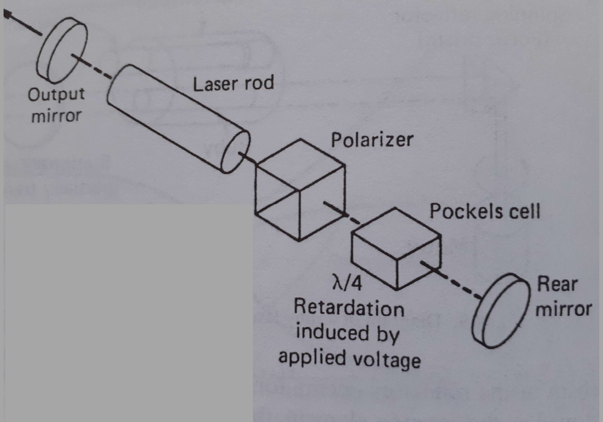
    
</aside>

<aside>
🤔

- **Půlvlnné zapojení**
    
    Elektrooptická cela je mezi dvěma zkříženými polarizátory.
    
    Po celou dobu není zapnuté napětí (až do momentu generování pulzu)
    
    Po přivedení napětí se po prvním průchodu záření otočí o 90° a po opětovném průchodu se otočí o dalších 90° → efektivně se s ním nic “nestalo”
    
    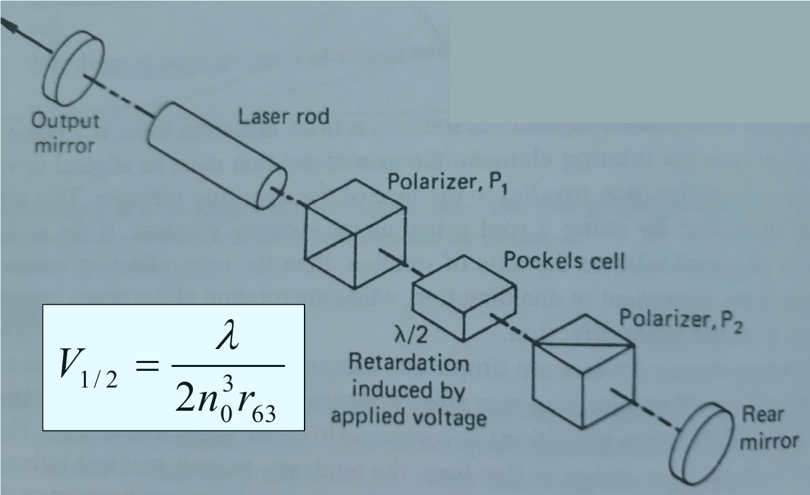
    
    Ten jedná neznámá je element tenzoru 3. řádu - **elektrooptický koeficient** (má normal 18 koeficientů - ale dost jich je nulových díky symetriím) a druhá je **řádný index lomu**
    
    Napětí nezávisí na tloušťce krystalu
    
</aside>

Dají se dále rozdělit do dvou typů a to v závislosti, jestli přikládáme **elektrické pole rovnoběžně** se směrem optického svazku nebo **kolmě** na směr optického svazku.

Při rovnoběžném se využívá lineárního elektrooptického jevu (Pockels - změna indexu lomu anizotrop. prostředí je úměrná intenzitě přiloženého napětí ). Při absenci elektrického pole jsou tyto krystaly jednoosé. 

Při příčném přiložení již napětí $\lambda/2$ závisí na geometrii krystalu a poměru tloušťky k jeho délce (lze dosáhnout nižších napětí).

$$
V_{1/2} = \dfrac{\lambda d}{n_0^3 r_{63}l},
$$

 neznámé jsou popsané [ZDE](4Rezimy_generace.md).

<aside>
🤔

- **Kerrova cela**
    
    Kvadratický elektrooptický jev příčná - změna indexu lomu anizotropního prostředí je úměrná na druhé mocnině elektrického pole 
    
    $$
    \Delta n = n k E^2,
    $$
    
    kde $n$ je index lomu v nepřítomnosti elektrického pole a $k$ je kerrova konstanta.
    
    Zde už se využívá jistá kyveta naplněná izotropní látkou (jsou v ní dvě elektrody - vytvářejí rovinný kondenzátor)
    
    Využívají asi 5-10x větší napětí než Pockels
    
</aside>

</aside>

<aside>
🙈

### Akusto-optické

Tyto spínače jsou založeny na difrakci optického záření na zvukových vlnách.

Ultrazvuková vlna je vyslána do transparentního optického materiálu. Při průchodu vlny tímto materiálem se materiál chová jako optická mřížka

<aside>
🤔

- **FOTOELASTICKÝ JEV**
    
    Pod vlivem akustického napětí dochází ke změně indexu lomu.
    
    Perioda kmitů mřížky je shodná s periodou kmitů procházející vlny a amplituda je úměrná amplitudě zvukové vlny.
    
    Při interakci se světelným zářením dochází k rozptylu.
    
</aside>

Vhodnou volbou parametrů může být rozptylované světlo odkloněno mimo dutinu rezonátoru → zvýší se ztráty → pak se vypnou zvukové vlny → skok ve ztrátách

Piezoelektrický transduktor - zdroj ultrazvukových vln

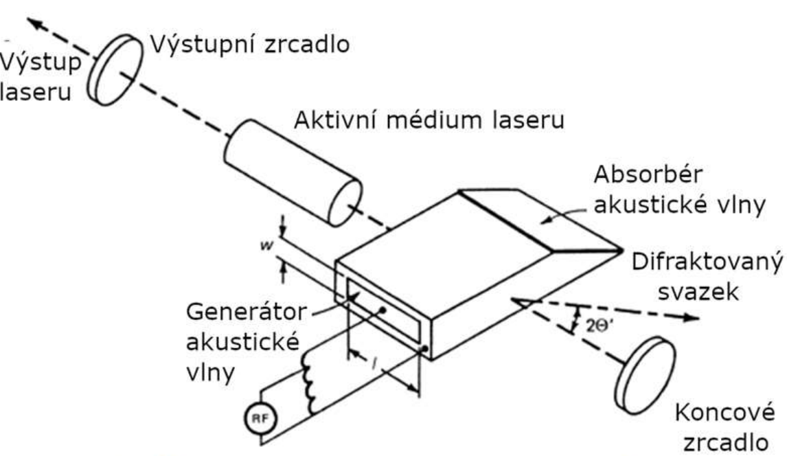

Podle optických a akustických vlnových délek (+ vzdálenosti na které spolu interagují) se difrakce dělí: **Ramanův-Nathanův rozptyl** a **Braggův rozptyl**

</aside>

<aside>
🧑‍🔬

### Saturovatelné absorbéry

Nejvíc ez metoda ovlivnění činitele jakosti → prostě někam do rezonátoru dám krystal (ez)

Krystal vykazuje silnou nelinearitu transmitance v závislosti na intenzitě dopadajícího záření.

<aside>
🤔

- **Důležité pojmy**
    - **Nesaturovatelné ztráty $A_{ns}$** - ztráty v rezonátoru způsobené Q-spínačem
    - **Hloubka modulace $A_0$** - změna transmise absorbéru od stavu zavřený do otevřený
    - **Saturační intenzita $I_S$** - při jaké intenzitě dopadajícího záření dojde ke změně transmitance o 50%
    - Spektrum optimální funkčnosti
    - Doba relaxace ….
    
    $$
    A(I) = \dfrac{A_0}{1+\frac{I}{I_S}} + A_{ns}
    $$
    
    Podobným vztahem se mění i absorpční koeficient a střední doba života excitovaného stavu (obzvlášť ten jmenovatel je stejnej)
    
</aside>

Absorpční koeficient klesá s rostoucí intenzitou (víc a víc se propouští to světlo) 

Molekuly absorbéru pohltí dopadající záření → excitují se → sníží se pravděpodobnost absorpce → vybělení absorbéru = otevření pasivního spínače → za *střední dobu života excitovaného stavu $\tau_S$* se vracejí molekuly zpátky

<aside>
😮

- **Požadavky na SA**
    - Maximum absorpční křivky by mělo být shodně s generovanou vlnovou délkou
    - velký příčná průřez absorpce
    - krátká doba života v excitovaném stavvu
    - velká stálost parametrů
</aside>

Využívali se organická barviva (docela jedovatý nebo karcinogenní), pevnolátkové či polovodičové absorbéry

**Výhody**

- jednoduchost
- cenová dostupnost

**Nevýhody - to asi k těm organickým barvivům**

- chemická a fotochemická nestabilita
- toxicita
- absorpční ztráty

Normálně takhle tam hodím Sat. Abs. a je to 😊

</aside>

<aside>
👌

### Srovnávání

**Konstrukční jednoduchost**

1. Pasivní absorbéry
2. Rotující hranol
3. Pockelsova cela - hard

**Synchronizace s ostatními prvky**

1. Pockelsova cela
2. Rotující hranol
3. Pasivní absorbéry (nepřesnost až mikrosekundy-milisekundy)
</aside>

<aside>
🧑‍🔬

### Matematický model

Když se berou charakteristické vlastnosti generovaného impulzu → můžeme si zjednodušit rychlostní rovnice

To co je zakroužkované budeme zanedbávat

Zanedbáme: člen zodpovídající spontánní emisi $S$, buzení $W_p$  a člen s $\tau_f$

Ze zlehčených rovnic dostaneme **vztah pro změnu hustoty fotonů** $\phi$

$$
\frac{\partial \phi}{\partial t} = \sigma c n \frac{l}{L}\phi - \frac{\varepsilon}{t_r}\phi,\quad t_r = \frac{2L}{c},
$$

kde jsme dobu života fotonu uvnitř rezonátoru $\tau_c$ vyjádřili pomocí oběhového času $t_r$ (round-trip time). Oběhový čas je doba, za kterou foton projde rezonátorem (sem tam) a dostane se do stejného místa v rezonátoru.

**První člen** v této rovnici - přírůstek fotonů uvnitř rezonátoru daný stimulovanou emisí

**Druhý člen** - úbytek těchto fotonů daný všemi ztrátami v oscilátoru

- $\varepsilon$ - všechny ztráty včetně zavedených ztrát do rezonátoru Q-spínačem (fractional loss per roundtrip)
    - dělí se dále na ztráty dané reflektancí zrcadel $-\ln R$ a neměnné ztráty v rezonátoru $\delta$ (rozptyl, absorpce, difrakce ve všech elementech) a člen popisující proměnné ztráty Q-spínače $\zeta(t)$
- $l$ - délka krystalu
- $L$ - délka rezonátoru
- $\sigma$ - absorpční příčný průřez saturovatelného absorbéru

Dále dostaneme vztah pro inversi obsazení hladin v aktivním prostředí

$$
\frac{\partial n}{\partial t} = -\gamma \sigma c n \phi
$$

Z numerického řešení rychlostních rovnic pro opticko-mechanicko či elektro-optický spínač dostaneme:

- Energii uvnitř/vně rezonátoru
- Délka generovaného impulzu
- Doba nárůstu Q-spínaného impulzu ze šumu
- Náběžná a spádová doba impulsu
- Špičkový výkon uvnitř/vně rezonátoru

<aside>
😮

- **Průběh**
    
    V okamžiku, kdy jsou ztráty sníženy na minimální hodnotu → hustota fotonů narůstá z *initial* hodnoty do maximální hodnoty a pak padá na nulu
    
    Populace inverze je od okamžiku nárůstu hustoty fotonů (zase *initial*) monotónně klesající funkcí času→ klesá to až do nějaké finální hodnoty (menší než prahová, která je nutná pro laserovou činnost)
    
    Jestli není počáteční hodnota inverze moc vysoko na prahem, potom koncová inverze je stejně daleko pod prahem a výstupní signál je symetrický
    
    Pokud je moc vysoko, tak zisk klesá rychle po několika obězích v rezonátoru $\tau_R$, ve kterých se vyrovnávají ztráty. Hlavní spádová část impulzu má časovou konstantu rovnou $\tau_c$ (doba života fotonu uvnitř rezonátoru)
    
</aside>

Nejkratší možný impulz je $\tau_c$ (nezávisí na AP, závisí na parametrech rezonátoru a dosažitelné relativní inverze populace hladin).

Vysoký poměr zisku ke ztrátám vede k vysoké extrakční účinnosti

</aside>

---

---

## Synchronizace módů - Mode-locking

Porovnání [TOTO](4Rezimy_generace.md) a jak to vypadá v synchronizaci módů

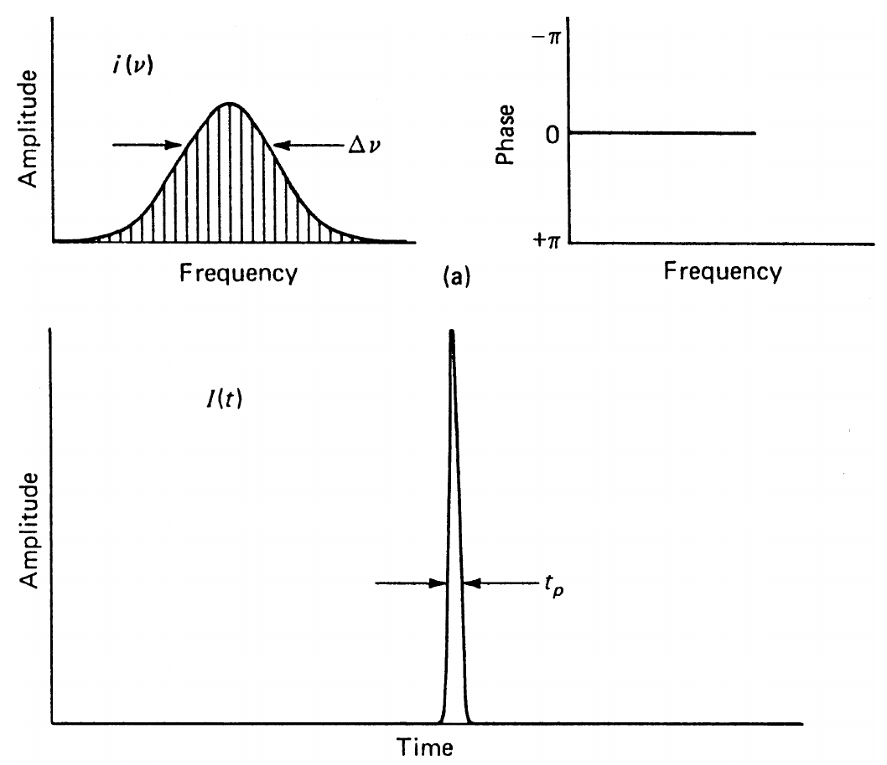

Normálně máme v laseru mnoho oscilujících podélných módů (jejich fáze a intenzity jsou náhodné).

Zajistíme svázání těchto podélných (axiálních) módů uvnitř rezonátoru → svázáním myslíme, že módy budou oscilovat s určitým pevným vztahem mezi jejich fázemi.

Synchronizace módů = Mode-locking → je to **rezonanční jev → synchronní modulací může být generovaná impuls kratší, než je doba oběhu**

Zkracování délky impulsu pokračuje tak dlouho, až je puls uvnitř rezonátoru tak krátký (a spektrum široký), že nastane mechanismus jeho prodlužování, který vede k zužování spektra pulsu dané konečnou šířkou čáry zisku

Pro dosažení modelockingu je nutné odstranit příčiny selekce podélných módů

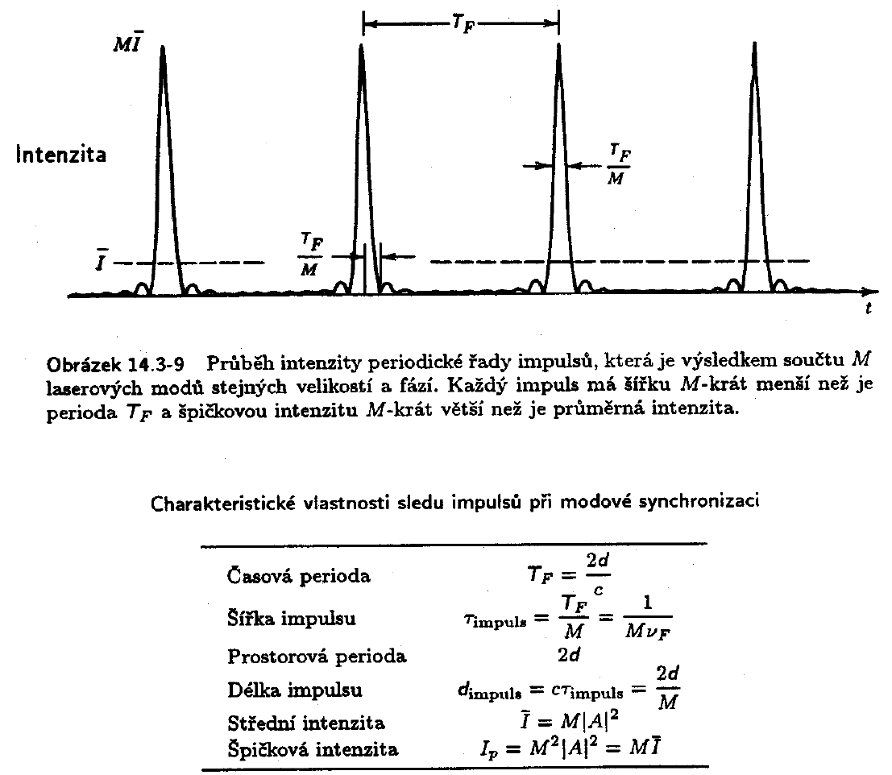

Základní vztahy + frekvence je $1/T_F$

**V rezonátoru obíhá 1 impulz, ale na výstupu máme sled impulzů**

Jak to v časové doméně je hezky zobrazeno v dalším obrázku. 

- Máme do rezonátoru přivedené jisté ztráty
- Pokud puls projde modulátorem v čase kdy jsou min. ztráty → pak se za dobu oběhu vrací zpět do stejných podmínek
- Pokud ovšem přichází v jiný čas → jeho náběhová část pociťuje větší ztráty a dochází ke zkrácení → maximum impulzu se posune blíž k tomu okamžiku, kdy jsou min. ztráty

Svázání a superpozici lze popsat pomocí Fourierky (mezi časovou a frekvenční závislostí elektrického pole)

Z toho dostaneme **Time-bandwdith product** 

$$
\Delta\nu_p \times \Delta \tau_p \geq K,
$$

kde $K$ závisí na předpokládaném tvaru impulzu (jaké ztráty předpokládáme, GVD, SPM …)

<aside>
😮

### Aktivní

Do rezonátoru je vložen prvek, který aktivně moduluje ztráty v rezonátoru

Dělíme na Amplitudový a Fázový modulátor.

</aside>

<aside>
😊

### Pasivní

Do rezonátoru je vložen prvek, který má proměnnou transmitanci či reflektivitu

Tyhle se dělí dále na pomalý - saturovatelné absorbéry - relaxační doba absorbéru je pomalejší než je délka generovaného impulzu

Rychlý - Kerr lens - okamžitá odezva absorbéru na dopadající záření

</aside>

---

---

# Nějaké režimy navíc - coming soon

<aside>

## Otevírání rezonátoru - Cavity dumping

</aside>

<aside>

## Spínání ziskem - Gain switching

</aside>