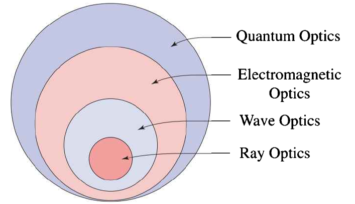
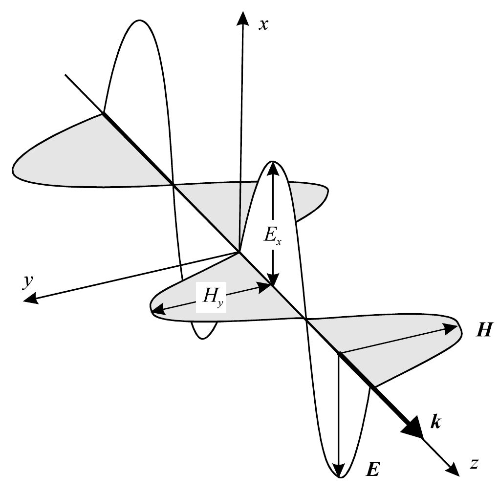
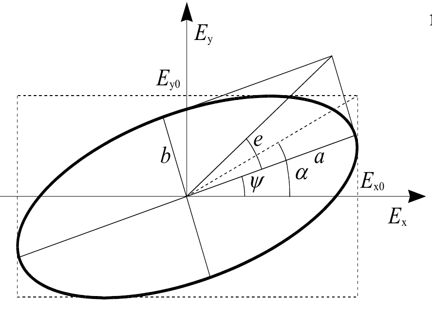
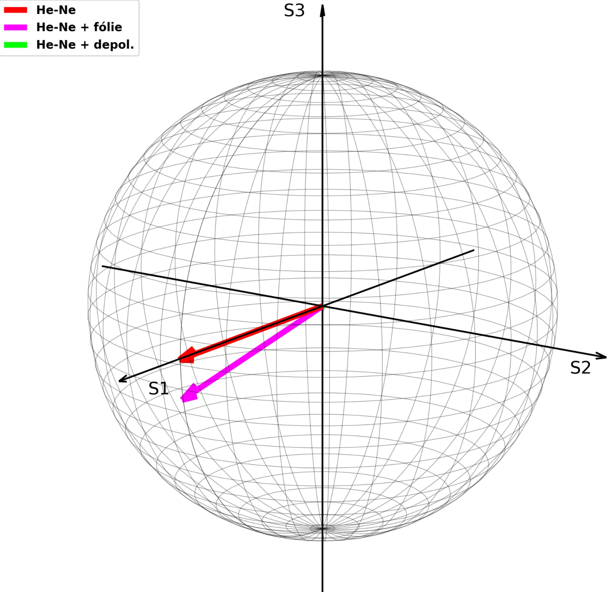
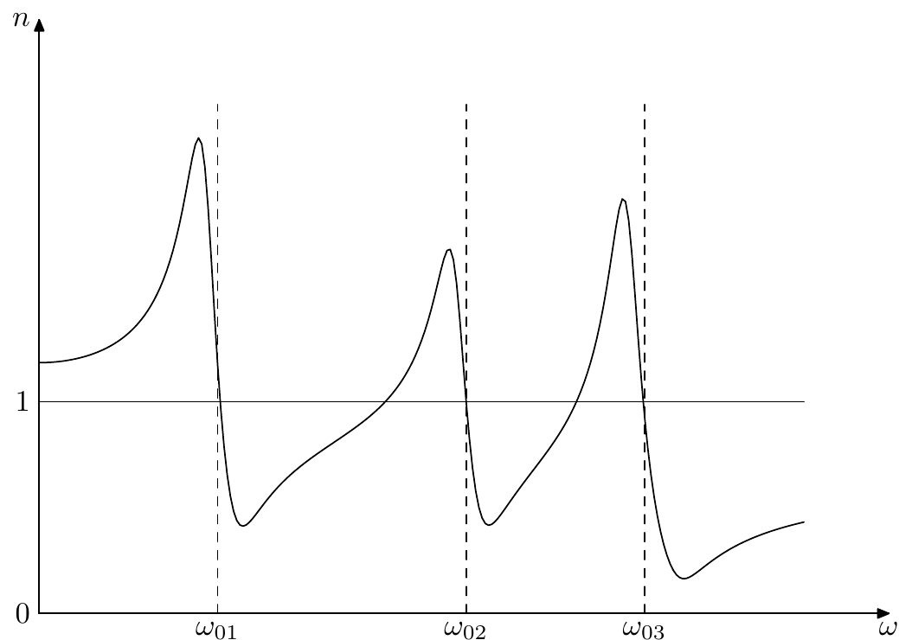
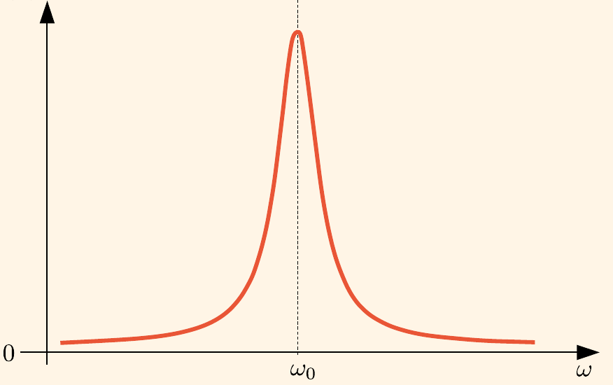
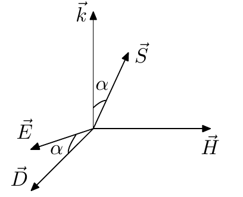
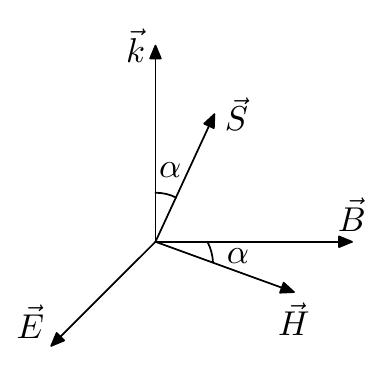

# Formy popisu světla, Vliv materiálu, rovinné vlny

**VR - vlnová rovnice**

**MR - Maxwellovy rovnice**

**HR - Helmholtzova rovnice**

# Formy popisu světla

Světlo může být popsáno jako elektromagnetická vlna.

Magnetické a elektrické pole jsou svázány sériemi [Maxwellových rovnic](6Popis_svetla.md), ze kterých je možné odvodit [vlnovou rovnici](6Popis_svetla.md).

- Historicky to šlo - Paprsková → Vlnová → Elektromagnetická → Kvantová optika

<aside>
🔋

## Maxwellovy rovnice

Formulují prostorové a časové vztahy mezi základními makroskopickými veličinami v obecném prostředí

### Ve vakuu - mikroskopické

Jsou lineární, obsahují první mocniny veličin a lineární operátory → platí princip superpozice.

**Diferenciální tvar:**

$$
\begin{split}  
\text{2. série}&\,- \,\nabla \times \mathcal{E} + \dfrac{\partial \mathcal{B}}{\partial t} = 0 \qquad \qquad \quad \, \nabla \cdot \mathcal B  =0 \\
\text{1. série}&\,- \,\nabla \times \mathcal{B} - \mu_0 \varepsilon_0\dfrac{\partial \mathcal{E}}{\partial t} =\mu_0 \mathcal J \qquad  \nabla \cdot \mathcal E  =\dfrac{\rho}{\varepsilon_0}\\
\end{split}
$$

**Integrální tvar:**

$$
\begin{split}  \oint_l \mathcal E \cdot dl &= -\frac{\partial}{\partial t}\int_S \mathcal B \cdot dS\\\oint_l \mathcal B \cdot dl &= \mu_0\int_S \left( \mathcal J + \varepsilon_0 \dfrac{\partial \mathcal E}{\partial t}  \right) \cdot dS\\\oint_S \mathcal E \cdot dS &= \frac{1}{\varepsilon_0}\int_V \rho  \cdot dV\\\oint_S \mathcal B \cdot dS &= 0\end{split}
$$

Faradayův zákon, Ampérův zákon a poslední dvě jsou stejné vyjádření Gaussova zákona.

- $\varepsilon_0$ - permitivita vakua $8.85\cdot 10^{-12}$ C$\cdot$N$^{-1}\cdot$ m$^{-2}$
- $\mathcal E$ - intenzita elektrické pole - V/m
- $\mathcal B$ - magnetická intenzita - $\text{Wb/m}$$^2$

- $\mu_0$ - permeabilita vakua $1.257\cdot 10^{-6}$ N$\cdot$A$^{-2}$
- $\mathcal J$ - proudová hustota - $\text{A/m}^2$
- $\rho$ - hustota náboje - $\text{C/m}^3$

### V prostoru - makroskopické

Makroskopické se dostávají středováním mikroskopických přes lokální pole (malé oblasti)

$$
\begin{split}  
\text{1. série}&\,- \,\nabla \times \mathcal{H} - \dfrac{\partial \mathcal{D}}{\partial t} = \mathcal J_{free} \qquad  \nabla \cdot \mathcal E  =\rho_{free} \\\text{2. série}&\,- \,\nabla \times \mathcal{E} + \dfrac{\partial \mathcal{B}}{\partial t} = 0 \qquad \qquad \quad \, \nabla \cdot \mathcal B  = 0 \\

\end{split}
$$

- $\mathcal D$ - elektrická indukce - $\text{C/m}^2$
- $\mathcal H$ - intenzita magnetického pole - $\text{A/m}$

- $\mathcal J_{free}$ - proudová hustota volných nábojů - $\text{A/m}^2$
- $\rho_{free}$ - hustota volných nábojů - $\text{C/m}^3$

V první sérii se nachází zobecněný Ampérův zákon a Gaussův zákon elektrického pole. V druhé sérii je Faradayův indukční zákon a Gaussův zákon magnetického pole.

Divergenční rovnice mají význam **počátečních podmínek** (na rotační rovnice hodíme divergenci a dostaneme, že divergenční rovnice nezávisí na čase - **divergenční rovnice platí v každém čase**).

Z první série lze odvodit rovnici kontinuity

$$
\nabla\cdot \mathcal J + \dfrac{\partial \rho}{\partial t} = 0.
$$

Vlastnosti prostředí svazují základní veličiny polí

$$
\begin{split}
\mathcal D &= \varepsilon_0\mathcal E + \mathcal P = \varepsilon_0 \overset{\leftrightarrow }{\varepsilon} \mathcal E \\
\mathcal B &= \mu_0\mathcal H + \mathcal M = \mu_0 \overset{\leftrightarrow}{\mu}\mathcal H\\
\mathcal J &= \overset{\leftrightarrow}{\sigma}\mathcal E\\
\mathcal P &= \varepsilon_0 (\overset{\leftrightarrow}{\varepsilon}-1)\mathcal E = \varepsilon_0\overset{\leftrightarrow}{\chi}\mathcal E
\end{split}
$$

- $\mathcal P$ - polarizace prostředí
- $\mathcal M$ - magnetizace prostředí
- $\overset{\leftrightarrow}{\chi}$ - bezrozměrný tenzor dielektrické susceptibility

- $\overset{\leftrightarrow}{\sigma}$ - tenzor vodivosti prostředí
- $\overset{\leftrightarrow}{\varepsilon}$ -bezrozměrný tenzor dielektrické permitivity
- $\overset{\leftrightarrow}{\mu}$ - bezrozměrný tenzor relativní magnetické permeability

Krom MR potřebujeme i vztah pro Lorentzovu sílu (+ pohybovou rovnici v relativistickém tvaru)

$$
F = e (\mathcal E + v\times \mathcal B) =\frac{d }{dt} \left( \dfrac{m_0 v}{\sqrt{1-\left(\frac{v}{c}\right)^2}} \right) 

$$

</aside>

## Vlnová rovnice

Odvození není tak těžký (pár vztahů z TEF2) → vede to na obecný tvar

$$
\begin{split} \text{LS} &\to \nabla^2 \mathcal E- \varepsilon_0\mu_0 \dfrac{\partial^2 \mathcal E}{\partial t^2} \\ \text{PS} &\to \mu_0 \dfrac{\partial^2 \mathcal P}{\partial t^2} - \frac{1}{\varepsilon_0} \nabla(\nabla \cdot \mathcal P) + \nabla\times ~\frac{\partial \mathcal M}{\partial t} +~\mu_0\frac{\partial \mathcal J}{\partial t}~+~\frac{\nabla \rho}{\varepsilon_0} \end{split}
$$

Jelikož to je odvozený z obecných MR, můžeme tvrdit:

- ELMAG procesy popsané MR připouštějí vektorový vlnový proces
- LS je vakuová - tvořena bezdisperzní rovnicí
- PS je zdrojová - dána prostředím

Pokud se zaměříme na dielektrický prostředí, bez volných nábojů a v homogenním prostředí (plus žádná polarizace) (de facto šíření světla ve vakuu)→ dostaneme lehčí rovnici

$$
\nabla^2 \mathcal E - \dfrac{1}{c_0^2} \dfrac{\partial^2 \mathcal E}{\partial t^2} = 0 \qquad c_0 = \dfrac{1}{\sqrt{\varepsilon_0\mu_0}}
$$

Každé řešení vlnové rovnice se nazývá vlnou. Jedním z nejlehčích řešení jsou **Rovinné vlny**.

## Helmholtzova lineární  vlnová rovnice

Pokud budeme uvažovat partikulární řešení [vlnové rovnice](6Popis_svetla.md) pro **časovou harmonickou vlnu,** kde využijeme  vztah $\mathcal E = \text{Re}\left\{ \mathbf{E}(r)e^{i\omega t} \right\}$ (přecházíme ke komplexním veličinám) ****→ dostaneme **HR**

$$
\nabla^2 \mathbf{E}(r) + k_0^2\mathbf{E}(r) = 0 \qquad k_0 = \dfrac{\omega}{c_0}
$$

$k$ či $k_0$ typicky označuje vlnové číslo.

Řešení **HR** je stacionární

<aside>
🧑‍🔬

### MR ve frekvenční oblasti

$$
\begin{split}\nabla \times \mathbf{H} + i\omega \mathbf{D} &= \mathcal J(\omega) \\\nabla \cdot \mathbf B &= 0\\\nabla\cdot \mathbf D &= \rho(\omega)\end{split}
$$

</aside>

Jelikož ELMAG vlna má vektorový charakter, tak pro její úplný popis je nutné znát **amplitudu, fázi, kmitočet a polarizaci**.

V izotropních prostředí je možné díky linearitě VR libovolné její řešení sestrojit jako superpozici jednoduchých vln (rovinných) → nekonečně rozlehlá monochromatická  TEM vlna, jejíž fyzikální veličiny nezávisí na souřadnicích kolmých ke směru šíření. Je možné jí zapsat 

$$
\vec E = \vec i_e E_0 \cos(\omega t - \vec k \cdot \vec r + \phi),
$$

kde $\vec i_e$ je polarizační vektor,  $\phi$ je fáze a $E_0$ je amplituda

<aside>
🤔

### Pojem TEM a OG

Pokud máme obecný tvar rovinné vlny

$$
\mathbf E(\mathbf r) = \mathbf E e^{\mp i \mathbf k_0 \mathbf r},
$$

kde $\mathbf k_0$ je vlnový vektor orientovaný ve směru šíření této rovinné vlny.

Z MR dostaneme to, že vektory pole $\mathbf E , \mathbf H$ nemají funkční z-tovou složku (nechali jsme rovinnou vlnu plynou v ose z) → funkční jsou tedy ostatní složky a proto jde o **transverzálně elektromagnetické pole.**

Pokud dále pustíme rovinnou vlnu na HR (z ní bude 1-D rovnice), tak dostaneme

$$
\begin{split}\mathbf k \times \mathbf E &= \mu_0 \omega \mathbf H \\\mathbf k \times \mathbf H &= -\varepsilon_0 \omega \mathbf E\end{split}
$$

Z tohoto plyne, že veličiny  $\mathbf E , \mathbf H$ a $\mathbf k$ tvoří **ortogonální pravotočivý systém**.

</aside>

## Polarizace

Orientace vektoru elektrického pole (magnetické a elektrické pole jsou na sebe kolmé - stačí řešit jen jednu z nich).

Budeme-li uvažovat rovinou harmonickou vlnu se složkami

$$
\begin{split}E_x = E_{x0} \cos(\omega t - kz - \phi_x) \\E_y = E_{y0} \cos(\omega t - kz - \phi_y) \end{split}
$$

a když označíme $\delta = \phi_x - \phi_y$, tak vektor elektrického pole opisuje **elipsu** s parametrem $\Phi = \omega t - kz$ a parametrické rovnice elipsy jde napsat (*obecná polarizace je eliptická*)

$$
\left(\frac{E_x}{E_{x0}} \right)^2 - 2 \dfrac{E_x E_y}{E_{x0}E_{y0}} +      \left( \frac{E_y}{E_{y0}} \right)^2 = \sin^2\delta
$$

Obecně tuto elipsu je možno charakterizovat

- poloosami $a,b$ - resp. jejich poměrem - úhlem elipticity $e$

$$
\begin{split} a^2+b^2 &= E_{x0}^2 + E_{y0}^2 \\ \tan e &= \frac{b}{a}\end{split} 
$$

- sklonem této elipsy $\Psi$

$$
\tan 2\Psi = \frac{2E_{x0}E_{y0}}{E^2_{x0} - E^2_{y0}} \cos\delta
$$

- opsaným obdélníkem elipsy $E_{x0}, E_{y0}$ nebo sklonem tohoto obdélníku $\alpha$

$$
\tan 2\alpha = \frac{2E_{x0}E_{y0}}{E^2_{x0} - E^2_{y0}}
$$

Stav polarizace harmonické vlny lze charakterizovat součinitelem polarizace

$$
P = \frac{E_x}{E_y}
$$

Stav polarizace jde také určit pomocí **Stockesových parametrů** (mezi amplitudami a fázemi existují korelace, díky kterým můžeme zjistit tyto parametry) nebo využitím **koherenční matice** (jejíž prvky charakterizují stupeň koherence mezi příčnými složkami intenzity elektrického pole).

Stokesovy parametry se dají hezky hodit na Poincarého kouli 

### Orientace otáčení

Souvisí se smyslem otáčení vektoru intenzity elektrického pole vzhledem k funkci $\Psi$.

<aside>
↪️

- **Pravotočivá**
    
    Když $\delta \in (0, \pi)$
    
    Při pohledu proti směru šíření se $\mathbf E$ v **čase** otáčí ve směru hodinových ručiček.
    
    V **prostoru** průběh $\mathbf E$ tvoří pravotočivou eliptickou šroubovici
    
</aside>

<aside>
↩️

- **Levotočivá**
    
    Když $\delta \in (0, -\pi)$
    
    Při pohledu proti směru šíření se $\mathbf E$ v **čase** otáčí proti směru hodinových ručiček.
    
    V **prostoru** průběh $\mathbf E$ tvoří levotočivou eliptickou šroubovici
    
</aside>

### Speciální případy polarizace

<aside>
↪️

- **Lineární polarizace**
    
    Nastává, jsou-li obě kmitající komponenty ve fázi, nebo protifázi
    
    $\delta = 0,\pm \pi$
    
    Elektrické pole je ve tvaru $\vec E = E_0\vec n e^{i(\omega t + \varphi)}$ ($\theta$ je úhel natočení vektoru od osy x)
    
    $$
    \hat{\vec E } = E_0 \vec n e^{i\varphi} \qquad \vec n = (\cos \theta,  \sin \theta)
    $$
    
</aside>

<aside>
↩️

- **Kruhový polarizace**
    
    Nastává za těchto dvou podmínek
    
    $\delta = \pm \frac{1}{2} \pi$ a $E_{x0} = E_{y0}$
    
</aside>

**Nemonochromatická vlna může mít libovolný stupeň polarizace.**

---

---

## Energetické vlastnosti TEM vlny

Hustotu energie popíšeme vztahem

$$
w(\mathbf r,t) = \frac{1}{2} \varepsilon_0 \mathcal E^2 + \frac{1}{2} \varepsilon_0c_0^2 \mathcal B^2 \qquad [\text{J}\cdot \text{m}^{-3}]
$$

Hustotu toku výkonu popíšeme **Poyntingovým vektorem (real a komplex)**

$$
\begin{split}\mathcal S &= c_0^2\varepsilon_0 \mathcal E\times \mathcal B \qquad [\text{W}\cdot \text{m}^{-2}]\\\mathbf S &= \frac{1}{2}c_0^2\varepsilon_0 \mathbf E\times \mathbf B^* \end{split}
$$

**Reálná část Poyntingova** vektoru představuje → reálnou energii, která je přenášena fázovou rychlostí

**Imaginární část** → představuje jalovou energii (vpřed se reálně nepřenáší), je způsobena nesoufázovostí obou složek 

Imaginární složka vzniká, když se energie kumuluje na jednom místě (stojatá vlna), nebo když je energie postupně v prostoru ztrácena (ohmické ztráty elektrického pole)

### Admitance

Z MR plyne vztah mezi amplitudou magnetického a elektrického pole → zavádí se pojem **charakteristická admitance vakua**

$$
Y_0 = c_0^2\varepsilon_0 \frac{\Vert \mathbf B \Vert}{\Vert \mathbf E \Vert} = \left[ \frac{\omega}{c_0}\Vert \mathbf E \Vert = \omega \Vert \mathbf B \Vert \right]  = \sqrt{\frac{\varepsilon_0}{\mu_0}}
$$

V prostředí, kde magnetické a elektrické pole nekmitá ve fázi → **komplexní charakteristická admitance**

$$
\hat Y = \hat n Y 
$$

### Intenzita světla

Pro skalární popis toku energie plochou definujeme intenzitu světla (středovaná hustota toku výkonu)

$$
I = \text{Re}\mathbf S = \frac{1}{2}Y_0\vert \mathbf E\vert^2
$$

### ZZE

Zákon zachování energie má tvar

$$
\frac{\partial W}{\partial t} + \text{div}\, (W \vec v) = 0,
$$

kde $W$ je celková hustota energie pole

---

---

## Disperze světla

Disperzí světla nazýváme vliv frekvence na rychlost šíření v daném prostředí (vliv indexu lomu).

<aside>
❓

### Index lomu a vlnové číslo

Poměr fázové rychlosti světla ve vakuu $c_0$ ku fázové rychlosti světla v daném prostředí $c$.

- určuje změnu fázové rychlosti v daném prostředí při dané vlnové délce
- určuje fázový vývoj při šíření
- je mírou výměny elektrické a magnetické energie v prostředí
- je mírou odezvy prostředí v hodnotách $\mathbf E$ a $\mathbf H$

Vlnové číslo, související se změnou fáze ve směru šíření, definujeme vztahem

$$
k = \frac{\omega}{c} = \frac{\omega}{c_0} n = k_0 = \frac{2\pi}{\lambda}n
$$

</aside>

<aside>
❓

### Komplexní Index lomu a vlnové číslo

Při zobecnění existují i útlumové jevy, které lze zakomponovat do již využívaných pojmů tím, že přidáme komplexní části

$$
\begin{split} \hat n &=  n(1- ia)\\ \hat k &=  k_0\cdot \hat n \end{split}
$$

a je index absorpce

</aside>

Disperze jako taková dělá to, že materiálové vztahy závisí na předcházejících **časech** (*v prostředí jsou procesy s dobou trvání srovnatelnou s kmitem pole - zpoždění*)/**místech**

Disperze se obecně dělí na frekvenční a prostorovou.

**Frekvenční disperze**, která se projevuje nejvíce v okolí rezonance (kdy přicházející frekvence je podobná rezonančním kmitům vnitřních procesů - odpovídají kvantovým přechodům), dělá závislost $\varepsilon, \mu, \sigma$ na kmitočtu.

**Prostorová disperze** (taky má nějaká místa kde to působí nejvíc (**charakteristické parametry $a$**) - Debyeova délka, …) zase dělá závislost $\varepsilon, \mu, \sigma$ na vlnovém vektoru. Pokud jsme v oblasti optického pásma → pokud $a  << \frac{\lambda_0}{n}$ → můžeme jí zanedbat

Jelikož dochází k tomu, že každá vlnová délka/frekvence procházející prostředím pociťuje jiný index lomu a tudíž se šíří jinou rychlostí → dochází ke zkreslení tvaru impulzu ([CPA](Laserov%C3%BD%20zesilova%C4%8D%20245ae1c2f20880d1b95fdbbb262f1059.md) to využívá)

<aside>
👌

### Disperzní relace

Pro její získání vztahu, kde propojujeme index lomu a kmitočet záření, tak musíme vyřešit *úlohu o interakci elektromagnetické vlny s náboji daného prostředí*. Jedním způsobem je to zjistit ze vztahu $\varepsilon(\omega)$ (což je v disperzním prostředí komplexní skalární funkce) 

Prvně pole polarizuje prostředí → vznikají dipólové momenty → valenční elektrony jsou vázány elastickou vratnou silou → považování atomů za nucené oscilátory s útlumem → z toho se odvodí vztah ve kterém když se přiblížíme rezonanční frekvenci → máme singularitu

V klasické teorii disperze je pohyb elektronu v molekule popsán modelem Drude-Lorentze, podle kterého je možno si představit molekulu ve formě mnoho (i jednoho) lineárních oscilátorů, jež odpovídají vlastním kmitům elektronů v molekule

$$
m\frac{d^2 \vec r}{d t^2} + m\nu \frac{d \vec r}{dt} + m\omega_0^2 \vec r = e \vec E_d(t)
$$

$m$ je efektivní hmotnost, $m\nu$ je součinitel respektující útlum

Z toho se odvodí vztah

$$
\dfrac{n^2-1}{n^2+1} = \dfrac{q^2_e}{3\varepsilon m_e} \sum_j \dfrac{N F_j}{\omega^2_{0j}-\omega^2+i\omega\nu},
$$

kde $N$ je počet molekul, $F_j$ má smysl váhového faktoru

</aside>

<aside>
❓

### Normální a anomální disperze

Pokud budeme pracovat s [rovnicí](6Popis_svetla.md), tak nastanou dva případy

1. $\omega \to \omega_{0j}$ → index lomu roste s kmitočtem; grupová rychlost je menší jak fázová → **Normální disperze (*disperzní křivka je konkávní - ZAOP*)**
2. $\omega\approx \omega_{0j}$ → útlumový člen je dominantní a vznikají absorpční pásy, index lomu klesá s kmitočtem; grupová je menší jak fázová → **Anomální disperze (*disperzní křivka je konvexní*)**

Reálná část indexu lomu

Imaginární část indexu lomu - absorpce

**Grupová rychlost** je ustálená rychlost výslednice celé polychromatické vlny $\frac{\partial \omega}{\partial k}$

**Fázová rychlost** je ustálená rychlost šíření fáze dané složky monochromatické vlny o frekvenci $\omega$

</aside>

# Vliv materiálu

Tak jak jsme si popsali MR [ZDE](6Popis_svetla.md) nebyl úplný popis,

Jelikož MR je série 8 skalárních rovnic pro 4 vektory pole. Čtyři homogenní MR je možné vyřešit vyjádřením intenzity elektrického pole a magnetické indukce pomocí skalárního potenciálu a vektorového potenciálu → na nehomogenní tvar bychom museli znát materiálové vztahy

$$
\begin{split} \vec D = \vec D(\vec E, \vec B)\\ \vec H = \vec H (\vec E, \vec B) \end{split}
$$

Z MR je celkem 6 nezávislých rovnice → zbylých 6 dostaneme právě z materiálových relací.

K vyjádření vektorů prostředí je nejužitečnější následující zápis

$$
\begin{bmatrix}c\vec D\\ \vec H\end{bmatrix} = \mathbf C \begin{bmatrix}\vec E\\ c\vec B\end{bmatrix} \qquad \mathbf C = \begin{bmatrix}\mathbf P & \mathbf L \\ \mathbf M & \mathbf Q\end{bmatrix} 
$$

kde prvky uvnitř materiálové matice $\mathbf C$ (má rozměr admitance; matice 6x6) jsou tenzory (matice 3x3)

Podle právě zadefinované materiálové matice se dají rozdělit prostředí:

- **Nehomogenní**  -  $\mathbf C$ je funkce prostorových souřadnic
- **Nestacionární** -  $\mathbf C$ je funkcí času
- **Časově/Prostorově disperzní** -  $\mathbf C$ je funkcí časových/prostorových derivací
- **Ne/lineární** - je/není funkcí veličin ELMAG pole

Takhle jsme si rozdělili prostředí podle vlastností  $\mathbf C$, ale dají se rozdělit i podle toho jaké jsou ty její elementy (jelikož díky $\mathbf L, \mathbf M$ jsou vyjádřeny závislosti mezi elektrickým a magnetickým polem)

- **Bianizotropní** →  $\mathbf L \neq \overline 0 \wedge \mathbf M \neq \overline 0$
    - prostředí, která se vyjadřují současnou závislostí na elektrickém a magnetickém poli
    - speciálním případem je Biizotropní prostředí
- **Anizotropní** → $\mathbf L = \overline 0 \wedge \mathbf M = \overline 0$
    - závisí fyzikální vlastnosti na směru
    - **Izotropní** → $\mathbf P$ a $\mathbf Q$ jsou skaláry
        - $\mathbf P = c\varepsilon \mathbf I \qquad \mathbf Q = \frac{1}{c\mu}\mathbf I$
        - materiálové vztahy mají následující tvary
        - $c\vec D = c\varepsilon \vec E \qquad \vec H = \frac{1}{\mu}\vec B$
        - ve vakuu platí $\varepsilon =\varepsilon_r\varepsilon_0$ (podobně permeabilita)

## Dielektrikum

Spojité prostředí charakterizované objemovou koncentrací elektrických dipólových momentů vyjádřenou pomocí elektrické polarizace $\vec P$ (bude dán vektorem elektrického pole).

Podle velikost relativní permitivity je dělíme na

- $\varepsilon_r$  < 10 - měkká (nepolární)
- $10<\varepsilon_r  < 100$ - tvrdá (polární)
- $\varepsilon_r  > 1000$ - feroelektrika (segnetoelektrika)

## Magnetikum

Látkové prostředí, jehož vlastnosti jsou ovlivňovány vnější magnetickým polem.

Analogie - spojité bezeztrátové prostředí tvořené soustavou magnetických dipólů a charakterizováno objemovou hustotou magnetických dipólových momentů vyjádřenou pomocí vektoru magnetizace $\vec M$

- $\mu_r$  < 1 - diamagnetika (teplotně nezávislá)
- $\mu_r >1$ - paramagnetika (teplotně závislá)
- $\mu_r  >> 1$ - feromagnetika

## Anizotropní prostředí

Taková prostředí, jejich fyzikální vlastnosti (né nutně pro všechny - pro jedny může být normal izotropní) závisejí na směru. 

V krystalických prostředí (pravidelné uspořádání zvyšuje anizotropii) jsou hlavní dielektrické směry → každému jinému směru šíření odpovídají dvě různá vlnová čísla →2 vlny s různou fázovou rychlostí → štěpení na dvě lineárně polarizovené vlny s různými fázovými rychlostmi

Vzniká buď strukturou prostředí (krystaly) nebo může vzniknout v důsledku použití vnějších polí (Pockels, Kerr, fotoelekastický jev, elektrooptický jev)

Podle toho jaké je působené vnější polí, tak můžeme odlišit

1. **Magnetoaktivní** - anizotropní prostředí vzniká pod vlivem stálého magnetického pole
    1. tenzory permitivity a permeability jsou nesymetrické
    2. **gyromagnetické** (permitivita je skalár a permeabilita je tenzor) 
        1. ferit vložený do stálého magnetického pole
        2. šíří se kruhově polarizované vlny → lineární se rozštěpí na dvě → fázové zpoždění → stáčení roviny polarizace (Faradayův jev) → stáčení je dáno směrem magnetického pole
    3. **gyroelektrické** (permeabilita je skalár a permitivita je tenzor)
        1. elektronové plazma vložené do silné magnetického pole
        2. šířící vlny mají kruhovou/eliptickou polarizace
2. Elektricky anizotropní
    1. permitivita je tenzor, permeabilita je skalár
    2. Budou se lišit směry šíření fázové a grupové rychlosti
    3. Jak vypadají polohy základních vektorů
    
    
    
3. Magneticky anizotropní
    1. permitivita je skalár, ….
    2. Jak vypadají polohy základních vektorů
    
    
    

Dělí podle symetrie tenzorů prostředí:

1. taková prostředí, kde $\varepsilon_{11}=  \varepsilon_{22} =  \varepsilon_{33}$ (lze navzájem zaměnit všechny hlavní osy) - z optického hlediska se to chová jako **izotropní prostředí**
2.  **jednoosá prostředí →** $\varepsilon_{11}= \varepsilon_{22}\neq  \varepsilon_{33}$ (je zvýrazněný jeden směr) - (*záporná/nezáporná* - podle znaménka těch dvou stejných os)
    1. Mohou se šířit dvě vlny - **řádná vlna** (má disperzní relaci podobnou izotropnímu prostředí) a **mimořádná vlna** (velikost vlnového vektoru $\vec k$ bude závislá na směru šíření)
    2. výskyt dvou charakt. vln (šířících se odlišnými rychlostmi - $v_o,v_e$)  se nazývá dvojlomem
3. taková prostředí, kde se žádná nerovná → existují dva význačné optické směry → **biaxiální či dvojosá**

Máme 3 základní anizotropní jevy

- **Dvojlom** - anizotropie ovlivňující index lomu lineární polarizace
- **Dichroismus** - anizotropie ovlivňující index absorpce lineární polarizace (projevuje se odlišnou spektrální absorpcí při směru polarizace) - dielektrický tenzor prostředí má symetrickou matici s komplexními koeficienty (lišící se jen indexem absorpce)
- **Optická aktivita** - anizotropie ovlivňující index lomu kruhové polarizaci - stáčení roviny polarizace

## Nelineární materiály

Závislost vektoru polarizace na elektrickém poli je už složitější

$$
\begin{split}\vec P &= \varepsilon_0\chi^{(1)}\vec E + \varepsilon_0\chi^{(2)}\vec E^2 + \varepsilon_0\chi^{(3)}\vec E^3 \ldots  \\&= \vec P^{LIN} + \vec P^{NL}

\end{split}
$$

typické velikosti susceptibilit jsou ($\pi/2, 10^{-12}, \ldots$) → **je třeba vysokých intenzit aby se tyto členy projevily**

Dosadíme-li do MR → (nekonzistenci značení odpustíme 🙂)

$$
\nabla^2 \mathcal E - \dfrac{\varepsilon^{(1)}}{c_0^2} \dfrac{\partial^2 \mathcal E}{\partial t^2} = \mu_0 \dfrac{\partial ^2 \mathcal P^{(NL)}}{\partial t^2}
$$

PS nemůže být zanedbána pro vysoké intenzity.

**Generace druhé harmonické, generace součtů/rozdílů, třívlnové procesy….**

# Rovinné vlny

Jsou to jedny z řešení vlnových rovnic.

Geometrické místo bodů, v nichž má obecná fáze vlny pro určitý čas konstantní hodnotu, se nazývá **vlnoplochou**.

Nekonečně rozlehlá monochromatická vlna, jejíž veličiny nezávisí na souřadnicích kolmých ve směru šíření

Obecná neuniformní rovinná vlna (nemá shodné roviny konst. fáze a konst. amplitud) je popsaná vztahem

$$
u(\vec r , t) = A e^{-\vec k^{\prime\prime}\cdot \vec r} \cdot e^{-(\omega t -\vec k^\prime \cdot \vec r)}
$$

Reálná část vlnového vektoru popisuje fázovou rychlost vlny.

Rovina konst. fáze je dána $\vec k\cdot\vec r = konst$. 

Na uniformní vlnu se přechází, když $\vec k ^{\prime\prime}\vert\vert \vec k^\prime$ - budou vzájemně shodné roviny konst. fází a amplitud.

Vztah mezi elektrickým a magnetickým polem určuje parametr impedance $Z$ ($E/H = \sqrt{\mu/\varepsilon}$ )