# Základy geometrické optiky

# Základy geometrické optiky

Světlo je popisováno **paprsky**, které jdou skrz různé optické materiály. To procházení je v souladu s geometrickými pravidly → **Geometrická optika**

**Oddělení fázové a amplitudové části při šíření**

Základní vlastnosti paprsku:

- šíří se v homogenním prostředí vždy přímočaře
- vedlejší paprsky na vlnoploše jsou nezávislé
- paprsky neznají polarizaci, fázi, interferenci, difrakci…
- změna směru paprsku je dána změnou indexu lomu
- paprsek je nositel energetické grupy (geometrizovaný Poynting)

Paprsek - křivka, jejíž tečna je v každém bodě shodná se  směrem šíření vlny

V izotropních prostředí se podél paprsků šíří energie / v anizotropních to tak nebude.

Bod předmětu je průsečíkem tzv. homocentrického svazku paprsků - paprsků procházející tímto bodem (pro popis jsou nutné 2 různoběžné paprsky)

<aside>

## Odvození rovnice paprsku a eikonalu

V nehomogenním prostředí je permitivita funkcí prostoru → Helmholtzova rovnice pak vypadá

$$
\nabla^2 \mathbf E + k^2\mathbf E = -\nabla \left(\mathbf E  \cdot \frac{\nabla \varepsilon}{\varepsilon}\right)
$$

Když $\vert\nabla\varepsilon\vert\lambda<<1$ - pravá strana lze zanedbat. Dále  $k^2 = n^2(x,y,z)k_0$

Dále předpokládáme pomalou změnu dielektrických vlastností → pak jde ve skalárním přiblížení hledat řešení ve tvaru

$$
E(x,y,z) = V(x,y,z)e^{-ik_0S(x,y,z)}
$$

Funkce $S$ se nazývá **optická dráha/eikonála** (pro rovinnou vlnu v homogenním prostředí je $S=nr$) - dá se chápat jako funkce popisující vlnoplochu - respektuje celkovou fázi

Tento tvar řešení se následně dosadí zpět do Helmholtze → dostaneme dvě rovnice (nulovost reálné a imaginární složky), které musí platit aby PS byla nulová

$$
\begin{split}(\nabla S)^2 - n^2 &= \frac{1}{k_0^2}\frac{\nabla^2 V}{V}\\\nabla S  \cdot \nabla\ln V &= \frac{1}{2} V\nabla^2 S\end{split}
$$

→ vývoj fáze je propojený s vývojem amplitudy

Dále se bude hledat podmínka, za které se dají ty dvě věci oddělit (jelikož v geometrické optice tyhle dvě věci nezávisejí na sobě).

Využívá se první odvozené [rovnice](9Zaklady_geom_optiky.md) → fáze a amplituda nejsou pevně svázány.

Za jakých podmínek se to dá rozdělit?

- vlnové číslo $k_0$ je velmi malé →vlnová délka je velmi malá → dobře platí pro záření s krátkými vlnovými délkami
- $\nabla^2V/V$ jde limitně k nule - amplituda se v prostoru mění pouze velmi pomalu a rovnoměrně

S těmito předpoklady (jeden z nich stačí) se dá odvodit **rovnice eikonalu**

$$
(\nabla S)^2 = n^2
$$

$(\nabla S)^2$  udává kvadrát vektoru gradientu eikonalu - směr paprsku.

Označíme-li  $s(x,y,z)$ prostorovou křivkou dráhy paprsku majícího směr modifikovaného vlnového vektoru $\mathbf k$ a lokální jednotkový vektor tohoto směru $\kappa = \mathbf k/k$ → pak rovnice eikonalu přejde na tvar

$$
\nabla S =n\kappa
$$

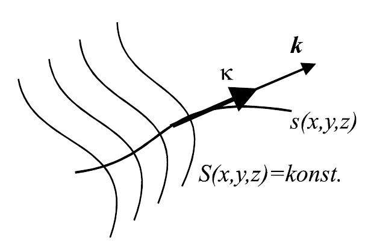

**Rovnice paprsku** bude mít tvar

$$
\frac{d}{ds}\left(n\frac{dr}{ds}\right) = \nabla n
$$

vyjadřuje, že přírůstek směru dráhy paprsku v nehomogenním prostředí vzniká ve směru gradientu indexu lomu

Když budeme mít homogenní prostředí - $\nabla n = 0$ → $\frac{d^2 r}{d s^2}=0$ a tedy řešením je přímka → paprsek se šíří po přímce

</aside>

<aside>

## Postuláty geometrické optiky

- **V homogenním prostředí se světlo šíří přímočaře dle geometrických přímek - optické paprsky**
- **Ve světelném svazku jsou optické paprsky navzájem nezávislé**
- **Na rozhraní dvou izotropní prostředí 1 a 2 platí relace zákonu lomu a odrazu**
- **Optické médium je charakterizováno indexem lomu $n=c_0/c$ → čas trvající světlu se dostat z přes vzdálenost $d$ je úměrný produktu $nd$ (optická dráha)**
- **V nehomogenním prostředí (index lomu je funkcí pozice $n(\mathbf r)$) → Optická dráha mezi bodem A a B je dána**
    
    $$
    \text{Optická dráha} = \int_{A}^{B} n(\mathbf r) ds,
    $$
    
- **Fermatův princip - princip nejkratší optické dráhy**
- Nepřipouští difrakci světla v blízkosti hran objektů
</aside>

## Ideální zobrazení a projektivní geometrie

Ideální zobrazení - zobrazení mezi dvěma prostory - předmětovým a obrazovým kde platí:

- obrazem bodu je bod
- obrazem přímky je přímka
- obrazem roviny je rovina

Uvažují se osově symetrické systémy se společnou optickou osou (samosdružená přímka)

**Body z nekonečna (nevlastní body)** se zobrazují systémem rovnoběžných paprsků; jsou součástí nevlastní roviny (taky kolmá na osu) 

Znaménková konvence je vidět na dalším obrázku

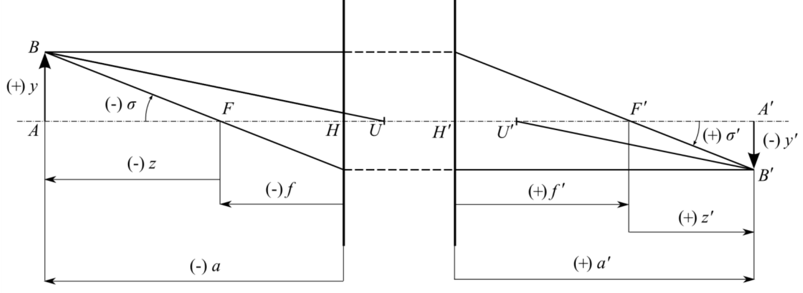

<aside>
🤔

### Zobrazovací roviny

- **Rovina meridionální (tangenciální)** - obsahuje zvažovaný paprsek (i zobrazovaný bod) a osu symetrie soustavy - rovina nákresu
- **Rovina sagitální** - obsahuje zvažovaný paprsek a je kolmá k tangenciální
</aside>

<aside>
🧑‍🔬

### Základní definice

- **Příčné zvětšení** $\beta$ - změna příčné úsečky při transformace (u rotačně symetrických soustav a IZ bude konst pro kterýkoliv bod ležící v rovině kolmé na optickou osu)  $\beta \equiv  \frac{dy^\prime}{dy} \equiv  \frac{dx^\prime}{dx}$
- **Podélné zvětšení** $\alpha$ - změna podélne úsečky při transformaci  $\alpha \equiv  \frac{dz^\prime}{dz} \equiv  \frac{da^\prime}{da}$
- **Úhlové zvětšení** $\gamma$ - změna úhlové souřadnice na optické ose  $\gamma \equiv  \frac{\tan \sigma^\prime}{\tan \sigma} \equiv  \frac{\beta}{\alpha}$
- **Hlavní roviny** - roviny (kolmé na osu), které mají $\beta=1$ - převodní roviny pro předmětový a obrazová prostor - průsečíky s osou označujeme $H, H^\prime$ a nazýváme je **hlavními body zobrazení**
- **Fokální roviny** - Nechť předmětová rovina nevlastní (tvořená všemi body v nekonečnu) je zobrazována na rovinu vlastní → této rovině se říká **obrazová fokální rovina**; Jestliže vlastní rovině v předmětovém prostoru  odpovídá v obrazovém prostoru nevlastní rovina → vlastní rovina se nazývá **předmětová fokální rovina**
- **Ohniska** - průsečíky s příslušnou fokální rovinou se nazývají **ohniska/fokusy - značí se $F,F^\prime$**
- **Ohnisková (fokální) vzdálenost** - vzdálenost mezi příslušnými hlavními body a příslušným fokuse je ohnisková vzdálenost - **předmětová** $f$, **obrazová** $f^\prime$
- **Fokální systémy** - systémy, kde existují fokální roviny (**afokální** zobrazí nevlastní roviny na vlastní)

</aside>

### Zobrazovací rovnice

Ideální zobrazení dioptrického systému lze definovat 4 body (ohnisky a hlavními body)

Pro konstrukci zobrazení obecného bodu lze použít hlavních paprsků (procházejících ohniskem a rovnoběžných s osou)

K odvození zobrazovacích rovnice se využívá podobnosti trojúhelníků ABF a B’HF; A’B’F’ a BH’F’

→získá se **Newtonova zobrazovací rovnice**

$$
zz^\prime = ff^\prime
$$

Když se zvolí jiná volba soustavy pro odečítání vzdáleností $z = a-f ; z^\prime = a^\prime - f^\prime$, pak se dá získat **Gaussova zobrazovací rovnice**

$$
\begin{split}(a-f)(a^\prime-f^\prime) &= ff^\prime\\\dfrac{f^\prime}{a^\prime} + \dfrac{f}{a} &= 1\end{split}
$$

Ta druhá se spíš označuje jako ta **Gaussova zobrazovací rovnice**

Obě zobrazovací rovnice udávají pouze relace podélných souřadnic při zobrazení, nikoliv vztah velikostní relace předmětu → je nutné je doplnit relacemi - vlastnostmi pro jednotlivá zvětšení - pro dioptrický systém (systém se zvětšením) platí

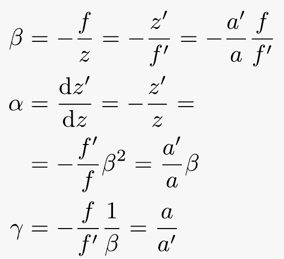

## Paraxiální optická soustava

Ideální zobrazení nemusí být možné reálně fyzikálně realizovat.

Ideální transformace (popsaná [ZDE](9Zaklady_geom_optiky.md)) nejsme schopni realizovat pro obecnou polohu a velikost předmětu.

Odchylku paprsků od ideálního zobrazení bodu - nazýváme **paprskové aberace** (**aberace - optické vady**; odchylky od ideálních stavů)

**Dokonalé zobrazení** - je dosaženo zobrazení na akceptovatelné úrovni (dané rozlišovací schopností nebo měřitelností) - lze jej dosáhnout za cenu různých kompromisů pomocí korekce aberací a omezení některých parametrů systému a zobrazení 

**Paraxiální přiblížení** - omezení úhlů dopadu paprsků na prvek - zobrazení je potom monochromaticky bezaberační (prostor, ve které lze přibl. realizovat se nazývá **paraxiální prostor** - blízko osy - cca do 6 stupňů)

Přiblížení → aproximace funkce sinus

$$
\sin \alpha = \alpha - \frac{\alpha^3}{3!} + \frac{\alpha^5}{5!} - \frac{\alpha^7}{7!} + \ldots
$$

**Paraxiální prostor** je prostorem prvního řádu - **Gaussův prostor -** normálně chyby nejsou - ale když se připustí disperze - barevná vada - jediná vada v tomto prostoru

**Seilderův prostor** - přiblížení 3. řádu - není bezaberační (12 stupňů)

<aside>
🏐

### Paraxiální refrakční kulová plocha

Jak to vypadá je na obrázku

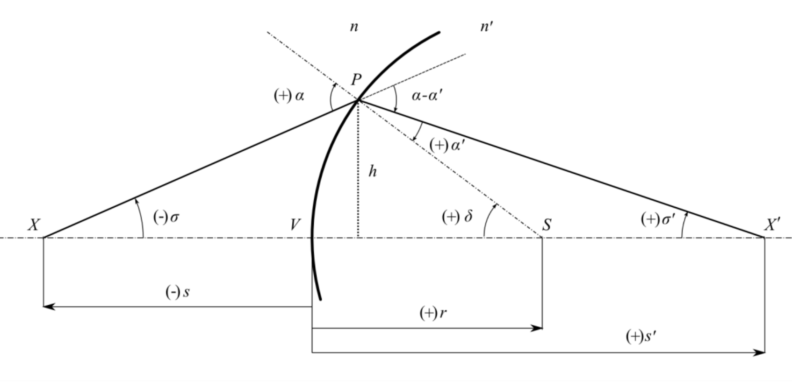

Popisuje se zobrazení osového bodu

**Optická mohutnost** lámavé plochy se definuje jako

$$
\varphi = \frac{n^\prime-n}{r} \, [\text{dpt}=m^{-1}]
$$

$r$ je poloměr kulové plochy

Získá se paraxiální zobrazovací rovnice kulové lámavé plochy

$$
\frac{n^\prime}{s^\prime} -\frac{n}{s} = \varphi\qquad \text{kde} \, -\sigma = -\frac{h}{s}, \, \sigma^\prime = \frac{h}{s^\prime}
$$

Rovnice už neobsahuje závislost na příčných souřadnicích a úhlech

Dále se dá odvodit vztah/y 

$$
\frac{f^\prime}{f} = -\frac{n^\prime}{n} \quad f= -\frac{n}{\varphi} \quad f^\prime = \frac{n^\prime}{\varphi}
$$

→ pro konkrétní prvek se dá stanovit hodnota ohniskových vzdáleností

Hodnota optické mohutnosti pomůže lépe definovat typy prvků

- $\varphi>0$ - **systém dioptrický kladný (spojný)**
- **$\varphi <0$ - systém dioptrický záporný (rozptylný)**
- **$\varphi = 0$ - systém afokální**

Dají se dále definovat různé obrazy

- **obraz reálný** - jestliže zobrazovacím systémem je zobrazovaný bod po transformaci tvořen *konvergujícími paprsky* (obraz lze zachytit na stínítko)
- **obraz virtuální** - jestliže je zobrazovaný bod po transformaci tvořen *divergujícími paprsky* (jeho obraz je možno získat prodloužením paprsků proti směru svého chodu)
- **převrácený  - $\beta <0$**
- **vzpřímený - $\beta>0$**
- **zvětšený - $\vert \beta\vert > 1$**
- **zmenšený - $\vert \beta\vert < 1$**
</aside>

<aside>
🏐

### Paraxiální reflexní kulová plocha

U reflexní plochy se využije předešlých vztahů a z refrakční plochy se stane reflexní → $n^\prime = -n$  → pro optickou mohutnost dostaneme

$$
\varphi = \frac{-2n}{r} 
$$

a z toho následně dostaneme 

$$
f^\prime= f = -\frac{n}{\varphi}= \frac{r}{2}
$$

Systém má pouze jednu ohniskovou vzdálenost, spojný systém má zápornou hodnotu poloměru, ohnisková vzdálenost je záporná

</aside>

<aside>
🔎

### Tenká čočka

Je zakončena dvěma kulovými rozhraními o hodnotách optických mohutností $\varphi_1,\varphi_2$ - předpokládáme, že tloušťka čočky jde k nule (hlavní roviny splývají) → celková mohutnost bude součet dvou optických mohutností → celková optická mohutnost je i dána vztahem (kde bereme poloměry čoček, okolní index lomu a indexu lomu čočky) 

$$
 \varphi = (n-n_0)\left(\frac{1}{r_1} - \frac{1}{r_2} \right)
$$

Dá se i odvodit ohnisková vzdálenost tenké čočky

$$
f^\prime = \frac{n_0}{n-n_0} \frac{r_1r_2}{r_2-r_1}
$$

protože má čočka z obou stran stejný index lomu → platí [vztah](9Zaklady_geom_optiky.md) → v absolutní hodnotě jsou obě ohniskové vzdálenosti stejné

</aside>

<aside>
🔎

### Paraxiální afokální soustavy čoček

Z důvodu korekce aberací se čočky řadí do soustav, u stmelených dubletů a tripletů se uvažují stejné hlavní roviny a mohutnosti se sčítají, u složitějších systémů ale hlavní roviny nekoincidují

Pokud má být systém afokální (rovnoběžný svazek se transformuje na rovnoběžný)  → musí se využít alespoň dvě čočky se společným ohniskem

Dvě hlavní uspořádání

### Spojka a spojka

$f_1^\prime, f_2^\prime>0$, ohniskové roviny jsou v nekonečnu, bod z nekonečna se zobrazí do nekonečna, je ale možné zobrazovat i bod z konečna do konečna → soustava **převrací**, obraz může být **reálný** i **virtuální** 

Příčné zvětšení je dáno $\beta = -\frac{f_2^\prime}{f_1^\prime}$ a ostatní zvětšení jsou dány $\gamma = \frac{1}{\beta}$ a $\alpha= \beta^2$

### Spojka a rozptylka

$f_1^\prime>0, f_2^\prime<0$. Zvětšení je dáno stejně jako u předchozího systému. **Obraz bude vždy vzpřímený a virtuální**

### Poznámky

Podle toho, kde jsou ohniska (předmětová a obrazová) tak poznám co je spojka a co rozptylka

Divadelní kukátko - základ jako Galile. dalekohled - neobrací obraz

Fokální vzdálenost oka - vzdálenost čočky a sítnice

**Případ tlusté spojky**

**Případ tlusté rozptylky**

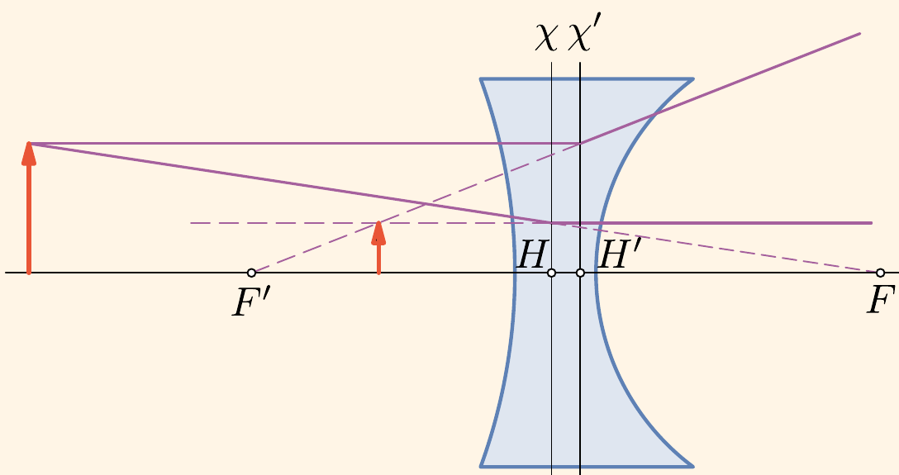

</aside>

<aside>
🪲

### Optické aberace prvků

Vady, které vedou na odchylku od definovaného ideálního zobrazení

Korigují se sférickými/asférickými prvky → nevede to na dosažení ideálu, ale na dosažení uspokojivých vlastností

Jedná se o vady způsobené neparaxialitou, zobrazování širokým svazkem a nebo velký objekt

**Chromatická vada** je dána disperzí a je i v prostoru 1. řádu

Ostatní jsou monochromatické vady

- otvorová vada
- koma
- astigmatismus
- zklenutí
- zkreslení - důsledek nekonstantnosti příčného zvětšení v závislosti na velikosti objektu (přímka se nezobrazí na přímku, ale bod/rovina se zobrazí na bod/rovinu)

### Otvorová vada

Projevuje se u osových bodů při zobrazení širokými svazky, kde jednotlivé paprsky přesahují paraxiální hodnoty úhlů

Paprsky homocentrického svazku se nezobrazí jako homocentrické 

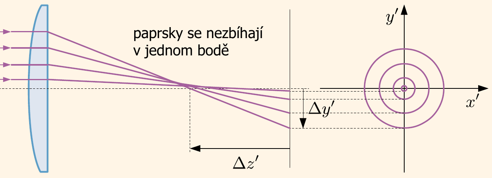

### Koma

Vzniká při zobrazení mimoosového bodu širokým svazkem - mimoosová analogie otvorové vady

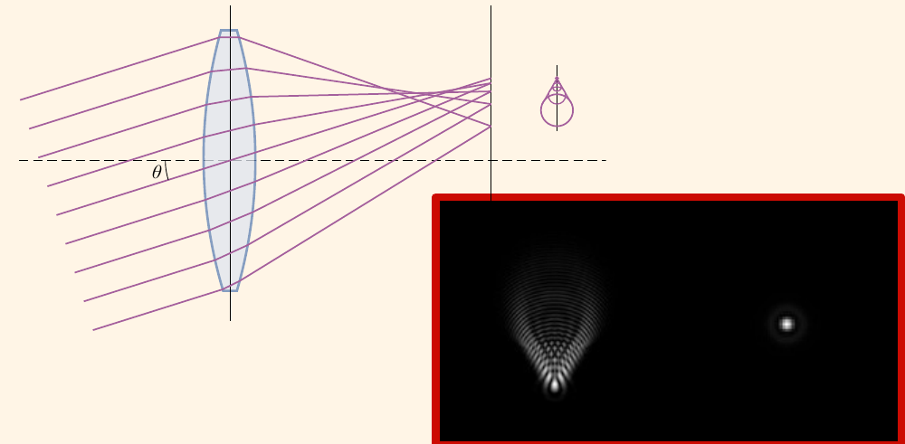

### Astigmatismus

Vada úzkých silně mimoosových svazků (velký dopadový úhel)

Projevuje se různě v meridionální a sagitální rovině

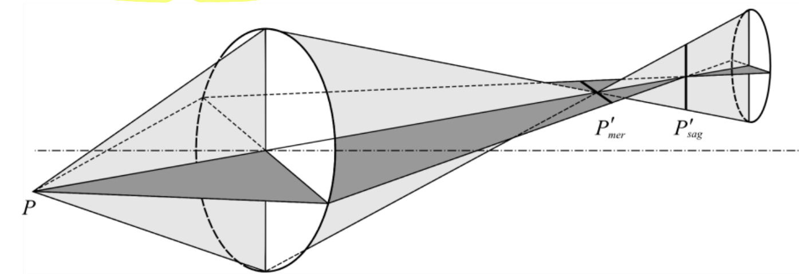

### Chromatická aberace

Nenastává u reflexní systémů

Díky materiálové disperzi dochází ke změně mohutnosti optických prvků

Optická mohutnost čočky je dána [vztahem](9Zaklady_geom_optiky.md) → její změna závisí na změně indexu lomu

$$
\Delta \varphi = \frac{\varphi}{\nu} \qquad \text{kde} \, \nu= \frac{n-1}{\Delta n}
$$

kde $\nu$ je **Abbého číslo**

Koriguje se to kombinací čoček z různých materiálů

</aside>

# Základní optické přístroje

<aside>
👁️

## Oko - základy

Obrazová informace se promítá spojným systémem na obrazovou plochu (zklenutou sítnici) - ostrost zajišťuje akomodační schopnost oka

Množství prošlé energie ovlivňuje duhovka

Optická mohutnost je 54-58 dpt (malá část je z čočky a větší je z rohovky)

Konvenční optická vzdálenost je 25 cm

Čípky - barevné denní vidění - citlivé v oblastech RGB

Tyčinky - černobíle noční vidění, mimo žlutou skvrnu

</aside>

Optické přístroje se využívají k zlepšení lidského vidění, záznam optické informace, projekci optické informace

<aside>
🏗️

## Základní komponenty

### Hranoly, klíny, planparalelní skla

Využívají se jako komponenty pro změnu chodu paprsku, převracející soustavy, děliče, disperzní prvky

Hranoly mohou fungovat na principu totálního odrazu - úchylné, převracející, disperzní, polarizační

Hranoly s malou lámavostí jsou optické klíny - dosažení malé deviace paprsků

Planparalelní skla - krycí okénka, krycí skla, děliče - spolu s čočkami mohou posouvat fokus a způsobovat otvorovou vadu

### Čočky

Krom geom. parametrů je charakterizujeme indexem lomu a Abbého číslem

Nejčastěji sférické, torické a cylindrické

### Zrcadla

Bezdisperzní prvky s funkcí nezávislou na indexu lomu

### Matnice

Slouží k rozptylu obrazu do většího úhlu, než má původní svazek.

Mohou být transmisní, reflexní

Parametrem je rozptylová charakteristika

</aside>

<aside>
📐

## Optické materiály

Často se využívá polychromatické světla → nutnost charakterizovat spektrální vlastnosti materiálů → pro každou vlnovou délku určujeme index lomu a Abbého číslo

Využívá se disperzní diagram (x-Abbého číslo - ale opačně, y-index lomu)

Nejčastějším materiálem je optické sklo → dělí se podle Abbého čísla

- s malou disperzí - korunová skla - $\nu > 50$
- s velkou disperzí - flintová skla - $\nu< 50$
</aside>

<aside>
🔨

## **Základní parametry optických přístrojů**

### Celkové zvětšení $\Gamma$

Zvětšení se vztahuje k pozorování pomocí samotného oka bez přístroje

Tady je oko - systém akomodovaný na nekonečno

$$
\Gamma = \frac{\tan \alpha^\prime}{\tan \alpha}
$$

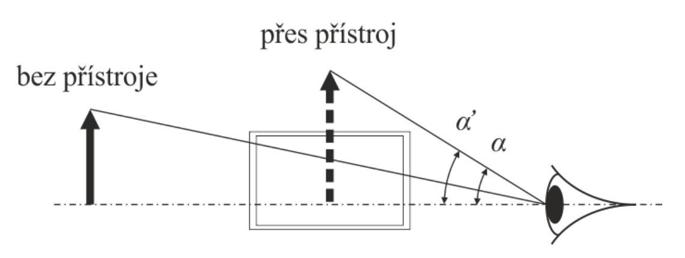

### Rozlišovací schopnost optických soustav

Určuje míru vnímání “detailů” - **posouzení mírou vnímání dvou blízkých bodů**

U menších apertur je dána difrakcí na apertuře

Užívá se Rayleighovo kritérium - předpokládá, že mezi rozlišitelnosti je dána situací, kdy hlavní maximum difrakčního obrazce jednoho bodu v  rovině obrazu padne do difrakčního minima druhého bodu

Odvodí se úhlové rozlišení 

$$
\Delta \theta = \theta_{min} = 1.22\frac{\lambda}{D}
$$

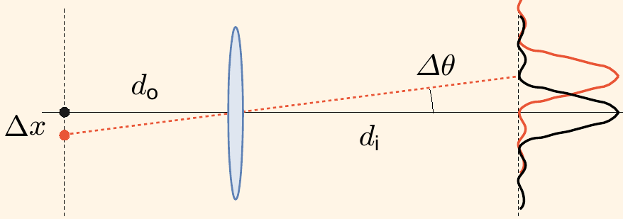

### Relativní otvor a numerická apertura

Nutnost posoudit energetickou výtěžnost systému (světelnost..) - množství světla co projde systémem

Když je **objekt v nekonečnu** - zavádí se relativní otvor $C$ - poměr velikosti apertury systému a obrazové ohniskové vzdálenosti

$$
C = \frac{D}{f^\prime}
$$

Pro objekty v konečnu → numerická apertura NA - součin indexu lomu předmětového prostoru a  sinu maximálního předmětového osového aperturního úhlu

$$
NA = n\sin\sigma
$$

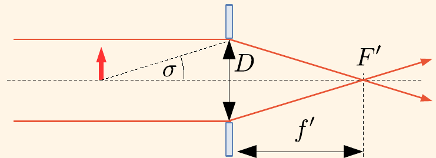

### Přenosová funkce

Optical transfer function OTF 

Popisuje vlnově přenos signálu v prostorovém spektru intenzit, zahrnuje veškeré vady systému.

Nulovost funkce pro danou frekvenci se projeví ztrátou detailů obrazu přenášených na této frekvenci

</aside>

<aside>
🔎

## Lupa

Jednočlenný optický systém určený pro pozorování blízkých předmětů

Předmět se klade do předmětové fokální roviny → oko je zaostřeno na nekonečno 

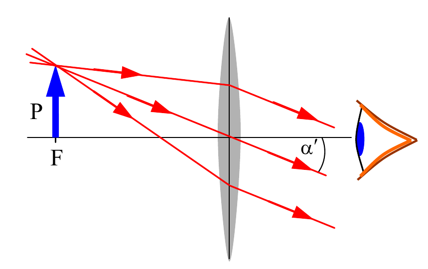

Celkové zvětšení $\Gamma$ vychází se srovnáním s pozorováním na konvenční vzdálenost 250 mm (3-15x zvětšení)

$$
\Gamma = \frac{250}{f^\prime}
$$

</aside>

<aside>
🔎

## Okulár

Zobrazovací dioptrický systém - funkčně podobný lupě

Určen pro dvojčlenné optické soustavy, kdy pozorujeme vzdušný obraz

Oproti lupě:

- nepotřebuje řešit dostupnost fokální předmětové roviny (pozoruje se vzdušný obraz objektu - vytvořený optickým systémem - objektiv)
- nepotřebuje řešit osvětlení předmětu
- je možné dát test do místa roviny předmětu

Typické zvětšení 6-20x a obsahují korekci na zrakovou vadu $\pm5$ dpt

</aside>

<aside>
🔎

## Mikroskop

Podobný jako lupa, ale je dvoustupňový → reálný předmět je nejprve zvětšený objektivem a tento vzdušný obraz je dále zvětšen okulárem

Celkové zvětšení

$$
\Gamma = \beta_{objektiv}\cdot \Gamma_{okular}
$$

S ohledem na aberace není poloha předmětu obecná - je přesně vymezena a objektiv je tak konstruován na definované zvětšení

Smysluplné zvětšení je do optické oblasti je cca 1500x

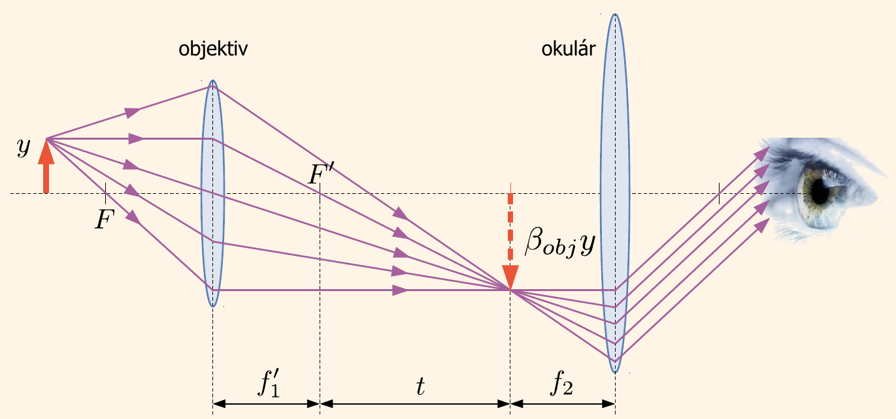

</aside>

<aside>
🔎

## Dalekohled

Zařízení pro pozorování objektů v nekonečnu

Volí se afokální systémy, kde zvětšení je dáno úhlovým zvětšením

$$
\Gamma = \gamma = -\frac{f^\prime_{objektiv}}{f^\prime_{okular}}
$$

Dělí se na 

- **Keplerův dalekohled** - tvořen dvěma spojnými soustavami s funkcí objektivu a okuláru - převrací obraz; astronomie, geodetické aplikace, vojenské aplikace
- **Galileův dalekohled**  - tvořen spojnou a rozptylnou soustavou, nepotřebuje převracející systém, pouze pro nenáročné aplikace s malým rozlišením

Světelnost i rozlišovací schopnost dalekohledu je daná průměrem objektivu

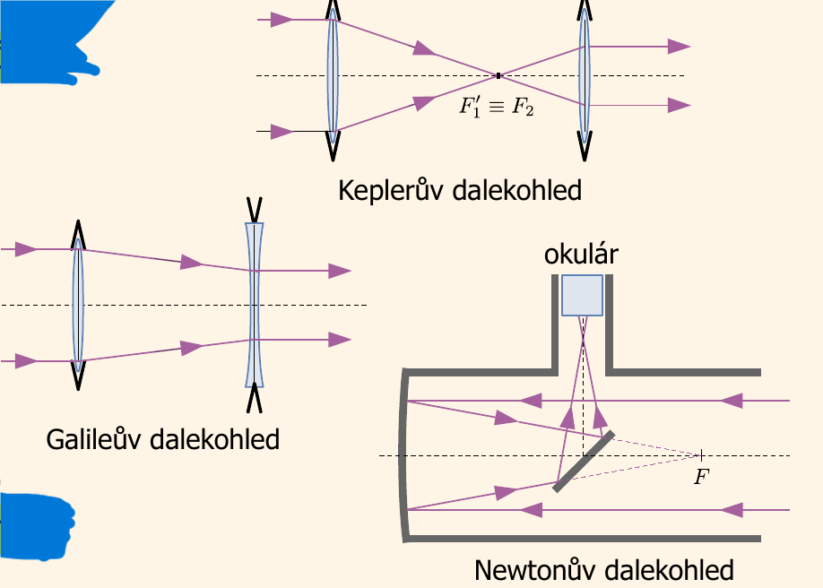

</aside>

<aside>
🔎

## Fotografie

Objekt je většinou uvažován ve velké vzdálenosti…

Objekt je objektivem zobrazen na záznamovém médiu..

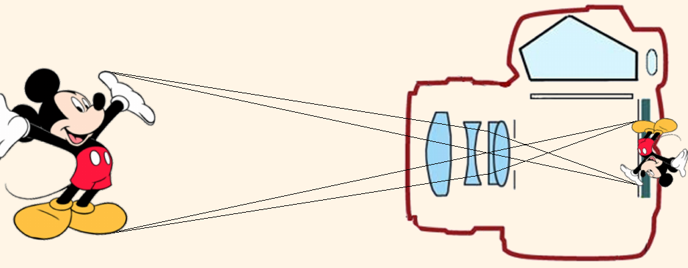

</aside>

<aside>
🔎

## Projektor

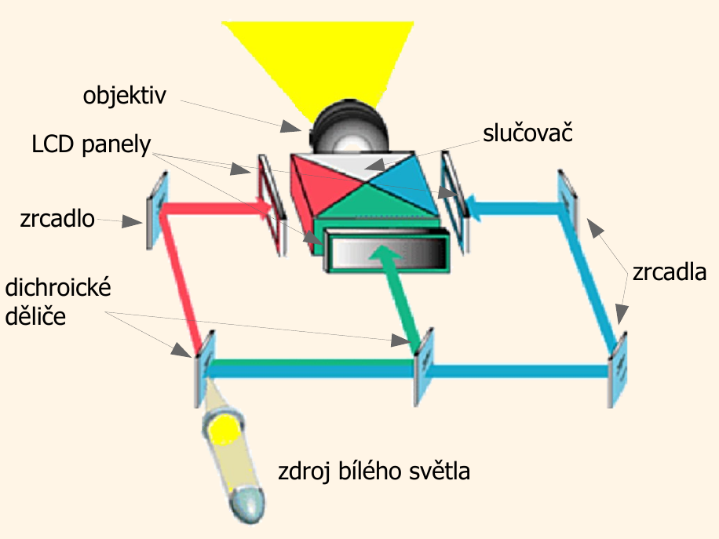

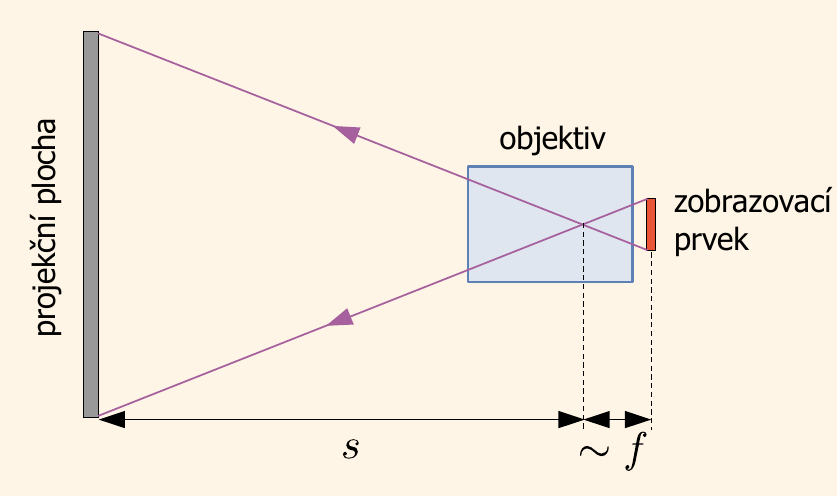

</aside>